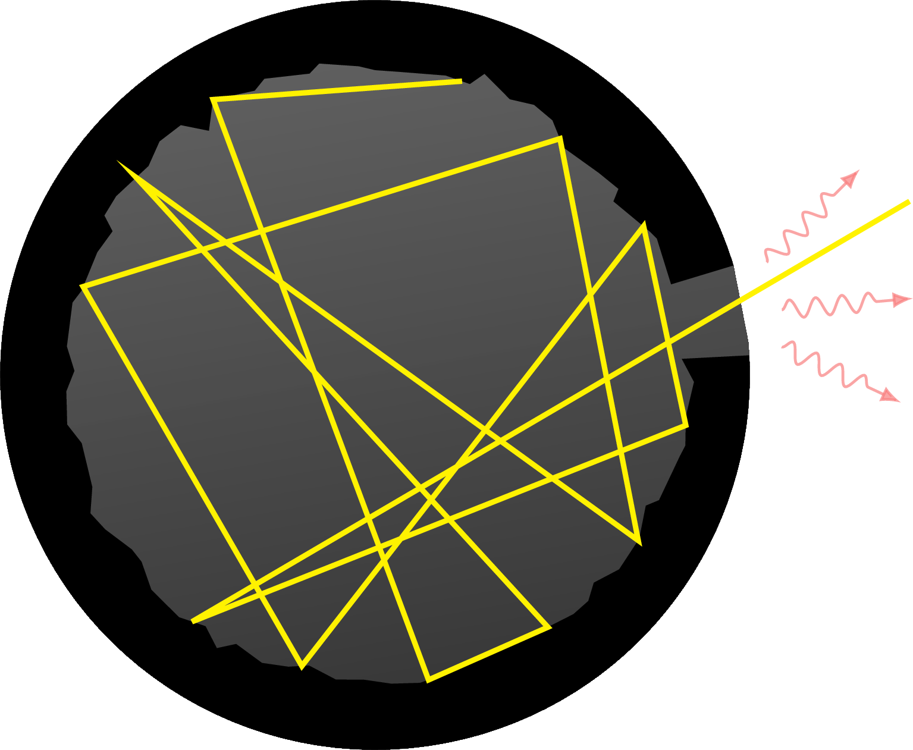
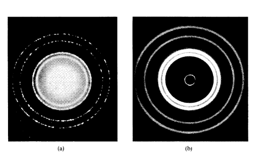
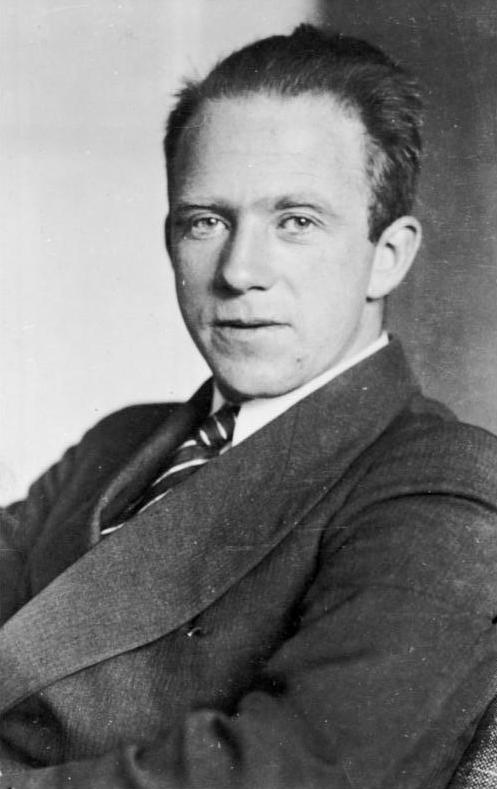
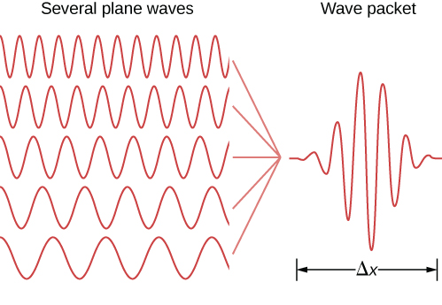
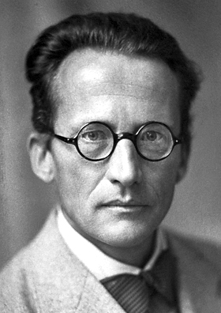

# Bases experimentais e teóricas da Química Quântica

> "The more important fundamental laws and facts of physical science have all been discovered, and these are so firmly established that the possibility of their ever being supplanted in consequence of new discoveries is exceedingly remote." 
> 
> — Albert A. Michelson, 1896[^michelson]

Uma série de experimentos realizados entre o final do século XIX e o início do século XX modificou profundamente os conceitos fundamentais da física. Esses experimentos revelaram limitações da física clássica na descrição da interação entre radiação e matéria em escalas microscópicas, abrindo caminho para o desenvolvimento da mecânica quântica.

## Radiação de Corpo Negro e Max Planck

A ideia é que em um corpo negro toda a radiação incidente é absorvida e a radiação emitida por esse corpo deve ser uma função apenas da temperatura do corpo, tal que, 

$$\frac{d\epsilon}{d\nu}=\frac{d\epsilon}{d\nu}(\nu,T)$$

 é a densidade de energia numa dada faixa de frequência ao redor de $\nu$ para um corpo a uma dada temperatura. 

{#fig-blackbody width=300px}

O trabalho de Lord Rayleigh and J.H. Jeans introduziu a partir da teoria eletromagnética clássica a lei dada por 
$$
\rho(\nu,T) =
\frac{8\pi \nu^2}{c^3} k_B T .
$$ {#eq-rayleigh-jeans}
onde $c$ é a velocidade da luz e $k_B$ a constante de Boltzmann. A @eq-rayleigh-jeans reproduz os dados experimentais em baixas frequências, mas diverge no limite de altas frequências. A lei de Rayleigh-Jeans prevê que a densidade de energia irradiada diverge com $\nu^2$, um fenômeno conhecido como **catástrofe do ultra-violeta**. 

> Não há nenhum erro na derivação da lei de Rayleigh-Jeans de acordo com a física da época, faltavam novos ingredientes físicos no problema!

A lei do deslocamento de Wien [@Wien1894], proposta empiricamente em 1894, estabelecia que o comprimento de onda $\lambda_\text{max}$ na qual a emissividade era máxima é dado por
$$\lambda_\text{max} T = 2.9 \times 10^{-3}\ \text{m.K}$$

Baseado nessa ideia, Planck em 1901[@Planck1901] introduziu a lei de estados dada por 
$$\frac{d\epsilon}{d\nu}(\nu,T) = \frac{8 \pi h }{c^{3}} \frac{\nu^3}{e^{h \nu/k_B T}-1},$$
onde $h$ é a constante de Planck. 

## Efeito Fotoelétrico e Albert Einstein

1905

## Descoberta do Núcleo Atômico e Rutheford

## Espectro Atômico e Niels Bohr

Em 1915, Niels Bohr propos um modelo atômico em que os elétrons orbitam o núcleo atômico sem emitir radiação pois existem estados estacionários em que a energia do átomo é constante. 

Bohr explicou que os elétrons podem ser deslocados para níveis mais altos de energia com a absorção de _quantum_ de energia na forma de um fóton. Quando um elétron retorna a um nível mais baixo de energia, o átomo emite um fóton com novo _quantum_ de energia. 

1913

## Dualidade Onda-Partícula e Louis de Broglie

As ideias de Planck e Einstein trouxeram uma visão dual da luz, ora como onda, ora como partícula. Entre 1923 e 1924, Louis de Broglien[@DEBROGLIEWavesQuanta1923;@DEBROGLIERecherchesTheorieQuanta1924] formulou uma hipótese que a matéria poderia ter uma dualidade onda-partícula também, ou seja, um elétron poderia se comportar como onda também. 

{#fig-debroglie height=200px}

De Broglie deduziu, a partir da relação de Planck,
$$
E=h\nu,
$$
e da relatividade de Einstein, que o momento linear de uma partícula estaria relacionado ao seu comprimento de onda pela expressão
$$
p=\frac{h}{\lambda},
$$
ou, de forma equivalente,
$$
\lambda=\frac{h}{p},
$$
onde $h$ é a constante de Planck, $p$ é o momento linear da partícula e $\lambda$ é o comprimento de onda associado à matéria.

Essa relação ficou conhecida como **relação de de Broglie**. Ela indica que o comportamento ondulatório não é exclusivo da radiação eletromagnética, mas também pode ser atribuído a partículas materiais. Para objetos macroscópicos, o comprimento de onda de de Broglie é extremamente pequeno, tornando seus efeitos ondulatórios praticamente imperceptíveis. Hoje sabemos que, para partículas microscópicas, como elétrons, prótons e nêutrons, esse comprimento de onda pode ser comparável às dimensões atômicas, permitindo a observação de fenômenos de interferência e difração.

Em 1927, experimentos [@THOMSONDiffractionCathodeRays1927;@DAVISSONDiffractionElectronsCrystal1927] envolvendo difração de elétrons em sólidos comprovaram que a matéria pode ter um comportamento ondulatório assim como o raio-X e outros fenômenos eletromagnéticos. A @fig-difracao-eletrons mostra a comparação entre padrões de difração de elétrons e de raios-X em níquel sólido.

{#fig-difracao-eletrons width=80%}

Em 1929, de Broglie é agraciado com o prêmio Nobel após a descoberta experimental do comportamento ondulatório da matéria. 

## Princípio da Incerteza e Werner Heisenberg

A dualidade onda-partícula trouxe consequências profundas para a descrição do movimento de partículas microscópicas. Na mecânica clássica, uma partícula pode, em princípio, ter sua posição e seu momento linear determinados simultaneamente com precisão arbitrária. Entretanto, na mecânica quântica, essa ideia deixa de ser válida.

{#fig-heisenberg height=200px}

Em 1925, Werner Heisenberg publicou o artigo conhecido como *Umdeutung* [@HEISENBERGUmdeutung1925], considerado um dos trabalhos fundadores da mecânica quântica matricial. Nesse trabalho, Heisenberg propôs formular a mecânica quântica usando apenas grandezas observáveis, como frequências e intensidades espectrais, evitando conceitos clássicos não observáveis, como órbitas eletrônicas bem definidas.

Em 1927, Heisenberg formulou o **princípio da incerteza** [@HEISENBERGUeberAnschaulichenInhalt1927], segundo o qual existem pares de grandezas físicas que não podem ser conhecidos simultaneamente com precisão arbitrária. O exemplo mais importante envolve a posição $x$ e o momento linear $p_x$ de uma partícula. A relação de incerteza é escrita como

$$  
\Delta x , \Delta p_x \geq \frac{\hbar}{2},  
$$

onde $\Delta x$ representa a incerteza na posição, $\Delta p_x$ representa a incerteza no momento linear na direção $x$, e

$$  
\hbar=\frac{h}{2\pi}  
$$

é a constante de Planck reduzida.

Essa relação não deve ser interpretada apenas como uma limitação dos instrumentos de medida. Ela expressa uma característica fundamental da natureza quântica. Quanto mais precisamente se conhece a posição de uma partícula, maior será a incerteza associada ao seu momento linear, e vice-versa.

{#fig-uncertainty width=400px}

Uma forma intuitiva de compreender esse resultado está relacionada ao caráter ondulatório da matéria. Uma onda com comprimento de onda bem definido está associada a um momento bem definido, pela relação de de Broglie. Porém, uma onda perfeitamente definida no espaço não está localizada em uma região finita. Para localizar uma partícula em uma pequena região do espaço, é necessário construir um pacote de ondas, isto é, uma superposição de várias ondas com diferentes comprimentos de onda, conforme ilustrado na @fig-uncertainty. Como cada comprimento de onda corresponde a um valor de momento, a localização espacial da partícula implica uma dispersão nos possíveis valores de momento.

Assim, o princípio da incerteza mostra que a mecânica quântica não descreve partículas microscópicas por trajetórias bem definidas, como ocorre na mecânica clássica. Em vez disso, a descrição quântica envolve probabilidades, amplitudes de onda e limites fundamentais para a determinação simultânea de certas grandezas físicas.

## Função de Onda e Erwin Schrödinger

A hipótese de de Broglie indicava que partículas materiais poderiam apresentar comportamento ondulatório. A questão fundamental passou então a ser: qual equação descreve essa onda associada à matéria?

{#fig-schrodinger height=200px}

Em 1926, Erwin Schrödinger formulou uma equação capaz de descrever a evolução da onda associada a uma partícula quântica [@SCHRODINGERQuantisierungEigenwertproblem1926]. Essa equação, conhecida como **equação de Schrödinger**, tornou-se uma das bases matemáticas da mecânica quântica.

Para uma partícula de massa $m$ sujeita a um potencial $V(\mathbf{r},t)$, a equação de Schrödinger dependente do tempo é dada por

$$\left[  
-\frac{\hbar^2}{2m}\nabla^2 + V(\mathbf{r},t)  
\right]\Psi(\mathbf{r},t),  
$$

onde $\Psi(\mathbf{r},t)$ é a **função de onda** da partícula, $i$ é a unidade imaginária, $\hbar$ é a constante de Planck reduzida, $m$ é a massa da partícula e $V(\mathbf{r},t)$ é a energia potencial.

A função de onda contém toda a informação acessível sobre o estado quântico do sistema. Entretanto, ela não é, em geral, uma grandeza diretamente observável. A interpretação física da função de onda foi proposta por Max Born[^BORNQuantumMechanicsCollision1926], segundo a qual o módulo ao quadrado da função de onda está relacionado à probabilidade de encontrar a partícula em uma determinada região do espaço:
$$\Psi^*(\mathbf{r},t)\Psi(\mathbf{r},t).  
$$

Assim, $|\Psi(\mathbf{r},t)|^2$ representa uma **densidade de probabilidade**. A probabilidade de encontrar a partícula em um pequeno volume $d\tau$ em torno da posição $\mathbf{r}$ é dada por

$$  
|\Psi(\mathbf{r},t)|^2 d\tau.  
$$

Para que essa interpretação probabilística seja válida, a função de onda deve satisfazer a condição de normalização:

$$  
\int |\Psi(\mathbf{r},t)|^2 d\tau = 1.  
$$

Essa condição expressa o fato de que a partícula deve ser encontrada em algum lugar do espaço.

Quando o potencial não depende explicitamente do tempo, é possível separar a parte temporal da parte espacial da função de onda. Nesse caso, obtém-se a equação de Schrödinger independente do tempo:

$$  
\hat{H}\psi(\mathbf{r}) = E\psi(\mathbf{r}),  
$$

em que $\hat{H}$ é o operador Hamiltoniano, $E$ é a energia do sistema e $\psi(\mathbf{r})$ é a função de onda espacial. Para uma partícula em um potencial $V(\mathbf{r})$, o Hamiltoniano é escrito como

$$-\frac{\hbar^2}{2m}\nabla^2 + V(\mathbf{r}).  
$$

A equação de Schrödinger independente do tempo é uma equação de autovalores. Suas soluções fornecem os estados estacionários permitidos do sistema e suas respectivas energias. Essa característica explica, por exemplo, a quantização dos níveis de energia em átomos e moléculas.

Portanto, a função de onda representa uma mudança conceitual profunda em relação à mecânica clássica. Na mecânica quântica, o estado de uma partícula não é descrito por uma trajetória definida, mas por uma função matemática cuja interpretação está associada à probabilidade de ocorrência dos resultados de uma medida.

[^michelson]: Falsamento atribuída a Lord Kelvin.
