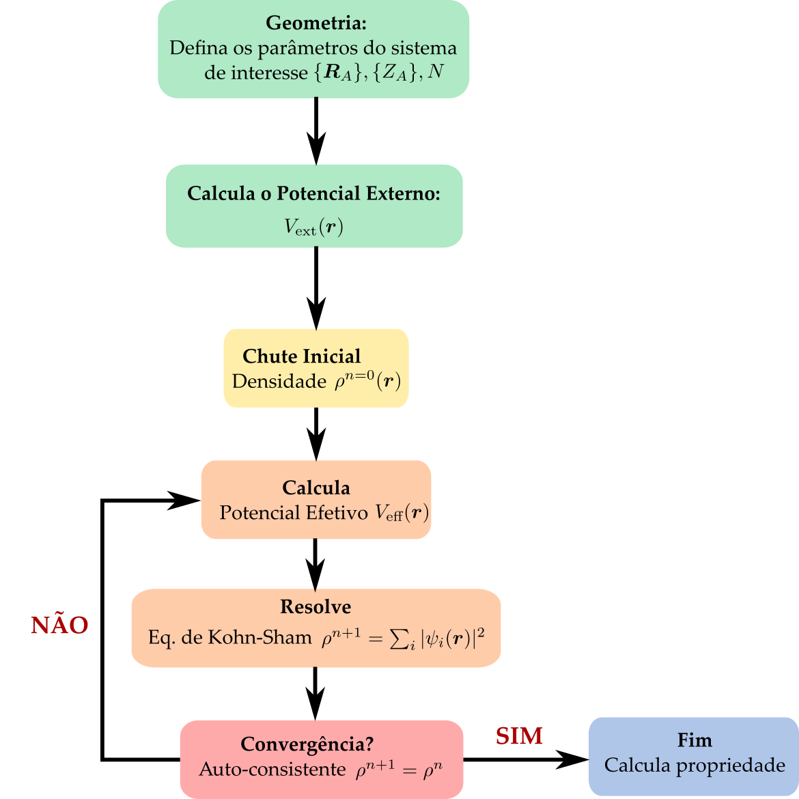

# Teoria do funcional da densidade

A teoria do funcional da densidade (**DFT**, sigla em inglês para **D**ensity **F**unctional **T**heory) se baseia na ideia que a energia total de um sistema com $N$ elétrons e $M$ núcleos atômicos possa ser escrita como um funcional da densidade eletrônica dado por 

$$
\begin{aligned}
    E_0[\rho(\boldsymbol{r})] &= \braket{\Psi|\hat{H}_e|\Psi } \\
    &= \braket{\Psi|\hat{T}_e + \hat{V}_{ee} + \hat{V}_{ne} |\Psi } 
\end{aligned}
$$

onde $\Psi$ é a função de onda dos $N$ elétrons e contem toda a complexidade do sistema. Nessa visão, os núcleos atômicos agem como potenciais externos sobre os elétrons, cujo valor esperado dessa interação pode ser calculado por 

$$
\begin{aligned}
    \braket{\Psi|\hat{V}_{ne}|\Psi } &= -\int \Psi^*(\boldsymbol{x}^N)\left[\sum_{i=1}^N\sum_{a=1}^M \frac{Z_a}{|\boldsymbol{r}_i-\boldsymbol{R}_a|} \right]\Psi(\boldsymbol{x}^N)\ \text{d}\boldsymbol{x}^N \\
     &= -\int \left\{\int \Psi^*(\boldsymbol{x}^N)\left[\sum_{i=1}^N \delta(\boldsymbol{r}-\boldsymbol{r}_i)\sum_{a=1}^M \frac{Z_a}{|\boldsymbol{r}-\boldsymbol{R}_a|} \right]\Psi(\boldsymbol{x}^N)\ \text{d}\boldsymbol{x}^N \right\}\text{d}\boldsymbol{r} \\
     &= -\sum_{a=1}^M  \int \frac{Z_a}{|\boldsymbol{r}-\boldsymbol{R}_a|}\rho(\boldsymbol{r})\ \text{d}\boldsymbol{r} = \int V_\text{ext}(\boldsymbol{r})\rho(\boldsymbol{r})\ \text{d}\boldsymbol{r} 
\end{aligned}
$$

onde $V_\text{ext}(\boldsymbol{r})$ pode ser entendido como o potencial externo produzido pelos núcleos atômicos sobre os elétrons. Assim, podemos escrever um funcional de energia eletrônica do sistema na forma de 

$$
\begin{aligned}
    E_0[\rho(\boldsymbol{r})] &= \braket{\Psi|\hat{T}_e + \hat{V}_{ee}  |\Psi }  +\int V_\text{ext}(\boldsymbol{r}) \rho (\boldsymbol{r})\text{d}\boldsymbol{r} \\
    &= E_\text{HK}[\rho(\boldsymbol{r})] +\int V_\text{ext}(\boldsymbol{r}) \rho (\boldsymbol{r})\text{d}\boldsymbol{r} 
\end{aligned}
$$ {#eq-funcional-KohnHohenberg}

onde agora os termos de energia cinética dos elétrons e a energia de interação elétron-elétron somados dão origem ao funcional de energia da densidade eletrônica. Esse funcional, $E_\text{HK}[\rho(\boldsymbol{r})]$ é conhecido como **funcional de Hohenberg-Kohn** e sua forma funcional é desconhecida. 

## Teoremas de Hohenberg-Kohn

Os teoremas de Hohenberg-Kohn constituem a base formal da teoria do funcional da densidade e foram demonstrados originalmente em 1964 [@Hohenberg1964]. O objetivo principal é trocar a função de onda para $N$ elétrons, $\Psi(\{\boldsymbol{r}_i\})$, que depende de $3N$ coordenadas espaciais, pela densidade eletrônica $\rho(\boldsymbol{r})$, que depende apenas de 3 coordenadas espaciais.

### Primeiro teorema de Hohenberg-Kohn

::: {#thm-HK1}
Para um sistema de elétrons interagentes no estado fundamental, o potencial externo $V_\text{ext}(\boldsymbol{r})$ é determinado univocamente pela densidade eletrônica $\rho_0(\boldsymbol{r})$, a menos de uma constante aditiva. Consequentemente, a densidade eletrônica do estado fundamental determina o Hamiltoniano do sistema e, portanto, todas as propriedades do estado fundamental.
:::

::: {.callout-note collapse="true"}
## Demonstração do primeiro teorema de Hohenberg-Kohn

A demonstração pode ser feita por contradição. Suponha que existam dois potenciais externos distintos, $V_\text{ext}(\boldsymbol{r})$ e $V'_\text{ext}(\boldsymbol{r})$, que não diferem apenas por uma constante, mas produzam a mesma densidade eletrônica fundamental $\rho_0(\boldsymbol{r})$. Os Hamiltonianos correspondentes são

$$
\hat{H}
=
\hat{T}_e+\hat{V}_{ee}+\hat{V}_\text{ext}
$$

e

$$
\hat{H}'
=
\hat{T}_e+\hat{V}_{ee}+\hat{V}'_\text{ext},
$$

com estados fundamentais $\Psi_0$ e $\Psi'_0$, e energias $E_0$ e $E'_0$, respectivamente.

Pelo princípio variacional,

$$
E_0
<
\braket{\Psi'_0|\hat{H}|\Psi'_0}.
$$

Como

$$
\hat{H}
=
\hat{H}'
+
\hat{V}_\text{ext}
-
\hat{V}'_\text{ext},
$$

temos

$$
E_0
<
E'_0
+
\int
\rho_0(\boldsymbol{r})
\left[
V_\text{ext}(\boldsymbol{r})
-
V'_\text{ext}(\boldsymbol{r})
\right]
\text{d}\boldsymbol{r}.
$$

Invertendo os dois sistemas, obtemos

$$
E'_0
<
E_0
+
\int
\rho_0(\boldsymbol{r})
\left[
V'_\text{ext}(\boldsymbol{r})
-
V_\text{ext}(\boldsymbol{r})
\right]
\text{d}\boldsymbol{r}.
$$

Somando as duas desigualdades,

$$
E_0+E'_0<E'_0+E_0,
$$

o que constitui uma contradição. Portanto, dois potenciais externos distintos, exceto por uma constante aditiva, não podem produzir a mesma densidade eletrônica do estado fundamental.
:::

### Segundo teorema de Hohenberg-Kohn

::: {#thm-HK2}
Para um dado potencial externo $V_\text{ext}(\boldsymbol{r})$, o funcional de energia

$$
E[\rho]
=
E_\text{HK}[\rho]
+
\int
V_\text{ext}(\boldsymbol{r})
\rho(\boldsymbol{r})
\text{d}\boldsymbol{r}
$$

atinge seu valor mínimo quando $\rho(\boldsymbol{r})$ é a densidade eletrônica do estado fundamental $\rho_0(\boldsymbol{r})$. Portanto,

$$
E[\rho] \geq E[\rho_0] = E_0.
$$
:::

::: {.callout-note collapse="true"}
## Demonstração do segundo teorema de Hohenberg-Kohn
A demonstração do segundo teorema pode ser feita diretamente a partir do princípio variacional. Considere uma densidade tentativa $\rho(\boldsymbol{r})$ associada a uma função de onda normalizada $\Psi$. Pelo princípio variacional de Rayleigh-Ritz,

$$
\braket{\Psi|\hat{H}|\Psi}
\geq
\braket{\Psi_0|\hat{H}|\Psi_0}
=
E_0.
$$

Como o Hamiltoniano eletrônico pode ser escrito como

$$
\hat{H}
=
\hat{T}_e
+
\hat{V}_{ee}
+
\hat{V}_\text{ext},
$$

temos

$$
\braket{\Psi|\hat{H}|\Psi}
=
\braket{\Psi|\hat{T}_e+\hat{V}_{ee}|\Psi}
+
\int
V_\text{ext}(\boldsymbol{r})
\rho(\boldsymbol{r})
\text{d}\boldsymbol{r}.
$$

Identificando o funcional universal de Hohenberg-Kohn como

$$
E_\text{HK}[\rho]
=
\braket{\Psi|\hat{T}_e+\hat{V}_{ee}|\Psi},
$$

podemos escrever

$$
E[\rho]
=
E_\text{HK}[\rho]
+
\int
V_\text{ext}(\boldsymbol{r})
\rho(\boldsymbol{r})
\text{d}\boldsymbol{r}.
$$

Portanto, pelo princípio variacional,

$$
E[\rho]
\geq
E_0.
$$

Para a densidade eletrônica do estado fundamental, $\rho_0(\boldsymbol{r})$, temos

$$
E[\rho_0]
=
E_0,
$$

de modo que

$$
E[\rho]
\geq
E[\rho_0].
$$

Assim, a energia do estado fundamental é obtida pela minimização do funcional de energia em relação à densidade eletrônica,

$$
E_0
=
\min_{\rho} E[\rho],
$$

sujeita à condição de normalização

$$
\int
\rho(\boldsymbol{r})
\text{d}\boldsymbol{r}
=
N.
$$

Portanto, o funcional de energia atinge seu valor mínimo quando a densidade tentativa coincide com a densidade eletrônica do estado fundamental,

$$
\rho(\boldsymbol{r})
=
\rho_0(\boldsymbol{r}).
$$

:::

::: {.callout-important}
## Funcionais e Cálculo Variacional

Um funcional é uma aplicação que associa um número a uma função. Um exemplo simples é um funcional da forma

$$
F[u] = \int f(u(\boldsymbol{r}))\,\text{d}\boldsymbol{r},
$$

onde $f(u)$ é uma função contínua. Nesse caso, uma pequena variação da função,

$$
u(\boldsymbol{r}) \rightarrow u(\boldsymbol{r})+\delta u(\boldsymbol{r}),
$$

produz uma variação do funcional dada por

$$
\delta F
=
F[u+\delta u]-F[u].
$$

Assim,

$$
\delta F
=
\int
\left[
f(u+\delta u)-f(u)
\right]
\text{d}\boldsymbol{r}.
$$

Expandindo $f(u+\delta u)$ em série de Taylor até primeira ordem,

$$
f(u+\delta u)
=
f(u)
+
\frac{\partial f}{\partial u}\delta u
+
\mathcal{O}(\delta u^2),
$$

obtemos

$$
\delta F
=
\int
\frac{\partial f}{\partial u}
\delta u(\boldsymbol{r})
\text{d}\boldsymbol{r}.
$$

A derivada funcional é definida através da relação

$$
\delta F
=
\int
\frac{\delta F}{\delta u(\boldsymbol{r})}
\delta u(\boldsymbol{r})
\text{d}\boldsymbol{r},
$$

de modo que, para esse caso simples,

$$
\frac{\delta F}{\delta u(\boldsymbol{r})}
=
\frac{\partial f}{\partial u}.
$$

#### Funcionais dependentes do gradiente

Um caso mais geral e particularmente importante em teoria do funcional da densidade ocorre quando o funcional depende não apenas da função $u(\boldsymbol{r})$, mas também de seu gradiente,

$$
F[u]
=
\int
f\left(
u(\boldsymbol{r}),
\nabla u(\boldsymbol{r})
\right)
\text{d}\boldsymbol{r}.
$$

Aplicando uma pequena variação

$$
u(\boldsymbol{r})
\rightarrow
u(\boldsymbol{r})
+
\delta u(\boldsymbol{r}),
$$

temos

$$
\nabla u(\boldsymbol{r})
\rightarrow
\nabla u(\boldsymbol{r})
+
\nabla\delta u(\boldsymbol{r}).
$$

A variação do funcional, mantendo apenas os termos de primeira ordem, será

$$
\delta F
=
\int
\left[
\frac{\partial f}{\partial u}
\delta u
+
\frac{\partial f}{\partial(\nabla u)}
\cdot
\nabla\delta u
\right]
\text{d}\boldsymbol{r}.
$$

O segundo termo pode ser integrado por partes utilizando

$$
\nabla\cdot
\left[
\frac{\partial f}{\partial(\nabla u)}
\delta u
\right]
=
\frac{\partial f}{\partial(\nabla u)}
\cdot
\nabla\delta u
+
\delta u
\nabla\cdot
\left[
\frac{\partial f}{\partial(\nabla u)}
\right].
$$

Assim,

$$
\begin{aligned}
\delta F
&=
\int
\left[
\frac{\partial f}{\partial u}
-
\nabla\cdot
\left(
\frac{\partial f}{\partial(\nabla u)}
\right)
\right]
\delta u
\text{d}\boldsymbol{r}
\\
&\quad+
\int
\nabla\cdot
\left[
\frac{\partial f}{\partial(\nabla u)}
\delta u
\right]
\text{d}\boldsymbol{r}.
\end{aligned}
$$

Assumindo que $\delta u(\boldsymbol{r})$ seja nula na fronteira do domínio, o termo de superfície desaparece. Portanto,

$$
\delta F
=
\int
\left[
\frac{\partial f}{\partial u}
-
\nabla\cdot
\left(
\frac{\partial f}{\partial(\nabla u)}
\right)
\right]
\delta u(\boldsymbol{r})
\text{d}\boldsymbol{r}.
$$

Comparando com a definição da derivada funcional,

$$
\delta F
=
\int
\frac{\delta F}{\delta u(\boldsymbol{r})}
\delta u(\boldsymbol{r})
\text{d}\boldsymbol{r},
$$

obtemos

$$
\boxed{
\frac{\delta F}{\delta u(\boldsymbol{r})}
=
\frac{\partial f}{\partial u}
-
\nabla\cdot
\left(
\frac{\partial f}{\partial(\nabla u)}
\right)
}
$$

que corresponde à forma funcional da equação de Euler-Lagrange.

#### Condição de extremo

Quando buscamos uma função $u(\boldsymbol{r})$ que minimize ou maximize o funcional $F[u]$, devemos impor

$$
\delta F=0
$$

para qualquer variação admissível $\delta u(\boldsymbol{r})$. Isso implica

$$
\boxed{
\frac{\partial f}{\partial u}
-
\nabla\cdot
\left(
\frac{\partial f}{\partial(\nabla u)}
\right)
=
0
}
$$

que é a equação de Euler-Lagrange associada ao funcional.

### Propriedades

Tais derivadas possuem algumas propriedades interessantes:

- se $F[u(x)] = \lambda A[u(x)]+ \mu B[u(x)]$ então $\frac{\delta F}{\delta u(x)} = \lambda \frac{\delta A}{\delta u(x)} + \mu \frac{\delta B}{\delta u(x)}$;
- se $F[u(x)] = A[u(x)]B[u(x)]$ então $\frac{\delta F}{\delta u(x)} = A \frac{\delta B}{\delta u(x)} + \frac{\delta A}{\delta u(x)}B$;
- se $F[u(x)] = u(x') = \int u(x) \delta(x-x') \text{d}x$ então $\frac{\delta F}{\delta u(x)} = \frac{\delta u(x')}{\delta u(x)} = \delta(x-x')$

:::

O principal problema do DFT é determinar a forma explícita, aproximada ou não, do funcional universal de energia de Hohenberg-Kohn, $E_\text{HK}[\rho(\boldsymbol{r})]$, afim de resolver o problema variacional e obter a densidade eletrônica para um dado potencial externo, $V_\text{ext}(\boldsymbol{r})$. 

## Método de Kohn-Sham

Em 1965, Kohn e Sham propuseram um método prático para resolver o problema variacional da DFT introduzindo um sistema auxiliar de elétrons não interagentes que reproduz a densidade eletrônica do sistema interagente [@Kohn1965]. Nesse caso, o funcional de energia de Hohenberg-Kohn pode ser escrito como

$$
    E_\text{HK}[\rho(\boldsymbol{r})] = E_\text{S}[\rho(\boldsymbol{r})]+E_H[\rho(\boldsymbol{r})] + E_\text{XC}[\rho(\boldsymbol{r})],
$$

onde $E_\text{S}$ é a energia cinética de elétrons não-interagentes dada por 

$$
    E_\text{S}[\rho] = \sum_{i=1}^N \braket{\psi_i|-\tfrac{1}{2} \nabla^2|\psi_i} = \sum_{i=1}^N \int \psi_i^*(\boldsymbol{x}) \left( -\frac{1}{2} \nabla^2\right)\psi_i(\boldsymbol{x})\text{d}\boldsymbol{x},
$$

com $\ket{\psi_i}$ sendo os spin-orbitais moleculares de 1 elétron. O termo $E_H$ é a energia de Hartree da interação coulombiana na aproximação de campo médio dada por 

$$
    E_H[\rho] = \frac{1}{2} \iint \frac{\rho(\boldsymbol{r})\rho(\boldsymbol{r}')}{|\boldsymbol{r}-\boldsymbol{r}'|}\text{d}\boldsymbol{r}\text{d}\boldsymbol{r}',
$$

e, por fim, o termo $E_\text{XC}$ é denominado como funcional de **energia de troca-correlação** (em inglês, *e**X**change-**C**orrelation*) e é definido como 

$$
    E_\text{XC}[\rho] = \left(\braket{\hat{T}_e}-E_\text{S}[\rho]\right) + \left(\braket{\hat{V}_{ee}} - E_H[\rho]\right)
$$

onde a primeira diferença $\braket{\hat{T}_e}-E_\text{S}[\rho]$ representa a diferença de energia cinética entre um sistema elétrons interagentes e um sistema de elétrons não-interagentes, e a segunda diferença $\braket{\hat{V}_{ee}} - E_H[\rho]$ define a diferença entre a energia de interação coulombiana total entre os elétrons e o termo de Hartree de campo médio. 

Com isso, os spin-orbitais moleculares de 1 elétron denominados aqui por **spin-orbitais de Kohn-Sham**, $\psi_i(\boldsymbol{x})\equiv \psi_i(\boldsymbol{r},\sigma)$, serão usados para calcular a densidade eletrônica na forma 

$$
    \rho(\boldsymbol{r})  = \sum_{i=1}^N \sum_\sigma |\psi_i(\boldsymbol{r},\sigma)|^2,
$$

e minimizar o funcional de energia eletrônico. 

Como os spin-orbitais de 1 elétron devem ser ortonormais,

$$
\braket{\psi_i|\psi_j}=\delta_{ij},
$$

devemos impor essas condições durante a minimização do funcional de energia. Para isso, introduzimos uma matriz de multiplicadores de Lagrange $\epsilon_{ij}$ e definimos a Lagrangeana

$$
\mathcal{L}[\{\psi_i\}]
=
E_0[\rho]
-
\sum_{i=1}^N
\sum_{j=1}^N
\epsilon_{ij}
\left[
\braket{\psi_i|\psi_j}
-
\delta_{ij}
\right].
$$

A condição de mínimo é obtida impondo

$$
\frac{\delta\mathcal{L}}
{\delta\psi_i^*(\boldsymbol{r})}
=
0.
$$

Explicitamente,

$$
\begin{aligned}
0
=
\frac{\delta}{\delta\psi_i^*(\boldsymbol{r})}
\Bigg\{
&E_\text{S}[\rho]
+
E_H[\rho]
+
E_\text{XC}[\rho]
+
\int
V_\text{ext}(\boldsymbol{r})
\rho(\boldsymbol{r})
\text{d}\boldsymbol{r}
\\
&-
\sum_{j=1}^N
\sum_{k=1}^N
\epsilon_{jk}
\left[
\braket{\psi_j|\psi_k}
-
\delta_{jk}
\right]
\Bigg\}.
\end{aligned}
$$

A derivada funcional do termo cinético em relação a $\psi_i^*(\boldsymbol{r})$ é

$$
\frac{\delta E_\text{S}}
{\delta\psi_i^*(\boldsymbol{r})}
=
-\frac{1}{2}\nabla^2\psi_i(\boldsymbol{r}).
$$

Para os termos que dependem da densidade eletrônica, podemos utilizar a regra da cadeia,

$$
\frac{\delta A[\rho]}
{\delta\psi_i^*(\boldsymbol{r})}
=
\frac{\delta A[\rho]}
{\delta\rho(\boldsymbol{r})}
\frac{\delta\rho(\boldsymbol{r})}
{\delta\psi_i^*(\boldsymbol{r})}.
$$

Como

$$
\frac{\delta\rho(\boldsymbol{r})}
{\delta\psi_i^*(\boldsymbol{r})}
=
\psi_i(\boldsymbol{r}),
$$

temos

$$
\frac{\delta E_H}
{\delta\psi_i^*(\boldsymbol{r})}
=
V_H(\boldsymbol{r})
\psi_i(\boldsymbol{r}),
$$

$$
\frac{\delta E_\text{XC}}
{\delta\psi_i^*(\boldsymbol{r})}
=
V_\text{XC}(\boldsymbol{r})
\psi_i(\boldsymbol{r}),
$$

e

$$
\frac{\delta}
{\delta\psi_i^*(\boldsymbol{r})}
\int
V_\text{ext}(\boldsymbol{r}')
\rho(\boldsymbol{r}')
\text{d}\boldsymbol{r}'
=
V_\text{ext}(\boldsymbol{r})
\psi_i(\boldsymbol{r}).
$$

Para o termo que impõe a ortonormalidade,

$$
\frac{\delta}
{\delta\psi_i^*(\boldsymbol{r})}
\braket{\psi_j|\psi_k}
=
\delta_{ij}\psi_k(\boldsymbol{r}),
$$

de modo que

$$
\frac{\delta}
{\delta\psi_i^*(\boldsymbol{r})}
\sum_{j,k}
\epsilon_{jk}
\braket{\psi_j|\psi_k}
=
\sum_k
\epsilon_{ik}
\psi_k(\boldsymbol{r}).
$$

Consequentemente, a condição variacional resulta em

$$
\left[
-\frac{1}{2}\nabla^2
+
V_H(\boldsymbol{r})
+
V_\text{XC}(\boldsymbol{r})
+
V_\text{ext}(\boldsymbol{r})
\right]
\psi_i(\boldsymbol{r})
=
\sum_{j=1}^N
\epsilon_{ij}
\psi_j(\boldsymbol{r}).
$$

Definindo o operador de Kohn-Sham como

$$
\hat{h}_\text{KS}
=
-\frac{1}{2}\nabla^2
+
V_\text{eff}(\boldsymbol{r}),
$$

com

$$
V_\text{eff}(\boldsymbol{r})
=
V_H(\boldsymbol{r})
+
V_\text{XC}(\boldsymbol{r})
+
V_\text{ext}(\boldsymbol{r}),
$$

podemos escrever

$$
\hat{h}_\text{KS}\psi_i
=
\sum_{j=1}^N
\epsilon_{ij}\psi_j.
$$

Os multiplicadores de Lagrange $\epsilon_{ij}$ formam uma matriz hermitiana. Portanto, existe uma transformação unitária dos orbitais ocupados capaz de diagonalizar essa matriz. Definindo novos orbitais por

$$
\phi_i
=
\sum_j
U_{ji}\psi_j,
$$

onde $U$ é uma matriz unitária escolhida de modo que

$$
U^\dagger
\boldsymbol{\epsilon}
U
=
\operatorname{diag}
(\epsilon_1,\epsilon_2,\ldots),
$$

as equações passam a ter a forma diagonal

$$
\boxed{
\hat{h}_\text{KS}
\phi_i(\boldsymbol{r})
=
\epsilon_i
\phi_i(\boldsymbol{r})
}
$$

que corresponde à forma canônica das equações de Kohn-Sham. 

Desta forma, o método de Kohn-Sham consiste em resolver o problema eletrônico a partir de um sistema auxiliar constituído de elétrons não-interagentes mas sujeitos a um potencial efetivo dado por $V_\text{eff}(\boldsymbol{r}) = V_\text{H}(\boldsymbol{r})  + V_\text{XC}(\boldsymbol{r}) + V_\text{ext}(\boldsymbol{r})$ onde o potencial de Hartree é calculado por 

$$
    V_\text{H}(\boldsymbol{r}) = \frac{\delta E_\text{H}[\rho]}{\delta \rho(\boldsymbol{r}) } = \int \frac{\rho(\boldsymbol{r}')}{|\boldsymbol{r}-\boldsymbol{r}'|}\text{d}\boldsymbol{r}',
$$

e o potencial de troca e correlação definido como 

$$
    V_\text{XC}(\boldsymbol{r}) = \frac{\delta E_\text{XC}[\rho(\boldsymbol{r})]}{\delta \rho(\boldsymbol{r})}.
$$

## Método Auto-Consistente

Assim, como no caso de Hartree-Fock, podemos usar modelos restritos ou irrestritos para resolver as equações de Kohn-Sham, como RKS ou UKS, respectivamente.

O procedimento auto-consistente é descrito como 

1. Decida a geometria do sistema que deseja resolver: $\{R_A\}, \{Z_A\}, N$
   e defina o tipo de conjunto de base;

2. Calcule o potencial externo $V_\text{ext}(\boldsymbol{r})$;

3. Inicialize o método com um chute inicial para a densidade $\rho^{n=0}(\boldsymbol{r})$;

4. Calcule o potencial efetivo $V_\text{eff}(\boldsymbol{r})$;

5. Resolve as Eq de Kohn-Sham para nova densidade $\rho^{n+1}(\boldsymbol{r}) = \sum_i |\psi_i(\boldsymbol{r})|^2$;

6. Verifique a convergência $\rho^{n+1}=\rho^{n}$. Se for verdadeiro, pare o cálculo e siga para o item 7. Caso contrário volte ao item 4. 

7. Por fim, obtenha a forma dos orbitais moleculares (MO) a partir de $\psi_i(\boldsymbol{r})$ e as energias dos MOs a partir de $\epsilon_i$.

Isso pode ser representado graficamente por um fluxograma como na @fig-SCF-DFT.

{#fig-SCF-DFT width=80%}

## Energia Total

A energia total do sistema de Kohn-Sham é dada por

$$
E[\rho]
=
E_\text{S}[\rho]
+
E_H[\rho]
+
E_\text{XC}[\rho]
+
\int
V_\text{ext}(\boldsymbol{r})
\rho(\boldsymbol{r})
\text{d}\boldsymbol{r}.
$$

A partir das equações de Kohn-Sham,

$$
\left[
-\frac{1}{2}\nabla^2
+
V_\text{ext}(\boldsymbol{r})
+
V_H(\boldsymbol{r})
+
V_\text{XC}(\boldsymbol{r})
\right]
\psi_i(\boldsymbol{r})
=
\epsilon_i\psi_i(\boldsymbol{r}),
$$

multiplicando por $\psi_i^*(\boldsymbol{r})$, integrando e somando sobre todos os orbitais ocupados, obtemos

$$
\sum_i\epsilon_i
=
E_\text{S}[\rho]
+
\int
V_\text{ext}(\boldsymbol{r})
\rho(\boldsymbol{r})
\text{d}\boldsymbol{r}
+
\int
V_H(\boldsymbol{r})
\rho(\boldsymbol{r})
\text{d}\boldsymbol{r}
+
\int
V_\text{XC}(\boldsymbol{r})
\rho(\boldsymbol{r})
\text{d}\boldsymbol{r}.
$$

Como

$$
E_H[\rho]
=
\frac{1}{2}
\iint
\frac{
\rho(\boldsymbol{r})
\rho(\boldsymbol{r}')
}{
|\boldsymbol{r}-\boldsymbol{r}'|
}
\text{d}\boldsymbol{r}
\text{d}\boldsymbol{r}',
$$

temos

$$
\int
V_H(\boldsymbol{r})
\rho(\boldsymbol{r})
\text{d}\boldsymbol{r}
=
2E_H[\rho].
$$

Portanto, a energia total pode ser escrita em termos dos autovalores de Kohn-Sham como

$$
\boxed{
E[\rho]
=
\sum_i\epsilon_i
-
E_H[\rho]
+
E_\text{XC}[\rho]
-
\int
V_\text{XC}(\boldsymbol{r})
\rho(\boldsymbol{r})
\text{d}\boldsymbol{r}
}
$$

ou, explicitamente,

$$
\boxed{
E[\rho]
=
\sum_i\epsilon_i
-
\frac{1}{2}
\iint
\frac{
\rho(\boldsymbol{r})
\rho(\boldsymbol{r}')
}{
|\boldsymbol{r}-\boldsymbol{r}'|
}
\text{d}\boldsymbol{r}
\text{d}\boldsymbol{r}'
+
E_\text{XC}[\rho]
-
\int
V_\text{XC}(\boldsymbol{r})
\rho(\boldsymbol{r})
\text{d}\boldsymbol{r}
}
$$

A soma dos autovalores de Kohn-Sham não corresponde diretamente à energia total do sistema. O termo de Hartree presente nos autovalores conta a interação elétron-elétron duas vezes e, por isso, uma contribuição $E_H[\rho]$ deve ser subtraída. Além disso, a contribuição de troca e correlação presente nos autovalores é dada por $\int V_\text{XC}(\boldsymbol{r})\rho(\boldsymbol{r})\text{d}\boldsymbol{r}$, que em geral é diferente do funcional de energia $E_\text{XC}[\rho]$. Por isso, essa contribuição deve ser subtraída e substituída por $E_\text{XC}[\rho]$.

## Funcionais de troca e correlação

Embora a energia $E_0$ possa, em princípio, ser calculada a partir do método de Kohn-Sham, não se conhece a forma exata do funcional de troca-correlação $E_\text{XC}[\rho(\boldsymbol{r})]$. Há um desenvolvimento extenso de funcionais $E_\text{XC}[\rho(\boldsymbol{r})]$ aproximados para descrever uma gama de propriedades físicas distintas.

### Aproximação da densidade local (LDA)

Para o gás de elétrons uniforme, o funcional de troca será dado por:

$$
E_\text{X}^{\text{LDA}}[\rho(\boldsymbol{r})] = \int \rho(\boldsymbol{r})\, \epsilon_\text{X}[\rho(\boldsymbol{r})]\, d\boldsymbol{r}
$$

E para a aproximação de um gás de elétrons uniforme podemos usar a aproximação de Slater, dando para o termo de troca:

$$
\epsilon_\text{X}[\rho(\boldsymbol{r})] = -\frac{3}{4} \left( \frac{3 \rho(\boldsymbol{r})}{\pi} \right)^{1/3}
$$

de modo que a derivada funcional seja 

$$
V_\text{X}(\boldsymbol{r}) = \frac{\delta E_\text{X}}{\delta \rho(\boldsymbol{r})} = - \left( \frac{3}{\pi} \right)^{1/3} \rho(\boldsymbol{r})^{1/3}.
$$

Existem várias expressões para a energia de correlação $E_\text{C}^{\text{LDA}}$ obtidas a partir de parametrizações de cálculos precisos de Monte Carlo Quântico para o gás eletrônico uniforme. Entre os resultados fundamentais estão os cálculos de Ceperley e Alder [@Ceperley1980], que forneceram dados de referência para a energia de correlação do gás de elétrons. Essas expressões são bastante complexas e geralmente são referidas por suas abreviações, como VWN, VWN5, CAPZ, entre outras. Apesar disso, elas produzem resultados muito semelhantes quando utilizadas em cálculos moleculares.

### Aproximação de Gradiente Generalizado (GGA)

Motivado pelo trabalho de Weizsäcker, que introduziu um termo de gradiente na energia cinética do modelo de Thomas–Fermi, podemos adotar que

$$
E_\text{XC}^{\text{GGA}}[\rho(\boldsymbol{r})] = \int f(\rho(\boldsymbol{r}), \nabla \rho(\boldsymbol{r}))\, d\boldsymbol{r}
$$

tal que a derivada funcional seja

$$
\begin{aligned}
V_\text{XC}^{\text{GGA}}[\boldsymbol{r}] = \frac{\delta E_\text{XC}}{\delta \rho(\boldsymbol{r})} 
= \frac{\partial f}{\partial \rho(\boldsymbol{r})} - \nabla \cdot \left( \frac{\partial f}{\partial \nabla \rho(\boldsymbol{r})} \right)
\end{aligned}
$$

Assim, diferentes escolhas para $f$ nos permitem descrever melhor as inomogeneidades da distribuição eletrônica. Um dos funcionais mais conhecidos e utilizados é o **PBE** [@Perdew1996PBE], cujo funcional de troca é escrito como

$$
E_\text{X}^{\text{PBE}}[\rho]
=
\int
\rho(\boldsymbol{r})
 \epsilon_\text{X}^{\text{LDA}}[\rho(\boldsymbol{r})]
F_\text{X}^{\text{PBE}}(s)
\,\text{d}\boldsymbol{r},
$$

com o gradiente reduzido dado por

$$
s
=
\frac{|\nabla\rho(\boldsymbol{r})|}
{2k_F(\boldsymbol{r})\rho(\boldsymbol{r})},
\qquad
k_F(\boldsymbol{r})
=
\left(3\pi^2\rho(\boldsymbol{r})\right)^{1/3}.
$$

No funcional PBE, o fator de intensificação de troca é definido como

$$
\boxed{
F_\text{X}^{\text{PBE}}(s)
=
1+\kappa
-
\frac{\kappa}
{1+\mu s^2/\kappa}
}
$$

onde

$$
\kappa=0.804
$$

e

$$
\mu\simeq0.21951.
$$

Para pequenos valores do gradiente reduzido, podemos expandir o fator de intensificação na forma

$$
F_\text{X}^{\text{PBE}}(s)
=
1+\mu s^2
-
\frac{\mu^2}{\kappa}s^4
+
\mathcal{O}(s^6).
$$ 

É importante observar que o coeficiente de segunda ordem da expansão em gradientes da energia de troca para um gás de elétrons lentamente variável é

$$
\mu_\text{GE}
=
\frac{10}{81}.
$$

Esse valor não é utilizado no PBE original, que adota $\mu\simeq0.21951$. A restauração do coeficiente $\mu_\text{GE}=10/81$ é uma das principais modificações introduzidas no funcional PBEsol, desenvolvido posteriormente para melhorar a descrição de propriedades de equilíbrio de sólidos e superfícies [@Perdew2008PBEsol].

Assim como PBE existem outros funcionais que são derivados de primeiros princípios (**funcionais físicos**) 

- Troca: B86, LG, P, PBE, mPBE
- Correlação: PW91

Outros funcionais contem parâmetros cujos valores são fitados para reproduzir experimentos ou cálculos mais acurados (**funcionais químicos**)

- Troca: B (de Becke), B88, CAM, FT97, O, PW, mPW, X
- Correlação: P86, LYP

### Aproximações Meta-Generalizadas (meta-GGA)

Nelas são introduzidas formas de derivadas de ordem mais alta:

$$
E_\text{XC}^{\text{meta-GGA}}[\rho(\boldsymbol{r})] = \int \epsilon_\text{XC}^{\text{meta-GGA}}(\rho, \nabla \rho, \nabla^2 \rho, \tau) \, d\boldsymbol{r},
$$

onde $\tau(\boldsymbol{r})$ é a densidade de energia cinética não-interagente, dada por:

$$
\tau(\boldsymbol{r}) = \frac{1}{2} \sum_{i=1}^N |\nabla \psi_i(\boldsymbol{r})|^2
$$

Alguns funcionais famosos são B95, B98, ISM, KCIS, PKZB, TPSS, VSXC e SCAN.

### Funcionais Híbridos

São funcionais baseados no princípio da combinação aditiva como o **PBE0** dado por 

$$
E_\text{XC}^{\text{PBE0}}[\rho] =  E_\text{XC}^{\text{PBE}} + \frac{1}{4}( E_\text{X}^{\text{HF}}-E_\text{X}^{\text{PBE}} )
$$

Outros funcionais híbridos usam como termo de troca a energia de Hartree-Fock dada por 

$$
    E_\text{X}^{\text{HF}} = -\sum_i \sum_j \iint \frac{\psi_i^*(\boldsymbol{r})\psi_j(\boldsymbol{r})\psi_j^*(\boldsymbol{r}')\psi_i(\boldsymbol{r}')}{|\boldsymbol{r}-\boldsymbol{r}'|}\ \text{d}\boldsymbol{r} \text{d}\boldsymbol{r}'
$$

com $\psi_i$ sendo os MO de Kohn-Sham. Assim, adotam outra parametrização na forma de

$$
\begin{aligned}
E_\text{XC}[\rho] =\ &  E_\text{XC}^{\text{LDA}} + a_0( E_\text{X}^{\text{HF}}-E_\text{X}^{\text{LDA}} ) + a_x(E_\text{X}^{\text{GGA}} - E_\text{X}^{\text{LDA}}) \\
& + a_c(E_\text{C}^{\text{GGA}} -E_\text{C}^{\text{LDA}})
\end{aligned}
$$

Um dos funcionais híbridos mais conhecidos é o **B3LYP**, baseado na forma de três parâmetros proposta por Becke [@Becke1993]. O funcional combina troca local, troca exata de Hartree-Fock, uma correção de gradiente para a troca e contribuições local e não local para a correlação.

Sua forma pode ser escrita como

$$
E_\text{XC}^{\text{B3LYP}}
=
E_X^{\text{LSDA}}
+
a_0
\left(
E_X^{\text{HF}}
-
E_X^{\text{LSDA}}
\right)
+
a_x
\Delta E_X^{\text{B88}}
+
E_C^{\text{VWN}}
+
a_c
\left(
E_C^{\text{LYP}}
-
E_C^{\text{VWN}}
\right),
$$

onde

$$
\Delta E_X^{\text{B88}}
=
E_X^{\text{B88}}
-
E_X^{\text{LSDA}}.
$$

De forma equivalente,

$$
\boxed{
E_\text{XC}^{\text{B3LYP}}
=
(1-a_0)E_X^{\text{LSDA}}
+
a_0E_X^{\text{HF}}
+
a_x\Delta E_X^{\text{B88}}
+
(1-a_c)E_C^{\text{VWN}}
+
a_cE_C^{\text{LYP}}
}
$$

com os parâmetros

$$
a_0=0.20,
\qquad
a_x=0.72,
\qquad
a_c=0.81.
$$

O parâmetro $a_0$ determina a fração de troca exata de Hartree-Fock, de modo que o B3LYP contém $20\%$ de troca exata. O parâmetro $a_x$ controla a contribuição da correção de gradiente de Becke para a troca, enquanto $a_c$ controla a mistura entre a correlação local de Vosko-Wilk-Nusair (VWN) e a correlação de Lee-Yang-Parr (LYP).

Os três parâmetros foram determinados empiricamente por ajuste a propriedades termoquímicas moleculares [@Becke1993]. A contribuição LYP é baseada no funcional de correlação desenvolvido por Lee, Yang e Parr a partir da expressão de Colle-Salvetti [@Lee1988], enquanto a contribuição VWN utiliza uma parametrização da energia de correlação do gás eletrônico uniforme [@Vosko1980].

Outros funcionais híbridos são B1PW91, B1LYP, B1B95, mPW1PW91 e PBE1PBE.

### Vantagens e Desvantagens

- **LDA**:
    - descreve ligações covalentes, átomos e metais razoavelmente bem;
    - cancelamento de erros sistemáticos;
    - subestima $E_x$ e superestima $E_c$;
    - superestima energia de ligação e subestima comprimentos;
    - problema com ligações de hidrogênio;
    - incapaz de incluir interações de longo alcance.

- **GGA**:
    - descreve inhomogeneidades;
    - não-empíricos: PBE
    - empíricos: B88, LYP.

- **meta-GGA**:
    - mais custosos computacionalmente.

- **Híbridos**:
    - mais versáteis;
    - PBE0 e B3LYP são os mais usados.

## Funcionais modernos e interações de dispersão

Apesar do sucesso das aproximações LDA, GGA, meta-GGA e dos funcionais híbridos, alguns fenômenos permanecem difíceis de descrever utilizando apenas funcionais semilocais ou híbridos globais. Entre eles estão as interações de dispersão de London, processos de transferência de carga e propriedades eletrônicas que dependem do comportamento de longo alcance do potencial de troca e correlação.

### Funcionais híbridos com separação de alcance

Nos funcionais híbridos convencionais, como PBE0 e B3LYP, uma fração fixa da troca de Hartree-Fock é utilizada para todas as distâncias eletrônicas. Nos funcionais híbridos com separação de alcance (*range-separated hybrids*), a interação coulombiana é separada em contribuições de curto e longo alcance.

Uma decomposição comum é

$$
\frac{1}{r_{12}}
=
\frac{\operatorname{erfc}(\omega r_{12})}{r_{12}}
+
\frac{\operatorname{erf}(\omega r_{12})}{r_{12}},
$$

onde $\omega$ controla a distância característica na qual ocorre a separação entre as contribuições de curto e longo alcance.

Essa decomposição permite utilizar diferentes quantidades de troca exata nas duas regiões. De maneira geral,

$$
E_X
=
E_X^\text{SR}
+
E_X^\text{LR},
$$

onde SR (*short range*) e LR (*long range*) representam as contribuições de curto e longo alcance, respectivamente.

Um exemplo conhecido é o funcional **CAM-B3LYP**, que combina a estrutura do B3LYP com uma separação de alcance baseada no método de atenuação coulombiana [@Yanai2004]. Esse tipo de funcional melhora, em particular, a descrição de fenômenos nos quais o comportamento de longo alcance da troca é importante, como estados excitados com transferência de carga.

Outros exemplos de funcionais com separação de alcance incluem $\omega$B97X, $\omega$B97X-D, $\omega$B97X-V e $\omega$B97M-V. Alguns desses funcionais também incorporam explicitamente correções para interações de dispersão.

### Interações de dispersão

As interações de dispersão de London são originadas por correlações instantâneas entre flutuações da densidade eletrônica em regiões espacialmente separadas. Em grandes distâncias, a interação entre dois átomos ou fragmentos apresenta como termo dominante um comportamento aproximadamente dado por

$$
E_\text{disp}
\sim
-\frac{C_6}{R^6},
$$

onde $R$ é a distância entre os fragmentos e $C_6$ é o coeficiente de dispersão.

Funcionais locais e semilocais convencionais não descrevem corretamente essa contribuição de correlação de longo alcance. Diferentes estratégias foram desenvolvidas para incorporar essas interações em cálculos DFT.

### Correções DFT-D

Uma estratégia consiste em adicionar à energia obtida por DFT uma contribuição de dispersão calculada separadamente,

$$
E_\text{DFT-D}
=
E_\text{DFT}
+
E_\text{disp}.
$$

No método **DFT-D3**, a correção de dispersão contém contribuições de pares atômicos, sendo escrita de forma esquemática como

$$
E_\text{disp}^{\text{D3}}
=
-
\sum_{A<B}
\sum_{n=6,8}
s_n
\frac{C_n^{AB}}{R_{AB}^n}
f_{d,n}(R_{AB}),
$$

onde $C_n^{AB}$ são coeficientes de dispersão, $R_{AB}$ é a distância entre os átomos $A$ e $B$, $s_n$ são parâmetros que dependem do funcional utilizado e $f_{d,n}$ é uma função de amortecimento que reduz a contribuição da correção de dispersão em pequenas distâncias [@Grimme2010D3].

Uma evolução desse método é o **DFT-D4**, no qual as polarizabilidades atômicas e os coeficientes de dispersão passam a depender também das cargas atômicas do ambiente químico. Dessa forma, a correção consegue responder de maneira mais flexível às mudanças no estado eletrônico dos átomos [@Caldeweyher2019D4].

Assim, notações como

$$
\text{PBE-D3}, \qquad
\text{B3LYP-D3}, \qquad
\text{PBE-D4}
$$

indicam que uma correção de dispersão foi adicionada ao funcional original.

### Funcionais de correlação não local

Outra estratégia consiste em incorporar a dispersão diretamente no funcional da densidade através de um termo de correlação não local,

$$
E_c^\text{NL}[\rho]
=
\frac{1}{2}
\iint
\rho(\boldsymbol{r})
\Phi(\boldsymbol{r},\boldsymbol{r}')
\rho(\boldsymbol{r}')
\text{d}\boldsymbol{r}
\text{d}\boldsymbol{r}',
$$

onde $\Phi(\boldsymbol{r},\boldsymbol{r}')$ é um núcleo não local que acopla a densidade eletrônica em diferentes pontos do espaço.

Um exemplo importante é o funcional **VV10**, proposto por Vydrov e Van Voorhis [@Vydrov2010VV10]. Nesse caso, a correlação não local permite descrever interações de van der Waals utilizando diretamente a densidade eletrônica.

Uma versão computacionalmente mais eficiente, denominada **rVV10**, foi posteriormente proposta por Sabatini, Gorni e de Gironcoli [@Sabatini2013rVV10].

A correlação VV10 ou rVV10 pode ser combinada com diferentes aproximações de troca e correlação semilocal. Exemplos modernos incluem funcionais como $\omega$B97X-V e $\omega$B97M-V, nos quais uma contribuição não local de dispersão é incorporada ao funcional [@Mardirossian2014wB97XV].

### Funcionais duplos híbridos

Os funcionais duplos híbridos estendem a ideia dos funcionais híbridos ao incluir, além da troca exata de Hartree-Fock, uma contribuição explícita de correlação obtida por teoria de perturbação.

De maneira esquemática, um funcional duplo híbrido pode ser escrito como

$$
E_\text{XC}^{\text{DH}}
=
a_X E_X^\text{HF}
+
(1-a_X)E_X^\text{DFT}
+
(1-a_C)E_C^\text{DFT}
+
a_C E_C^\text{PT2},
$$

onde $E_C^\text{PT2}$ é uma contribuição de correlação de segunda ordem calculada a partir dos orbitais e autovalores obtidos no cálculo de Kohn-Sham.

Um dos primeiros funcionais desse tipo amplamente utilizados foi o **B2PLYP**, proposto por Grimme [@Grimme2006B2PLYP], que combina troca B88 e correlação LYP com troca exata de Hartree-Fock e uma contribuição perturbativa de segunda ordem.

A inclusão do termo perturbativo geralmente aumenta o custo computacional em relação aos funcionais híbridos convencionais, mas pode melhorar significativamente a descrição de energias de reação, termoquímica e interações intermoleculares.

Funcionais duplos híbridos modernos também podem ser combinados com separação de alcance e correções de dispersão, dando origem a aproximações que incorporam simultaneamente troca exata, correlação perturbativa e interações de longo alcance.

## Seleção de Funcionais

Programas de Química Quântica oferecem uma grande variedade de funcionais, e selecionar um funcional adequado pode ser uma tarefa desafiadora. Para escolher um funcional, você deve:

- Pesquisar na literatura cálculos realizados em materiais e propriedades semelhante (muitas propriedades além da energia podem ser calculadas por DFT)
- Comparar os funcionais “candidatos” buscando, nas publicações que descrevem seu desenvolvimento, os pontos fortes e fracos — especialmente em relação ao tipo de cálculo que você deseja realizar;
- Verificar como seus funcionais candidatos se comportam com diferentes conjuntos de base (funcionais com parâmetros empíricos às vezes produzem melhores resultados com conjuntos de base “médios”, se foram parametrizados para isso);
- Realizar alguns cálculos de “calibração” em moléculas pequenas similares às que você deseja estudar, para comparar a precisão dos funcionais e conjuntos de base possíveis, decidindo assim qual combinação é melhor para os cálculos “definitivos”; 
- Você pode até criar seus próprios funcionais, combinando funcionais de troca e correlação disponíveis — mas é essencial saber exatamente o que está fazendo;
- Verifique, verifique e verifique novamente a literatura! Simulações computacionais de materiais consomem muito tempo de processamento. É extremamente frustrante descobrir que os cálculos que você rodou por 6 meses são inúteis!