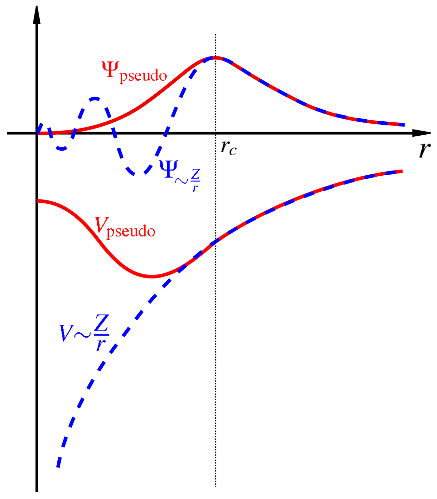

# DFT em Sólidos

A Teoria do Funcional da Densidade é um dos métodos mais utilizados para o cálculo da estrutura eletrônica de sólidos cristalinos. A formulação das equações de Kohn--Sham permanece essencialmente a mesma apresentada para sistemas moleculares, mas a periodicidade do cristal permite explorar a simetria translacional do sistema e utilizar representações particularmente convenientes para cálculos numéricos.

Para um sólido cristalino, o potencial externo produzido pelos núcleos satisfaz

$$
V_{\mathrm{ext}}
(\boldsymbol{r}+\boldsymbol{R})
=
V_{\mathrm{ext}}
(\boldsymbol{r}),
$$

onde $\boldsymbol{R}$ é um vetor da rede de Bravais. Consequentemente, a densidade eletrônica e o potencial efetivo de Kohn--Sham também apresentam a periodicidade da rede,

$$
\rho(\boldsymbol{r}+\boldsymbol{R})
=
\rho(\boldsymbol{r})
$$

e

$$
V_{\mathrm{KS}}
(\boldsymbol{r}+\boldsymbol{R})
=
V_{\mathrm{KS}}
(\boldsymbol{r}).
$$

As equações de Kohn--Sham podem então ser escritas como

$$
\left[
-\frac{1}{2}\nabla^2
+
V_{\mathrm{KS}}(\boldsymbol{r})
\right]
\psi_{n\boldsymbol{k}}(\boldsymbol{r})
=
\varepsilon_{n\boldsymbol{k}}
\psi_{n\boldsymbol{k}}(\boldsymbol{r}),
$$

em unidades atômicas, onde $n$ representa o índice da banda e $\boldsymbol{k}$ é um vetor pertencente à primeira zona de Brillouin.

De acordo com o teorema de Bloch, os orbitais de Kohn--Sham podem ser escritos como

$$
\psi_{n\boldsymbol{k}}(\boldsymbol{r})
=
e^{i\boldsymbol{k}\cdot\boldsymbol{r}}
u_{n\boldsymbol{k}}(\boldsymbol{r}),
$$

onde a função $u_{n\boldsymbol{k}}(\boldsymbol{r})$ possui a periodicidade da rede,

$$
u_{n\boldsymbol{k}}
(\boldsymbol{r}+\boldsymbol{R})
=
u_{n\boldsymbol{k}}(\boldsymbol{r}).
$$

Essa propriedade constitui a base para a representação dos orbitais eletrônicos em termos de ondas planas.

## Base de ondas planas

Como a função periódica $u_{n\boldsymbol{k}}(\boldsymbol{r})$ possui a periodicidade da rede cristalina, ela pode ser expandida em uma série de Fourier formada por vetores $\boldsymbol{G}$ da rede recíproca,

$$
u_{n\boldsymbol{k}}(\boldsymbol{r})
=
\sum_{\boldsymbol{G}}
c_{n\boldsymbol{k}}(\boldsymbol{G})
e^{i\boldsymbol{G}\cdot\boldsymbol{r}}.
$$

Substituindo essa expansão na forma de Bloch, obtemos

$$
\boxed{
\psi_{n\boldsymbol{k}}(\boldsymbol{r})
=
\sum_{\boldsymbol{G}}
c_{n\boldsymbol{k}}(\boldsymbol{G})
e^{i(\boldsymbol{k}+\boldsymbol{G})\cdot\boldsymbol{r}}
}
$$ {#eq-plane-wave-expansion}

Assim, para cada valor de $\boldsymbol{k}$, o orbital de Kohn--Sham é representado por uma combinação linear de ondas planas com vetores de onda

$$
\boldsymbol{k}+\boldsymbol{G}.
$$

As ondas planas constituem uma base particularmente conveniente para sistemas periódicos porque são naturalmente compatíveis com as condições periódicas de contorno e não estão associadas a posições atômicas específicas.

Além disso, a ação do operador de energia cinética sobre uma onda plana é simples,

$$
-\frac{1}{2}\nabla^2
e^{i(\boldsymbol{k}+\boldsymbol{G})\cdot\boldsymbol{r}}
=
\frac{1}{2}
|\boldsymbol{k}+\boldsymbol{G}|^2
e^{i(\boldsymbol{k}+\boldsymbol{G})\cdot\boldsymbol{r}}.
$$

Portanto, o operador de energia cinética é diagonal na representação de ondas planas.

Em contrapartida, funções de onda eletrônicas reais podem apresentar variações muito rápidas próximas aos núcleos. A descrição dessas oscilações utilizando ondas planas exigiria um número muito grande de funções de base. Essa dificuldade motiva o uso de pseudopotenciais ou do método PAW, que serão discutidos posteriormente.

## Energia de corte

A expansão da @eq-plane-wave-expansion contém, formalmente, um número infinito de vetores da rede recíproca. Em um cálculo computacional, essa expansão deve ser truncada.

A energia cinética associada a uma onda plana é

$$
E_{\mathrm{kin}}
=
\frac{1}{2}
|\boldsymbol{k}+\boldsymbol{G}|^2
$$

em unidades atômicas.

Define-se então uma **energia de corte**, $E_{\mathrm{cut}}$, de modo que apenas ondas planas que satisfaçam

$$
\boxed{
\frac{1}{2}
|\boldsymbol{k}+\boldsymbol{G}|^2
\leq
E_{\mathrm{cut}}
}
$$ {#eq-energy-cutoff}

sejam incluídas na expansão.

Geometricamente, essa condição corresponde à inclusão dos vetores $\boldsymbol{k}+\boldsymbol{G}$ localizados dentro de uma esfera no espaço recíproco de raio

$$
G_{\mathrm{max}}
\simeq
\sqrt{2E_{\mathrm{cut}}}.
$$

Quanto maior a energia de corte, maior o número de ondas planas utilizadas na expansão e, consequentemente, maior o custo computacional do cálculo.

Por outro lado, uma energia de corte muito baixa resulta em uma base insuficiente para representar adequadamente os orbitais eletrônicos.

Assim, $E_{\mathrm{cut}}$ constitui um dos principais parâmetros de convergência em cálculos utilizando ondas planas.

::: {.callout-important}
O valor adequado de $E_{\mathrm{cut}}$ não é universal. Ele depende principalmente do pseudopotencial ou do conjunto PAW utilizado e dos elementos químicos presentes no sistema. Dessa forma, a energia de corte deve ser submetida a testes de convergência.
:::

Um teste de convergência pode ser realizado calculando, por exemplo, a energia total para valores crescentes de $E_{\mathrm{cut}}$ até que a variação da propriedade de interesse se torne menor que uma tolerância previamente estabelecida.

## Pseudopotenciais

Os elétrons de um átomo podem ser separados, de maneira aproximada, entre **elétrons de caroço** e **elétrons de valência**.

Os elétrons de caroço estão fortemente ligados ao núcleo e geralmente apresentam pouca participação direta nas ligações químicas. Já os elétrons de valência são responsáveis pela maior parte das propriedades químicas e eletrônicas do material.

Próximo ao núcleo, o forte potencial coulombiano produz funções de onda que apresentam variações espaciais rápidas. Além disso, as funções de onda dos elétrons de valência devem permanecer ortogonais aos estados eletrônicos de caroço, introduzindo oscilações adicionais nessa região.

Uma representação direta dessas funções por ondas planas exigiria energias de corte muito elevadas.

A ideia central de um **pseudopotencial** é substituir o potencial produzido pelo núcleo e pelos elétrons de caroço por um potencial efetivo mais suave que atua apenas sobre os elétrons de valência.

{#fig-pseudo width=80%}

Esquematicamente,

$$
V_{\mathrm{núcleo}}
+
V_{\mathrm{caroço}}
\longrightarrow
V_{\mathrm{pseudo}}.
$$

A função de onda de valência verdadeira é então substituída por uma pseudofunção de onda que reproduz seu comportamento fora de uma determinada região próxima ao núcleo, mas apresenta uma forma mais suave no interior dessa região, como ilustrado na @fig-pseudo.

Como consequência, a pseudofunção de onda pode ser representada utilizando um número significativamente menor de ondas planas.

Uma característica importante dos pseudopotenciais é a **transferibilidade**, isto é, sua capacidade de reproduzir adequadamente as propriedades do átomo em diferentes ambientes químicos.

Entre as classes de pseudopotenciais utilizadas em cálculos de estrutura eletrônica encontram-se os pseudopotenciais de conservação de norma e os pseudopotenciais ultrasoft.

### Pseudopotenciais de conservação de norma

Nos pseudopotenciais de conservação de norma, a pseudofunção de onda é construída de forma que coincida com a função de onda *all-electron* fora de um raio de corte $r_c$.

Além disso, a carga integrada dentro da região do caroço é preservada,

$$
\int_0^{r_c}
|\psi_{\mathrm{pseudo}}(r)|^2
r^2\,dr
=
\int_0^{r_c}
|\psi_{\mathrm{AE}}(r)|^2
r^2\,dr,
$$

onde $\psi_{\mathrm{AE}}$ representa a função de onda *all-electron*.

Essa condição contribui para a transferibilidade do pseudopotencial entre diferentes ambientes químicos.

### Pseudopotenciais ultrasoft

Nos pseudopotenciais **ultrasoft**, a condição de conservação de norma é relaxada. Isso permite construir pseudofunções ainda mais suaves e, consequentemente, utilizar energias de corte menores.

A redução no tamanho da base de ondas planas pode produzir uma economia computacional significativa, especialmente para elementos cujos orbitais de valência apresentam forte localização espacial.

Em contrapartida, a formulação passa a exigir termos adicionais relacionados à reconstrução da densidade eletrônica.

## Projetor de Onda Aumentada (PAW)

O método **Projector Augmented-Wave** (PAW) fornece uma abordagem que combina características dos métodos *all-electron* com a eficiência computacional das representações suaves utilizadas em métodos de pseudopotencial.

A ideia central do PAW consiste em relacionar uma função de onda auxiliar suave,

$$
|\tilde{\psi}\rangle,
$$

à função de onda *all-electron*,

$$
|\psi\rangle,
$$

através de uma transformação linear,

$$
\boxed{
|\psi\rangle
=
\hat{\mathcal{T}}
|\tilde{\psi}\rangle
}
$$

A função auxiliar $\tilde{\psi}$ é suficientemente suave para ser representada eficientemente por uma base de ondas planas.

Nas regiões próximas aos núcleos, denominadas **regiões de aumento**, a função *all-electron* é reconstruída a partir de funções parciais atômicas.

A transformação PAW pode ser escrita de forma esquemática como

$$
|\psi\rangle
=
|\tilde{\psi}\rangle
+
\sum_i
\left(
|\phi_i\rangle
-
|\tilde{\phi}_i\rangle
\right)
\langle
\tilde{p}_i
|
\tilde{\psi}
\rangle,
$$

onde

- $|\phi_i\rangle$ são funções parciais *all-electron*;
- $|\tilde{\phi}_i\rangle$ são funções parciais auxiliares suaves;
- $|\tilde{p}_i\rangle$ são funções projetoras.

Fora das regiões próximas aos núcleos,

$$
\phi_i(\boldsymbol{r})
=
\tilde{\phi}_i(\boldsymbol{r}),
$$

de modo que a correção é necessária apenas dentro das regiões de aumento.

O método PAW permite, portanto, trabalhar numericamente com funções suaves enquanto mantém a possibilidade de reconstruir informações associadas ao comportamento *all-electron*.

Por apresentar boa precisão e custo computacional relativamente baixo, o método PAW é amplamente empregado em cálculos de DFT para sólidos.

## Malhas Monkhorst--Pack

As propriedades eletrônicas de um sólido dependem dos estados associados aos diferentes vetores $\boldsymbol{k}$ da primeira zona de Brillouin.

Grandezas físicas frequentemente envolvem integrais da forma

$$
\frac{1}{\Omega_{\mathrm{BZ}}}
\int_{\mathrm{BZ}}
f(\boldsymbol{k})
\,d\boldsymbol{k},
$$

onde $\Omega_{\mathrm{BZ}}$ representa o volume da primeira zona de Brillouin.

Em um cálculo computacional, essa integral é aproximada por uma soma sobre um conjunto finito de pontos,

$$
\boxed{
\frac{1}{\Omega_{\mathrm{BZ}}}
\int_{\mathrm{BZ}}
f(\boldsymbol{k})
\,d\boldsymbol{k}
\approx
\sum_{\boldsymbol{k}}
w_{\boldsymbol{k}}
f(\boldsymbol{k})
}
$$ {#eq-kpoint-integration}

onde $w_{\boldsymbol{k}}$ representa o peso associado a cada ponto $\boldsymbol{k}$.

Uma das estratégias mais utilizadas para realizar essa amostragem consiste nas **malhas Monkhorst--Pack**, que distribuem os pontos $\boldsymbol{k}$ de maneira regular na zona de Brillouin.

Uma malha pode ser especificada por

$$
N_1\times N_2\times N_3,
$$

onde $N_i$ corresponde ao número de divisões ao longo de cada direção da rede recíproca.

Por exemplo,

$$
4\times4\times4
$$

representa uma malha tridimensional com quatro divisões em cada direção.

O número efetivo de pontos utilizados no cálculo pode ser reduzido utilizando as simetrias do cristal, pois diferentes pontos da zona de Brillouin podem ser equivalentes por operações de simetria.

### Relação entre a célula real e a malha de pontos $\boldsymbol{k}$

Existe uma relação inversa entre o tamanho da célula no espaço real e o tamanho da zona de Brillouin.

De forma qualitativa,

$$
\boxed{
\text{célula real maior}
\quad\Longleftrightarrow\quad
\text{zona de Brillouin menor}
}
$$

Consequentemente, sistemas descritos por células primitivas pequenas geralmente requerem malhas de pontos $\boldsymbol{k}$ relativamente densas.

Por outro lado, supercélulas grandes possuem zonas de Brillouin menores e podem frequentemente ser descritas utilizando malhas menos densas.

No limite de células muito grandes, pode ser suficiente utilizar apenas o ponto

$$
\boldsymbol{k}=\boldsymbol{0},
$$

denominado **ponto $\Gamma$**.

### Convergência com relação à malha de pontos $\boldsymbol{k}$

Assim como ocorre com a energia de corte, a densidade da malha de pontos $\boldsymbol{k}$ deve ser determinada através de testes de convergência.

Por exemplo, pode-se comparar uma sequência de cálculos utilizando

$$
2\times2\times2,
$$

$$
4\times4\times4,
$$

$$
6\times6\times6,
$$

$$
8\times8\times8,
$$

até que a energia total ou outra propriedade de interesse apresente variações suficientemente pequenas.

Materiais metálicos geralmente exigem uma amostragem mais densa da zona de Brillouin devido à presença de estados eletrônicos próximos ao nível de Fermi.

## Cálculo SCF em sólidos

As equações de Kohn--Sham dependem da própria densidade eletrônica através dos potenciais de Hartree e de troca e correlação. Por esse motivo, devem ser resolvidas de maneira autoconsistente.

O procedimento é semelhante ao ciclo SCF utilizado em sistemas moleculares, mas, em sólidos, as equações devem ser resolvidas para um conjunto de pontos $\boldsymbol{k}$ da zona de Brillouin.

Partimos de uma estimativa inicial para a densidade,

$$
\rho^{(0)}(\boldsymbol{r}).
$$

A partir dessa densidade, construímos o potencial efetivo de Kohn--Sham,

$$
V_{\mathrm{KS}}^{(0)}(\boldsymbol{r})
=
V_{\mathrm{ext}}(\boldsymbol{r})
+
V_{\mathrm{H}}[\rho^{(0)}](\boldsymbol{r})
+
V_{\mathrm{XC}}[\rho^{(0)}](\boldsymbol{r}).
$$

Em seguida, resolvemos as equações

$$
\hat{H}_{\mathrm{KS}}^{(0)}
\psi_{n\boldsymbol{k}}^{(0)}
=
\varepsilon_{n\boldsymbol{k}}^{(0)}
\psi_{n\boldsymbol{k}}^{(0)}
$$

para os diferentes pontos $\boldsymbol{k}$ utilizados na amostragem da zona de Brillouin.

A partir dos orbitais obtidos, uma nova densidade é construída,

$$
\boxed{
\rho^{(1)}(\boldsymbol{r})
=
\sum_{\boldsymbol{k}}
w_{\boldsymbol{k}}
\sum_n
f_{n\boldsymbol{k}}
\left|
\psi_{n\boldsymbol{k}}(\boldsymbol{r})
\right|^2
}
$$ {#eq-density-periodic}

onde $f_{n\boldsymbol{k}}$ representa a ocupação do estado eletrônico $(n,\boldsymbol{k})$.

A nova densidade pode então ser combinada com a densidade da iteração anterior,

$$
\rho_{\mathrm{in}}^{(n+1)}
=
(1-\alpha)
\rho_{\mathrm{in}}^{(n)}
+
\alpha
\rho_{\mathrm{out}}^{(n)},
$$

onde $\alpha$ é um parâmetro de mistura.

O processo é repetido até que uma condição de convergência seja satisfeita, por exemplo,

$$
|E^{(n+1)}-E^{(n)}|
<
\varepsilon_E,
$$

e/ou

$$
\left\|
\rho^{(n+1)}
-
\rho^{(n)}
\right\|
<
\varepsilon_\rho.
$$

O ciclo autoconsistente pode ser representado esquematicamente por

$$
\rho^{(0)}
\longrightarrow
V_{\mathrm{KS}}
\longrightarrow
\psi_{n\boldsymbol{k}}
\longrightarrow
\rho^{(1)}
\longrightarrow
V_{\mathrm{KS}}
\longrightarrow
\cdots
$$

até que a densidade eletrônica e a energia total estejam convergidas.

### Ocupação dos estados

Em isolantes e semicondutores a separação entre bandas ocupadas e desocupadas é normalmente bem definida.

Em metais, entretanto, existem estados próximos ao nível de Fermi cuja ocupação varia rapidamente com a energia. Isso pode dificultar a integração numérica sobre a zona de Brillouin e a convergência do ciclo SCF.

Uma estratégia comum consiste em utilizar ocupações suavizadas, ou *smearing*, em torno do nível de Fermi.

Por exemplo, utilizando a distribuição de Fermi--Dirac,

$$
f(\varepsilon)
=
\frac{1}
{
e^{(\varepsilon-\mu)/(k_BT)}
+
1
},
$$

onde $\mu$ representa o potencial químico eletrônico.

O parâmetro utilizado para controlar o *smearing* deve ser escolhido cuidadosamente, pois valores excessivamente elevados podem modificar artificialmente as propriedades eletrônicas do sistema.

### Convergência dos cálculos

Um cálculo de DFT em sólidos deve ser acompanhado de testes sistemáticos de convergência numérica.

Entre os principais parâmetros encontram-se:

- a energia de corte $E_{\mathrm{cut}}$;
- a densidade da malha de pontos $\boldsymbol{k}$;
- o tamanho da célula ou supercélula;
- o número de bandas incluídas no cálculo;
- os parâmetros utilizados na ocupação dos estados eletrônicos.

O objetivo de um teste de convergência não é obter parâmetros numericamente infinitos, mas identificar valores para os quais a propriedade física de interesse apresenta variações menores que a precisão desejada.

Por exemplo, para a energia de corte podemos avaliar

$$
\Delta E(E_{\mathrm{cut}})
=
E(E_{\mathrm{cut}})
-
E(E_{\mathrm{cut}}^{\mathrm{ref}}),
$$

e aumentar progressivamente $E_{\mathrm{cut}}$ até que

$$
|\Delta E|
<
\varepsilon,
$$

onde $\varepsilon$ representa a tolerância escolhida.

O mesmo princípio deve ser utilizado para determinar uma malha adequada de pontos $\boldsymbol{k}$.

::: {.callout-important}
Os parâmetros de convergência devem ser avaliados para a propriedade que será estudada. Um valor de $E_{\mathrm{cut}}$ ou uma malha de pontos $\boldsymbol{k}$ suficiente para convergir a energia total pode não ser necessariamente suficiente para convergir forças, tensões, diferenças de energia ou outras propriedades.
:::