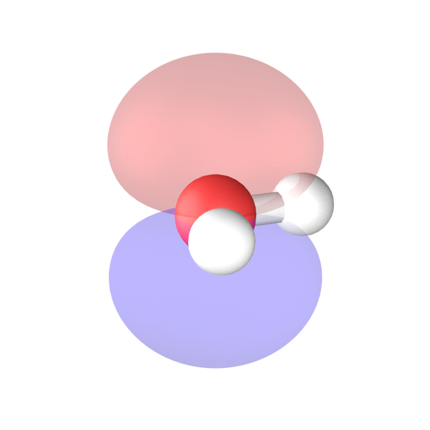
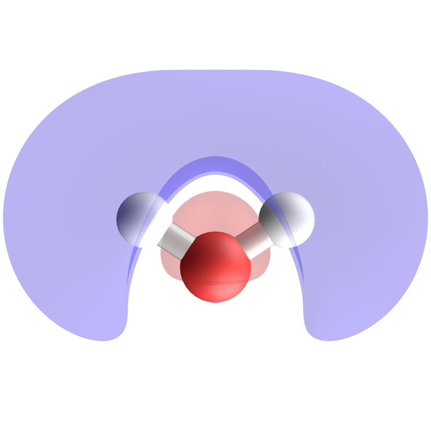
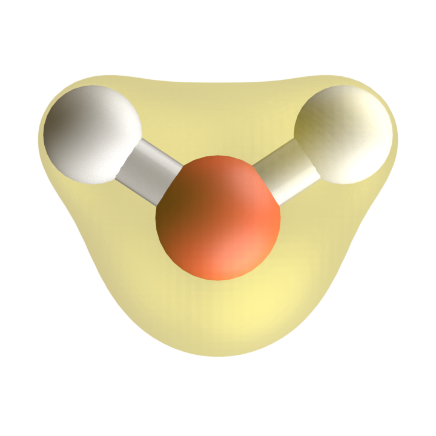

# PySCF

Nesse capítulo vamos apresentar o pacote PySCF, que é uma biblioteca de código aberto para cálculos de química quântica. O PySCF é escrito em Python e C, e oferece uma ampla gama de funcionalidades para cálculos de estrutura eletrônica, incluindo métodos de Hartree-Fock, DFT, e métodos pós-Hartree-Fock.

Seu website oficial é [https://pyscf.org](https://pyscf.org), onde você pode encontrar documentação detalhada, tutoriais e exemplos de uso.


## Instalação

A instalação do PySCF pode ser feita facilmente usando o gerenciador de pacotes `pip`. Para instalar o PySCF, você pode executar o seguinte comando no terminal:

```bash
pip install pyscf
```

## Criando uma molécula

No PySCF, você pode criar uma molécula usando a classe `Mole` do módulo `gto`. 

A seguir, apresentamos um exemplo de como criar uma molécula de hidrogênio (H2) com a base `sto-3g`:

```python
from pyscf import gto

mol_h2 = gto.M(
    atom = [['H',(0, 0, 0)], ['H',(1, 0, 0)]],
    basis = 'sto-3g')
```

Outro exemplo é a criação de uma molécula de água (H2O) com a base `6-31g`:

```python
mol_h2o = gto.M(
    atom = [['O',(0, 0, 0)], ['H',(0.7586, 0.5043, 0)], ['H',(-0.7586, 0.5043, 0)]],
    basis = '6-31g')
```

As unidades de distância são em Angstroms, e a base especificada é usada para os cálculos eletrônicos.

## Cálculos Auto-Consistentes de Energia 

::: {.callout-tip}

Os exemplos contidos nesta seção podem ser executados em um ambiente de notebook, como o Jupyter Notebook ou Google Colab. Para executar este notebook no Google Colab, você pode clicar no link:
<a href="https://colab.research.google.com/github/elvissoares/COQ875-QuimicaQuantica/blob/2026_2/notebooks/1-intro_pyscf.ipynb" target="_parent"></a>

:::

### Cálculos de Hartree-Fock

No PySCF, você pode realizar um cálculo de Hartree-Fock usando a classe `RHF` (Restricted Hartree-Fock) do módulo `scf`. 

A seguir, apresentamos um exemplo de como realizar um cálculo de Hartree-Fock para a molécula de hidrogênio (H2):

```python
from pyscf import scf

rhf_h2 = scf.RHF(mol_h2)
e_h2 = rhf_h2.kernel()
```
com `e_h2` contendo o valor da energia de Hartree-Fock para a molécula de hidrogênio (em unidades atômicas de energia, Hartree) e o output do cálculo será algo como:

```
converged SCF energy = -1.06610864931794
```

Para a molécula de água (H2O), o cálculo de Hartree-Fock seria realizado da seguinte forma:
```python
rhf_h2o = scf.RHF(mol_h2o)
e_h2o = rhf_h2o.kernel()
```
cujo output será algo como:
```
converged SCF energy = -75.982010306225
```

### Cálculos de DFT

No PySCF, você pode realizar um cálculo de DFT usando a classe `RKS` (Restricted Kohn-Sham) do módulo `scf`. 

A seguir, apresentamos um exemplo de como realizar um cálculo de DFT para a molécula de água (H2O) usando o funcional B3LYP:

```python
from pyscf import scf

rks_h2o = scf.RKS(mol_h2o)
rks_h2o.xc = 'b3lyp'
e_h2o_dft = rks_h2o.kernel()
```
cujo output será algo como:
```
converged SCF energy = -76.3780493873302
```

## Orbitais moleculares e Densidade Eletrônica

::: {.callout-tip}

Os exemplos contidos nesta seção podem ser executados em um ambiente de notebook, como o Jupyter Notebook ou Google Colab. Para executar este notebook no Google Colab, você pode clicar no link:
<a href="https://colab.research.google.com/github/elvissoares/COQ875-QuimicaQuantica/blob/2026_2/notebooks/2-orbitais_pyscf.ipynb" target="_parent"></a>

:::

### Orbitais Moleculares

No PySCF, você pode acessar os orbitais moleculares (MOs) e suas energias após a convergência do cálculo de Hartree-Fock ou DFT.

```python
from pyscf.tools import cubegen # para exportar aquivos cube

hartree_to_ev = 27.2114 # Conversão de Hartree para eV

# Exportanto os 8 primeiros orbitais moleculares
for i in range(8):
    cubegen.orbital(mol_h2o, f'h2o_mo_id{i+1}.cube', rhf_h2o.mo_coeff[:,i])
    print(f"MO {i+1} energy: {rhf_h2o.mo_energy[i]*hartree_to_ev} eV")
```

cujo output será algo como:
```
MO 1 energy: -559.0648505073075 eV
MO 2 energy: -37.35824208425234 eV
MO 3 energy: -20.472436335886574 eV
MO 4 energy: -15.010271665557314 eV
MO 5 energy: -13.620368424502718 eV
MO 6 energy: 5.892416334684666 eV
MO 7 energy: 8.489434880237042 eV
MO 8 energy: 30.794397465074287 eV
```
e os arquivos `h2o_mo_id1.cube`, `h2o_mo_id2.cube`, ..., `h2o_mo_id8.cube` serão gerados, podendo ser visualizados em softwares de visualização molecular, como o VESTA.

{#fig-water-mo-homo width=40%}

{#fig-water-mo-lumo width=40%}

Outro comando útil é o método `analyze()` que fornece informações detalhadas sobre a densidade eletrônica, populações de Mulliken, energias dos orbitais moleculares, entre outros dados:
```python
rhf_h2o.analyze()
```

cujo output será algo como:
```
**** MO energy ****
MO #1   energy= -20.5452439237712  occ= 2
MO #2   energy= -1.37288938034252  occ= 2
MO #3   energy= -0.752347778353432 occ= 2
MO #4   energy= -0.551617030566502 occ= 2
MO #5   energy= -0.500539054385394 occ= 2
MO #6   energy= 0.216542196825032  occ= 0
MO #7   energy= 0.311980819812176  occ= 0
MO #8   energy= 1.13167266164454   occ= 0
MO #9   energy= 1.16714239571367   occ= 0
MO #10  energy= 1.18839667472837   occ= 0
MO #11  energy= 1.21799463765162   occ= 0
MO #12  energy= 1.40648729738536   occ= 0
MO #13  energy= 1.67628216207442   occ= 0
 ** Mulliken atomic charges  **
charge of    0O =     -0.66401
charge of    1H =      0.33200
charge of    2H =      0.33200
Dipole moment(X, Y, Z, Debye):  0.00000,  2.45844, -0.00000
((array([1.99998907e+00, 1.59484969e+00, 3.37983153e-03, 1.32200180e+00,
         1.73548741e+00, 1.99560867e+00, 6.39191091e-03, 1.90976617e-03,
         4.39132862e-03, 6.46096227e-01, 2.18990368e-02, 6.46096227e-01,
         2.18990368e-02]),
  array([-0.66400947,  0.33200474,  0.33200474])),
 array([ 1.25552744e-14,  2.45844212e+00, -1.20462032e-16]))
```

### Densidade eletrônica

No PySCF, você pode calcular a densidade eletrônica usando o método `get_density()` do objeto de cálculo SCF. A densidade eletrônica é uma função que descreve a distribuição de elétrons na molécula.
```python
cubegen.density(mol_h2o, 'h2o_den.cube', rhf_h2o.make_rdm1())
```

cujo output será um arquivo `h2o_den.cube` que pode ser visualizado em softwares de visualização molecular, como o VESTA.


{#fig-water-den width=40%}

### Potencial eletrostático molecular

No PySCF, você pode calcular o potencial eletrostático molecular (MEP) usando o método `get_mep()` do objeto de cálculo SCF. O MEP é uma função que descreve a distribuição do potencial elétrico gerado pelos elétrons e núcleos da molécula.
```python
cubegen.mep(mol_h2o, 'h2o_pot.cube', rhf_h2o.make_rdm1())
```
cujo output será um arquivo `h2o_pot.cube` que pode ser visualizado em softwares de visualização molecular, como o VESTA.


