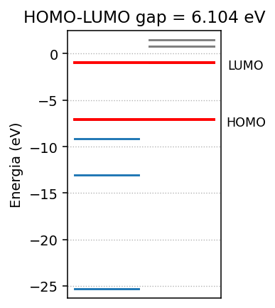
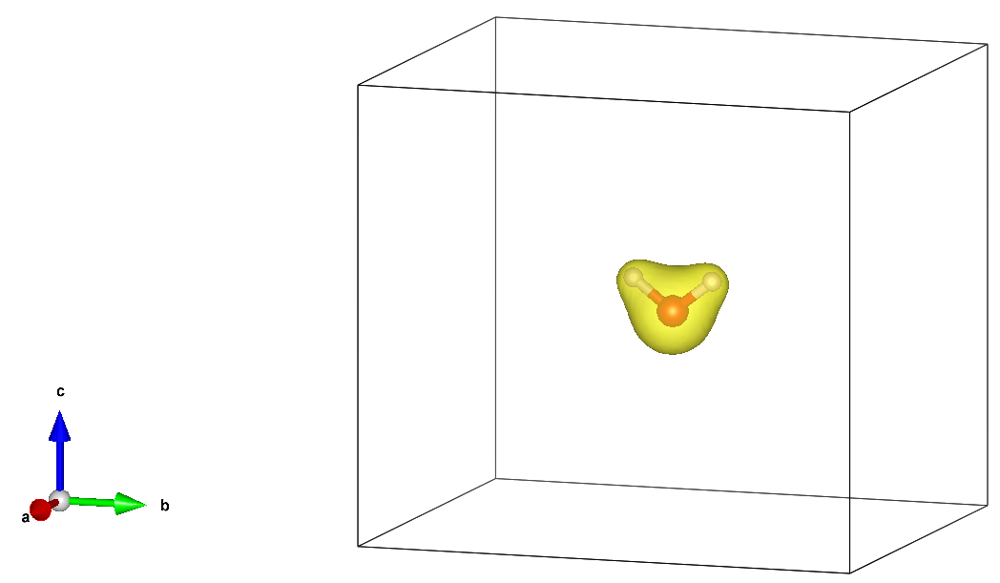
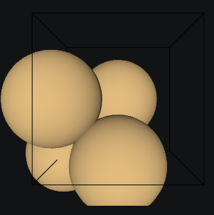
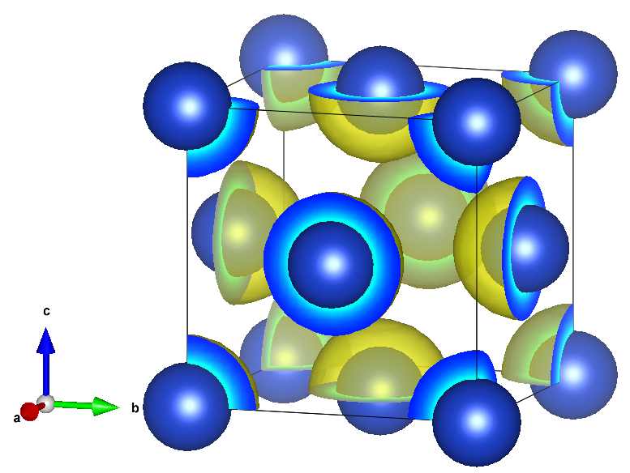

# VASP

Nesse capítulo vamos apresentar o pacote VASP (Vienna Ab initio Simulation Package), que é um software comercial amplamente utilizado para cálculos de estrutura eletrônica e simulações de materiais. O VASP é baseado em métodos de DFT (Density Functional Theory) e oferece uma ampla gama de funcionalidades para cálculos de propriedades eletrônicas, estruturais e dinâmicas de materiais.

## Instalação no Linux

Para instalar o VASP no Linux, siga os passos abaixo:

1. **Obtenha uma licença do VASP**: O VASP é um software comercial, portanto, você precisará adquirir uma licença para usá-lo. Visite o site oficial do VASP ([https://www.vasp.at/](https://www.vasp.at/)) para obter informações sobre como adquirir uma licença.

2. **Baixe o código-fonte do VASP**: Após obter a licença, você poderá baixar o código-fonte do VASP a partir do site oficial. Certifique-se de baixar a versão compatível com o seu sistema operacional.

3. **Instale as dependências necessárias**: Antes de compilar o VASP, você precisará instalar algumas dependências, como compiladores Fortran e C, bibliotecas MPI e BLAS/LAPACK. 

Você pode instalar essas dependências usando o gerenciador de pacotes do Ubuntu:
```bash
sudo apt update
sudo apt install rsync make build-essential g++ gfortran libopenblas-dev libopenmpi-dev libscalapack-openmpi-dev libfftw3-dev libhdf5-openmpi-dev
```

ou no caso do Fedora:
```bash
sudo dnf install rsync gcc gcc-c++ gcc-gfortran openblas-devel openmpi-devel scalapack-openmpi-devel fftw-devel hdf5-openmpi-devel
```
e modifique o arquivo `~/.bashrc` para incluir as variáveis de ambiente do OpenMPI:
```bash
export PATH=/usr/lib64/openmpi/bin:$PATH
export LD_LIBRARY_PATH=/usr/lib64/openmpi/lib:$LD_LIBRARY_PATH
```
e recarregue o arquivo `~/.bashrc`:
```bash
source ~/.bashrc
```

4. **Compile o VASP**: Navegue até o diretório onde você decompactou o código-fonte do VASP e siga as seguintes instruções de compilação.

4.1. Crie um arquivo de configuração `makefile.include` com as opções de compilação apropriadas para o seu sistema. Você pode encontrar exemplos de arquivos de configuração no diretório `arch` do código-fonte do VASP.
```bash
cp arch/makefile.include.gnu_omp makefile.include
```

4.2. Dentro do arquivo `makefile.include`, você pode ajustar as opções de compilação, como o compilador Fortran, flags de otimização e bibliotecas a serem usadas.

- Modifique a versão do compilador GCC que você deve usar para compilar o VASP. Nesse caso iremos modificar a linha `CFLAGS_LIB` para usar a versão `gnu17` do compilador GCC:
```makefile
CFLAGS_LIB  = -O -std=gnu17
```

- Comente a linha `OPENBLAS_ROOT` e adicione a linha `BLASPACK` como abaixo:
```makefile
# BLAS and LAPACK (mandatory)
#OPENBLAS_ROOT ?= /path/to/your/openblas/installation
BLASPACK    = -lopenblas
```

- Comente a linha `SCALAPACK_ROOT` e adicione a linha `SCALAPACK` como abaixo:
```makefile
# scaLAPACK (mandatory)
#SCALAPACK_ROOT ?= /path/to/your/scalapack/installation
SCALAPACK   = -lscalapack
```

- Comente a linha `FFTW_ROOT` e adicione a linha `LLIBS` e `INCS` como abaixo:
```makefile
# FFTW (mandatory)
#FFTW_ROOT  ?= /path/to/your/fftw/installation
LLIBS      += -lfftw3 -lfftw3_omp
INCS       += -I/usr/include
```

- Adicione as seguintes linhas para habilitar o suporte ao HDF5 (opcional, mas fortemente recomendado):
```makefile
# HDF5-support (optional but strongly recommended)
CPP_OPTIONS+= -DVASP_HDF5
#HDF5_ROOT  ?= /path/to/your/hdf5/installation
LLIBS      += -lhdf5_fortran
INCS       += -I/usr/lib64/gfortran/modules/openmpi/
```

Salve o arquivo `makefile.include` após fazer as alterações e compile o VASP executando o comando 
```bash
make DEPS=1 -j
```

5. **Conferindo instalação**: Após a compilação bem-sucedida, você pode conferir se o executável do VASP foi gerado corretamente no diretório `bin` do código-fonte. 

6. **Configure o ambiente**: Para facilitar a execução do VASP, você pode adicionar o diretório `bin` do código-fonte do VASP ao seu PATH. Adicione a seguinte linha ao seu arquivo `~/.bashrc`:
```bash
export PATH=/path/to/vasp/bin:$PATH
```

7. **Instalando pseudopotenciais**: O VASP utiliza pseudopotenciais para representar os núcleos dos átomos. Você precisará baixar os pseudopotenciais apropriados para os elementos que deseja simular. Os pseudopotenciais podem ser encontrados no site oficial do VASP ou em repositórios de terceiros. 

- Crie uma pasta `pp` dentro da pasta `/path/to/vasp`
```bash
mkdir -p pp
```

- Copie os arquivos de pseudopotenciais para essa pasta
```bash
cp ~/Downloads/potpaw_LDA.64.tgz pp/. && cp ~/Downloads/potpaw_PBE.64.tgz pp/.
```


- Entre na pasta `pp` e crie as seguintes pastas
```bash
cd pp && mkdir potpaw potpaw_PBE
```

- Descompacte o arquivo `potpaw_LDA.64.tgz` para dentro da pasta `potpaw`
```bash
tar -xvzf potpaw_LDA.64.tgz -C potpaw
```

- Descompacte o arquivo `potpaw_PBE.64.tgz` para dentro da pasta `potpaw_PBE`
```bash
tar -xvzf potpaw_PBE.64.tgz -C potpaw_PBE
```

Agora você possui os arquivos de pseudopotenciais instalados nessas pastas.

## Instalação no Windows 11

Para instalar o VASP no Windows 11, você pode usar o Windows Subsystem for Linux (WSL) para criar um ambiente Linux dentro do Windows. Siga os passos abaixo:
1. **Habilite o WSL**: Abra o PowerShell como administrador e execute o seguinte comando para habilitar o WSL:
```powershell
wsl --install
```

2. **Instale uma distribuição Linux**: Após habilitar o WSL, você precisará instalar uma distribuição Linux, como Ubuntu 24, a partir da Microsoft Store. 

3. **Siga os passos de instalação no Ubuntu 24**: Após instalar a distribuição Linux, abra o terminal do WSL e siga os mesmos passos de instalação descritos na seção "Instalação no Ubuntu 24" para instalar o VASP dentro do ambiente Linux.


## Instalação do ASE

O ASE (Atomic Simulation Environment) é uma biblioteca Python que facilita a configuração, execução e análise de simulações de materiais. Ele pode ser usado em conjunto com o VASP para automatizar tarefas e simplificar o fluxo de trabalho.

Para instalar o ASE (Atomic Simulation Environment), você pode usar o gerenciador de pacotes `pip`. Execute o seguinte comando no terminal:
```bash
pip install ase
```

## Configuração do ASE com o VASP

Para configurar o ASE para trabalhar com o VASP, siga os passos abaixo:
1. **Verifique a instalação do ASE**: Certifique-se de que o ASE foi instalado corretamente executando o seguinte comando no terminal:
```bash
python -c "import ase; print(ase.__version__)"
```

2. **Configure o caminho do VASP**: O ASE precisa saber onde o executável do VASP está localizado. Você pode definir a variável de ambiente `ASE_VASP_COMMAND` para apontar para o executável do VASP. No Linux, você pode adicionar a seguinte linha ao seu arquivo `~/.bashrc`:
```bash
export ASE_VASP_COMMAND="mpirun -np 1 vasp_std"
```

3. **Especificando pasta com pseudopotenciais**: O ASE precisa saber onde os arquivos de pseudopotenciais do VASP estão localizados. Você pode definir a variável de ambiente `VASP_PP_PATH` para apontar para o diretório que contém os pseudopotenciais. No Linux, você pode adicionar a seguinte linha ao seu arquivo `~/.bashrc`:
```bash
export VASP_PP_PATH =/path/to/vasp/pp
```

## Criando uma molécula com o ASE

::: {.callout-tip}

Os exemplos contidos nesta seção podem ser executados em um ambiente de notebook, como o Jupyter Notebook. Para executar este notebook no seu computador, você pode clicar no link: [Abrir no GitHub](https://github.com/elvissoares/COQ875-QuimicaQuantica/blob/2026_2/notebooks/3-intro_vasp.ipynb)

:::

No ASE, você pode criar uma molécula usando a classe `Atoms`. A seguir, apresentamos um exemplo de como criar uma molécula de água (H2O):
```python
from ase import Atoms, Atom

h2omol = Atoms([Atom('O', [0, 0, 0]),
                Atom('H', [0.0, -0.760265, 0.588373]),
                Atom('H', [0.0, 0.760265, 0.588373])])
```

que pode ser visualizada usando o método `view` do ASE:
```python
from ase.visualize import view
view(h2omol)
```
cujo output será uma janela interativa mostrando a molécula de água em 3D, permitindo que você gire, amplie e explore a estrutura da molécula.

Outra opção é usar o visualizador `x3d` do ASE, que permite visualizar a molécula em um navegador web. Para isso, você pode executar o seguinte comando:
```python
view(h2omol, viewer='x3d')
```

## Cálculos Auto-Consistentes de Energia no VASP com o ASE

No caso de moléculas devemos definir a célula de simulação para evitar interações entre imagens periódicas da molécula. Por exemplo, podemos definir uma célula cúbica que tenha um vácuo de 4 Å em torno da molécula de água com condição de contorno periódico:
```python
h2omol.center(vacuum=4.0) # caixa com 4 Angstroms de vácuo 
h2omol.pbc = True # condição de contorno periódica
```

E podemos importar a calculadora do VASP do ASE e definir os parâmetros de cálculo:
```python
from ase.calculators.vasp import Vasp

calc = Vasp(xc='PBE',                                   # funcional
            encut=350,     # safe default for PAW-PBE sets
            kpts=[1, 1, 1],gamma=True,  # Somente pontos Gamma em Fourier
            ibrion=-1,       # Calcula SCF 
            directory='water' # pasta em que os cálculos serão armazenados
        )
```

E devemos anexar a calculadora à molécula de água:
```python
h2omol.calc = calc
```

A energia total da molécula de água pode ser obtida com o método `get_potential_energy()`:
```python
E_h2o = h2omol.get_potential_energy()
print(f'Energia total da molécula de água: {E_h2o:.3f} eV')
```
cujo o output será
```
Energia total da molécula de água: -14.215 eV
```

## Orbitais moleculares e Densidade Eletrônica

### Orbitais moleculares

Podemos determinar os orbitais moleculares da molécula de água usando o VASP e o ASE. Para isso, podemos usar a função `calc.get_eigenvalues()` para obter os valores próprios (energias) dos orbitais moleculares. Por exemplo:
```python
eigenvalues = h2omol.calc.get_eigenvalues()

print("Valores próprios (energias) dos orbitais moleculares:")
for i, energy in enumerate(eigenvalues):
    print(f'Orbital {i+1}: {energy:.3f} eV')
```

cujo o output será 
```
Valores próprios (energias) dos orbitais moleculares:
Orbital 1: -25.308 eV
Orbital 2: -13.063 eV
Orbital 3: -9.152 eV
Orbital 4: -7.093 eV
Orbital 5: -0.989 eV
Orbital 6: 0.791 eV
Orbital 7: 0.824 eV
Orbital 8: 1.509 eV
```

Usando a função `calc.get_occupation_numbers()`, podemos obter os números de ocupação dos orbitais moleculares:
```python
occupations = h2omol.calc.get_occupation_numbers()

print("Números de ocupação dos orbitais moleculares:")
for i, occ in enumerate(occupations):
    print(f'Orbital {i+1}: {occ:.0f}')
```
cujo o output será
```
Números de ocupação dos orbitais moleculares:
Orbital 1: 2
Orbital 2: 2
Orbital 3: 2
Orbital 4: 2
Orbital 5: 0
Orbital 6: 0
Orbital 7: 0
Orbital 8: 0
```

A função `calc.get_homo_lumo()` permite que determinemos as energias dos orbitais HOMO (Highest Occupied Molecular Orbital) e LUMO (Lowest Unoccupied Molecular Orbital):
```python
homo, lumo = h2omol.calc.get_homo_lumo()
gap = (lumo - homo)

print(f'HOMO: {homo:.3f} eV')
print(f'LUMO: {lumo:.3f} eV')
print(f"Diferença: {gap:.3f} eV")
```
cujo o output será
```
HOMO: -7.093 eV
LUMO: -0.989 eV
Diferença: 6.104 eV
```

De forma mais elegante podemos visualizar
```python
import numpy as np 
import matplotlib.pyplot as plt

eigenvalues = h2omol.calc.get_eigenvalues()
occupations = h2omol.calc.get_occupation_numbers()

homo, lumo = h2omol.calc.get_homo_lumo()
gap = (lumo - homo)

# Sort for a clean plot
order = np.argsort(eigenvalues)
eigenvalues, occupations = eigenvalues[order], occupations[order]

# Split occupied / unoccupied
occ_mask = occupations > 0.5
E_occ = eigenvalues[occ_mask]
E_unocc = eigenvalues[~occ_mask]

# --- plotting ---
plt.figure(figsize=(3, 3.2), dpi=140)

# Sticks for occupied and unoccupied states
for E in E_occ:
    plt.plot([0, 0.6], [E, E],color='C0')
for E in E_unocc:
    plt.plot([0.7, 1.3], [E, E],color='grey')

# Highlight HOMO / LUMO
plt.plot([0, 1.3],[homo, homo],color='red', linewidth=2)
plt.plot([0, 1.3],[lumo, lumo],color='red', linewidth=2)

# Annotate
plt.text(1.6,homo-1, 'HOMO', ha='center', va='bottom', fontsize=9)
plt.text(1.6, lumo-1, 'LUMO', ha='center', va='bottom', fontsize=9)
plt.title(f'HOMO-LUMO gap = {gap:.3f} eV')

plt.ylabel('Energia (eV)')
plt.xticks([])          # hide y-axis (pure spectrum)
plt.ylim(min(eigenvalues)-1, max(eigenvalues)+1)
plt.grid(True, axis='y', linestyle=':', linewidth=0.7)
plt.tight_layout()
```

cujo output será uma figura do tipo
{#fig-homolumo-h2o}

### Densidade eletrônica

A densidade eletrônica calculada pelo VASP está contida em um arquivo denominado `CHGCAR`. Esse arquivo está entre os arquivos na pasta especificada no `calc` que denominamos `water`. Ele pode ser visualizado com programas de visualização de densidade eletrônica, como VESTA.

{#fig-densidade-h2o width="80%"}

## Criando um Sólido cristalino com ASE

Criando um cristal de cobre (Cu) usando o modulo `bulk` do ASE na forma 
```python
from ase.build import bulk

a = 3.5
Cu_crystal = bulk("Cu", crystalstructure="fcc", a=a, cubic=True)

print(Cu_crystal)
print("Cell:", Cu_crystal.get_cell())
print("Positions:\n", Cu_crystal.get_positions())
```
cujo output será
```
Atoms(symbols='Cu4', pbc=True, cell=[3.5, 3.5, 3.5])
Cell: Cell([3.5, 3.5, 3.5])
Positions:
 [[0.   0.   0.  ]
 [0.   1.75 1.75]
 [1.75 0.   1.75]
 [1.75 1.75 0.  ]]
```

e visualizando com o método `view` do ASE:
```python
from ase.visualize import view

view(Cu_crystal)    
```
temos

{#fig-cu-crystal width="60%"}

## Calculando a energia total de um sólido cristalino com o VASP e o ASE

Criando a calculadora do VASP com o ASE:
```python
calc = Vasp(directory='Cu',
                xc='PBE',
                kpts=[6, 6, 6],  # specifies k-points
                encut=350,
            )
```
e anexando a calculadora ao cristal de cobre:
```python
Cu_crystal.calc = calc
```
podemos calcular a energia total do cristal de cobre com o método `get_potential_energy()`:
```python
E_Cu = Cu_crystal.get_potential_energy()

print(f'Energia total do cristal de cobre: {E_Cu:.3f} eV')
```
cujo output será
```
Energia total do cristal de cobre: -14.603 eV
```

A energia por átomo do cristal de cobre pode ser obtida dividindo a energia total pelo número de átomos no cristal:
```python
E_per_atom = E_Cu / len(Cu_crystal)

print(f'Energia por átomo do cristal de cobre: {E_per_atom:.3f} eV')
```
cujo output será
```
Energia por átomo do cristal de cobre: -3.651 eV
```

## Densidade eletrônica de um sólido cristalino

Podemos visualizar a densidade eletrônica do cristal de cobre usando o arquivo `CHGCAR` gerado pelo VASP. Para isso, podemos usar o programa VESTA para abrir o arquivo `CHGCAR` e visualizar a densidade eletrônica em 3D.

{#fig-densidade-cu width="80%"}