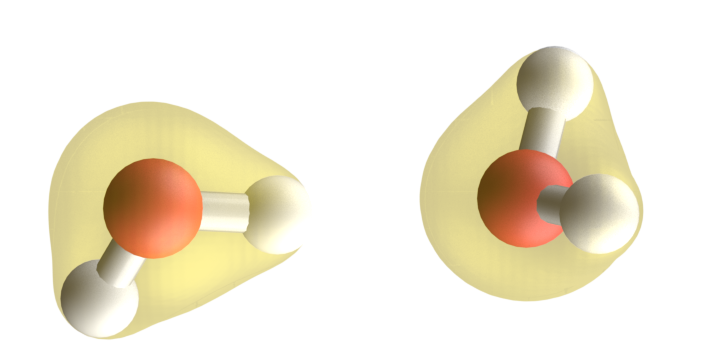

# Cálculos de Interações entre Moléculas

Para interação entre moléculas, é preciso considerar as interações dispersivas conforme discutimos no capítulo de DFT. 

Essas interações podem ser computadas pelas correções DFT-D, conforme @sec-DFT-D, que são implementadas em diversos pacotes de química quântica.


## Cálculos de Interações Moleculares usando PySCF

::: {.callout-tip}
Para executar este notebook no Google Colab, você pode clicar no link: [](https://colab.research.google.com/github/elvissoares/COQ875-QuimicaQuantica/blob/2026_2/notebooks/6-interacao_pyscf.ipynb)

:::

Para utilizar as correções DFT-D no PySCF, é necessário instalar o pacote `pyscf-dispersion`. Você pode instalar este pacote usando o pip:

```bash
pip install pyscf-dispersion
```

{#fig-dimer-den width=60%} 

Para um dímero de água, podemos calcular a energia de interação usando o método DFT com correções de dispersão. Abaixo está um exemplo de como fazer isso:

```python
import pyscf

# dímero de água
mol = pyscf.M(
    atom = [['H', (-0.6305, -0.8758, 0.2588)], 
            ['O', (-1.5614, -0.8255, 0.5368)], 
            ['H', (-1.9991, -1.5191, 0.0288)], 
            ['O', (1.2821, -0.7524, -0.1108)], 
            ['H', (1.5168, 0.1326, -0.4203)], 
            ['H', (1.7973, -0.8645, 0.6993)]],
    basis = 'aug-cc-pvdz')

# cálculo de energia total usando DFT com B3LYP (sem correção de dispersão)
from pyscf.dft import KS

mf = mol.KS()
mf.xc = 'b3lyp' # B3LYP
mf.kernel()

Edft = mf.e_tot
print(f"Energia total (DFT): {Edft:.6f} Hartree")

## adicionando a correção de dispersão D3 com amortecimento de Becke-Johnson
mf.disp = 'd3bj' 
mf.kernel()

Edftd = mf.e_tot
print(f"Energia total (DFT-D): {Edftd:.6f} Hartree")

## cálculando a diferença de energia entre DFT e DFT-D

print(f"Correção dispersiva da energia: {(Edftd-Edft):.6f} Hartree")
```

cujo output será

```
Energia total (DFT): -152.896758 Hartree
Energia total (DFT-D): -152.898907 Hartree
Correção dispersiva da energia: -0.002149 Hartree
```

Podemos comparar esse resultado com o valor reportado por @Temelso2011, que obtiveram uma energia de $-152.779123$ Ha empregando o método RI-MP2 com correção CCSD(T). A boa concordância entre os resultados indica que o cálculo DFT-D reproduz adequadamente a energia do dímero de água, sugerindo também que a contribuição da correção de dispersão para essa interação é relativamente pequena.
