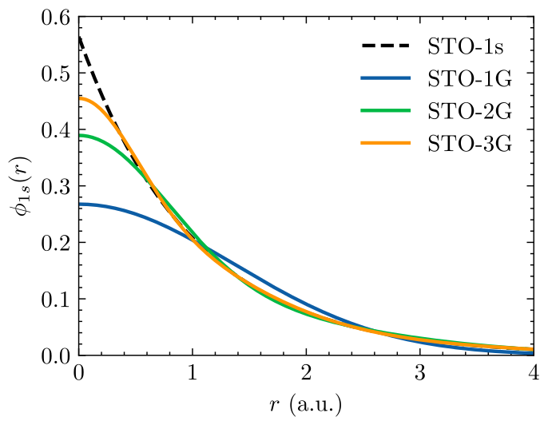

# Conjuntos de bases {#sec-bases}

Podemos escrever os orbitais moleculares de 1 elétron, $\varphi_k(\boldsymbol{r})$, em termos de um conjunto de base $\phi_\mu$ tal que
$$
\varphi_k(\boldsymbol{r}) = \sum_{\mu=1}^B c_{\mu k} \phi_\mu(\boldsymbol{r})
$${#eq-conjunto_de_base}
sendo $B$ o número de elementos do conjunto de base. Embora os spin-orbitais sejam ortonormais, tal que $\braket{\varphi_i|\varphi_j} = \delta_{ij}$, as funções da base podem não ser. De fato, podemos escolher elementos da base como sendo normalizados, i.e. $\braket{\phi_\mu|\phi_\mu} = 1$, porém dois elementos distintos do conjunto de base não precisam ser ortogonais entre si, levando a um \emph{overlap} dado por $\braket{\phi_\mu|\phi_\nu} = S_{\mu\nu}$.

Em geral, procuramos escrever as funções de base centradas nos núcleos atômicos, tal que $\phi_\mu(\boldsymbol{r}-\boldsymbol{R}_A)$ seja a função de base $\mu$ centrada no núcleo $\boldsymbol{R}_A$. Como exemplo, no caso do LCAO, usamos $\phi_\mu$ como sendo os orbitais atômicos. 

## Base de orbitais de Slater (STO)

Os orbitais de Slater (STO, do inglês, **S**later **T**ype **O**rbitals) são baseados nos orbitais do átomo de Hidrogênio mas sem levar em conta os polinômios de Laguerre. De fato, podemos escrever os orbitais de Slater como sendo 
\begin{align}
    \phi^{\text{STO}, nlm}(\boldsymbol{r}) = \mathcal{N} r^{n-1} e^{-\zeta r} Y_{lm}(\theta,\phi)
\end{align}
sendo $\mathcal{N}$ uma constante de normalização, $\zeta$ o parâmetro variacional e $n$, $l$ e $m$ sendo os números quânticos. Os orbitais de Slater primitivos para os orbitais 1s, 2p e 3d são 
\begin{align}
    \phi^{\text{STO}, 1s}(\boldsymbol{r}) &= \left(\frac{\zeta^3}{\pi}\right)^{1/2}e^{-\zeta r} \\
    \phi^{\text{STO}, 2p_x}(\boldsymbol{r}) &= \left(\frac{\zeta^5}{\pi}\right)^{1/2} x e^{-\zeta r} \\
    \phi^{\text{STO}, 3d_{xy}}(\boldsymbol{r}) &= \left(\frac{2\zeta^7}{3\pi}\right)^{1/2}  xy e^{-\zeta r}
\end{align}

## Base de orbitais gaussianos (GTO)

Os orbitais gaussianos (GTO, do inglês, **G**aussian **T**ype **O**rbitals) são baseados na função gaussiano, podendo ser escritos como 
\begin{align}
    \phi^{\text{GTO}}_{nlm}(\boldsymbol{r}) = \mathcal{N} r^{n-1} e^{-\alpha r^2} Y_{lm}(\theta,\phi)
\end{align}
sendo $\mathcal{N}$ uma constante de normalização, $\alpha$ o parâmetro variacional e $n$, $l$ e $m$ sendo os números quânticos. Uma das vantagens de orbitais 1s gaussianos é a simplificação do produto de duas gaussianas com centradas em átomos distintos ter como resultado uma nova gaussiana. De fato, temos que 
$$\phi^{\text{GTO}}_{1s}(\alpha,\boldsymbol{r}-\boldsymbol{R}_A)\phi^{\text{GTO}}_{1s}(\beta,\boldsymbol{r}-\boldsymbol{R}_B) = K_{AB} \phi^{\text{GTO}}_{1s}(p,\boldsymbol{r}-\boldsymbol{R}_P)$$
onde 
$$K_{AB} = \left(\frac{2 \alpha \beta}{\pi p}\right)^{3/4} e^{-\frac{\alpha \beta}{p} |\boldsymbol{R}_A-\boldsymbol{R}_B| }$$
com $p = \alpha + \beta$ e o novo centro sendo 
\begin{align}
    \boldsymbol{R}_P = (\alpha \boldsymbol{R}_A + \beta \boldsymbol{R}_B)/p.
\end{align}
Assim, qualquer integral de par de gaussianas pode ser efetuada como uma integral de gaussiano única. 

Os orbitais gaussianos primitivos para os orbitais 1s, 2p e 3d são 
$$\begin{aligned}
    \phi_\text{1s}(\boldsymbol{r}) &= \left(\frac{2 \alpha}{\pi}\right)^{3/4}e^{-\alpha r^2}  \\
    \phi_{\text{2p}_x}(\boldsymbol{r}) &= \left(\frac{128\alpha^5}{\pi^3}\right)^{1/4} x e^{-\alpha r^2}  \\
    \phi_{\text{3d}_{xy}}(\boldsymbol{r}) &= \left(\frac{2048\alpha^7}{\pi^3}\right)^{1/4}  xy e^{-\alpha r^2} 
\end{aligned}$$

## Base de orbitais gaussianos contraídos (CGF)

Nesse caso procuramos escrever os orbitais como soma de $n$ orbitais gaussianos tal que 
\begin{align}
    \phi^{\text{CGF},nlm}(\zeta,\boldsymbol{r}) = \sum_{i=1}^n d_{i\mu} \phi^{\text{GTO},nlm}_i(\zeta^2\alpha_{i\mu},\boldsymbol{r})
\end{align}
tal que a diferença entre as duas distribuições, dada por 
\begin{align}
    \varepsilon = \int [\phi^{nlm}(\boldsymbol{r})-\phi^{\text{CGF},nlm}(\boldsymbol{r})]^2\ \text{d}\boldsymbol{r}
\end{align}
seja mínima. 

## Base de orbitais estilo Pople (STO-$n$G)

Esse conjunto de base consiste em CGF onde as funções $\phi^{\text{CGF},nlm}(\boldsymbol{r})$ tentam reproduzir a base de Slater (dai o STO) com $n$ gaussianas (dai o $n$G). A @fig-sto_vs_gto apresenta a comparação do orbital de slater 1s com os primeiros orbitais de Pople STO-$n$G.

{#fig-sto_vs_gto width=80%}

A mais famosa delas é a **base primitiva STO-3G** onde são utilizadas 3 gaussianas afim de representar os orbitais 1s de Slater que pode ser representada por 
$$\begin{aligned}
    \phi^{\text{STO-3G},1s}(\zeta=1,\boldsymbol{r}) &= \sum_{i=1}^3 d_{i} \phi^{\text{GTO},1s}_i(\alpha_{i},\boldsymbol{r}) \\
    \phi^{\text{STO-3G},2s}(\zeta=1,\boldsymbol{r}) &= \sum_{i=1}^3 d_{i} \phi^{\text{GTO},2s}_i(\alpha_{i},\boldsymbol{r}) \\
    \phi^{\text{STO-3G},2p}(\zeta=1,\boldsymbol{r}) &= \sum_{i=1}^3 d_{i} \phi^{\text{GTO},2p}_i(\alpha_{i},\boldsymbol{r})
\end{aligned}$$
e como exemplo temos que 
$$\begin{aligned}
    \phi^{\text{STO-3G},1s}(\zeta=1,\boldsymbol{r}) =\ & 0.444635\phi^{\text{GTO},1s}(\alpha=0.109818,\boldsymbol{r})\nonumber \\
    & + 0.535328\phi^{\text{GTO},1s}(\alpha=0.405771,\boldsymbol{r}) \nonumber \\
    &+0.154329\phi^{\text{GTO},1s}(\alpha=2.22766,\boldsymbol{r})
\end{aligned}$$

Essa base é bem estabelecida para elementos da 1ª linha da tabela periódica (Li a F), mas pode ser estendida para elementos da 2ª linha (Na a Cl) também. 

## Base de orbitais split valence

Nesse conjunto de bases introduzimos mais funções afim de separar a parte mais interna dos orbitais e a parte mais externa dos orbitais. 

Um exemplo é dobrar o conjunto de funções tal que teremos dois parâmetros, $\zeta$ e $\zeta'$ para descrever cada orbital. Esse conjunto de base é denominado **double zeta**, e um exemplo desse conjunto é o **6-31G** onde as 6 primeiras funções representam o orbital mais interno (1s), enquanto que os orbitais de valência são representados com 3 gaussianas para um parâmetro $\zeta$ e 1 gaussiana para outro parâmetro $\zeta'> \zeta$. Para os átomos da 1ª linha da tabela períodica (Li a F) teremos 
$$\begin{aligned}
    \phi_{1s}(\zeta,\boldsymbol{r}) &= \sum_{i=1}^6 d_{i} \phi^{\text{GTO},1s}_i(\zeta^2\alpha_{i},\boldsymbol{r}) \\
    \phi_{2s}(\zeta,\boldsymbol{r}) &= \sum_{i=1}^3 d_{i} \phi^{\text{GTO},1s}_i(\zeta^2\alpha_{i},\boldsymbol{r}) \\
    \phi'_{2s}(\zeta',\boldsymbol{r}) &= d_{1}' \phi^{\text{GTO},1s}_i(\zeta'^2\alpha_{i},\boldsymbol{r}) \\
    \phi_{2p}(\zeta,\boldsymbol{r}) &= \sum_{i=1}^3 d_{i} \phi^{\text{GTO},2p}_i(\zeta^2\alpha_{i},\boldsymbol{r}) \\
    \phi'_{2p}(\zeta',\boldsymbol{r}) &= d_{1}' \phi^{\text{GTO},2p}_i(\zeta'^2\alpha_{i},\boldsymbol{r}) 
\end{aligned}$$
e para o H temos 
$$\begin{aligned}
    \phi_{1s}(\zeta,\boldsymbol{r}) &= \sum_{i=1}^3 d_{i} \phi^{\text{GTO},1s}_i(\zeta^2\alpha_{i},\boldsymbol{r}) \\
    \phi'_{1s}(\zeta',\boldsymbol{r}) &= d_{1}' \phi^{\text{GTO},1s}_i(\zeta'^2\alpha_{i},\boldsymbol{r})
\end{aligned}$$

Existem também orbitais **triple zeta** como o **6-311G**, orbitais **quadruple zeta**, orbitais **5 zeta** e assim por diante.

## Bases polarizadas e difusas

Até aqui usamos somente orbitais do tipo-s ou tipo-p para construir as bases. 

- **polarizados:** adição de orbitais tipo-d em átomos da 1ª linha Li-F e orbitais tipo-p para H. Como exemplo, temos **6-31G*** que adiciona orbitais do tipo-d para os elementos pesados. Adicionando os orbitais do tipo-p para o H teremos o conjunto **6-31G****.

- **difusos:** adição de orbitais tipo-s e tipo-p com $\zeta \gg 1$ em átomos não-H tal que tenha um decaimento lento, como exemplo temos o **6-31+G**. Se adicionarmos orbitais difusos tipo-s em átomos de H teremos **6-31++G**.

- **polarizados e difusos:** combinação dos dois anteriores. Exemplo, **6-31+G*** com funções polarizadas e difusas apenas em átomos pesados, e **6-31+G**** com funções polarizadas em átomos pesados e hidrogênio, bem como funções difusas em átomos pesados.

## Famílias modernas de conjuntos de base

Além dos conjuntos de base de Pople, outras famílias foram desenvolvidas com o objetivo de melhorar a sistematicidade, a eficiência computacional e a descrição da correlação eletrônica. Entre as mais utilizadas estão os conjuntos de Ahlrichs e colaboradores, particularmente a família **def2**, e os conjuntos **consistentes com correlação** desenvolvidos por Dunning e colaboradores.

### Conjuntos de base de Ahlrichs e família def2

Outro grupo importante de conjuntos de base gaussianos foi desenvolvido por Ahlrichs e colaboradores. As famílias originais incluem os conjuntos **SV** (*split valence*), **SVP**, **TZV** (*triple-zeta valence*) e **TZVP**, nos quais a letra **P** indica a inclusão de funções de polarização.

Posteriormente, esses conjuntos foram reformulados e sistematizados na família **def2**, que inclui conjuntos de qualidade *split-valence*, *triple-zeta valence* e *quadruple-zeta valence*, como

$$
\text{def2-SVP},
\qquad
\text{def2-TZVP},
\qquad
\text{def2-QZVP}.
$$

Também existem variantes contendo conjuntos adicionais de funções de polarização, indicadas pelo sufixo **PP**, como

$$
\text{def2-SVPP},
\qquad
\text{def2-TZVPP},
\qquad
\text{def2-QZVPP}.
$$

A nomenclatura pode variar entre diferentes programas de química quântica. Por exemplo, o conjunto denominado **def2-SV(P)** na literatura pode aparecer em alguns programas como `Def2SVPP`, enquanto nomes como `Def2TZVP` correspondem ao conjunto **def2-TZVP**.

A família def2 foi construída de maneira balanceada para uma ampla faixa da tabela periódica e é amplamente utilizada em cálculos de Hartree-Fock e DFT [@Weigend2005]. Para elementos mais pesados, esses conjuntos são frequentemente utilizados em conjunto com potenciais efetivos de caroço (*Effective Core Potentials*, ECPs), reduzindo o número de elétrons tratados explicitamente.

A sequência

$$
\text{def2-SV(P)}
\rightarrow
\text{def2-TZVP}
\rightarrow
\text{def2-QZVP}
$$

representa um aumento progressivo da flexibilidade do conjunto de base na região de valência. As variantes **P** e **PP** acrescentam funções de polarização, permitindo uma descrição mais flexível da distribuição eletrônica em moléculas e sólidos.

### Bases consistentes com correlação

Os conjuntos de base **consistentes com correlação** (*correlation-consistent basis sets*) foram desenvolvidos por Dunning e colaboradores com o objetivo de descrever de maneira sistemática a energia de correlação eletrônica [@Dunning1989]. Diferentemente de conjuntos construídos principalmente para reproduzir a energia de Hartree-Fock, essas bases são organizadas de modo que funções de diferentes momentos angulares sejam adicionadas em grupos que contribuem progressivamente para a recuperação da energia de correlação.

A nomenclatura geral desses conjuntos é

$$
\text{cc-pV}X\text{Z},
$$

onde **cc** significa *correlation consistent*, **p** indica a inclusão de funções de polarização, **V** indica que o conjunto foi construído para descrever a correlação dos elétrons de valência e $X$ representa a qualidade zeta do conjunto. Os valores mais comuns são

$$
X = D,\;T,\;Q,\;5,\;6,
$$

correspondendo, respectivamente, a *double-zeta*, *triple-zeta*, *quadruple-zeta*, *quintuple-zeta* e *sextuple-zeta*.

A característica fundamental dessa construção é que o aumento do conjunto de base não ocorre simplesmente pela adição arbitrária de funções. As funções de polarização são adicionadas em grupos ordenados de acordo com sua contribuição para a energia de correlação. Para elementos do primeiro período, por exemplo, a sequência de funções de polarização é

$$
\begin{aligned}
\text{cc-pVDZ} &:\quad 1d,\\
\text{cc-pVTZ} &:\quad 2d\,1f,\\
\text{cc-pVQZ} &:\quad 3d\,2f\,1g,\\
\text{cc-pV5Z} &:\quad 4d\,3f\,2g\,1h,\\
\text{cc-pV6Z} &:\quad 5d\,4f\,3g\,2h\,1i.
\end{aligned}
$$

Assim, ao passar de cc-pVDZ para cc-pVTZ, por exemplo, não adicionamos apenas uma nova função radial de valência, mas também um conjunto de funções de polarização necessário para melhorar de maneira balanceada a descrição da correlação eletrônica. Essa construção produz uma sequência hierárquica de conjuntos de base que converge sistematicamente em direção ao limite de conjunto de base completo (*Complete Basis Set*, CBS).

Alguns exemplos da composição dos conjuntos cc-pVXZ são apresentados na tabela abaixo.

| Base | **H** | **Li–F** | **Na–Cl** |
|---|---|---|---|
| **cc-pVDZ** | [2s 1p] → 5 funções | [3s 2p 1d] → 14 funções | [4s 3p 1d] → 18 funções |
| **cc-pVTZ** | [3s 2p 1d] → 14 funções | [4s 3p 2d 1f] → 30 funções | [5s 4p 2d 1f] → 34 funções |
| **cc-pVQZ** | [4s 3p 2d 1f] → 30 funções | [5s 4p 3d 2f 1g] → 55 funções | [6s 5p 3d 2f 1g] → 59 funções |
| **aug-cc-pVDZ** | [3s 2p] → 9 funções | [4s 3p 2d] → 23 funções | [5s 4p 2d] → 27 funções |
| **aug-cc-pVTZ** | [4s 3p 2d] → 23 funções | [5s 4p 3d 2f] → 46 funções | [6s 5p 3d 2f] → 50 funções |
| **aug-cc-pVQZ** | [5s 4p 3d 2f] → 46 funções | [6s 5p 4d 3f 2g] → 80 funções | [7s 6p 4d 3f 2g] → 84 funções |

Os conjuntos de base **aumentados**, identificados pelo prefixo **aug-**, incluem funções difusas adicionais, isto é, funções gaussianas com expoentes pequenos e, portanto, com maior extensão espacial. Dessa forma,

$$
\text{cc-pV}X\text{Z}
\longrightarrow
\text{aug-cc-pV}X\text{Z}.
$$

As funções difusas são particularmente importantes quando a densidade eletrônica se estende por regiões mais afastadas dos núcleos, como em ânions, estados de Rydberg, cálculos de afinidade eletrônica, polarizabilidades e interações intermoleculares de longo alcance. Os conjuntos aug-cc-pVXZ foram desenvolvidos justamente para melhorar a descrição desse tipo de sistema e propriedade [@Kendall1992].

Uma das principais vantagens da família correlation-consistent é a possibilidade de estudar de maneira sistemática a convergência de uma propriedade com o tamanho do conjunto de base,

$$
\text{cc-pVDZ}
\rightarrow
\text{cc-pVTZ}
\rightarrow
\text{cc-pVQZ}
\rightarrow
\text{cc-pV5Z}
\rightarrow
\text{cc-pV6Z}
\rightarrow
\text{CBS}.
$$

Essa característica torna esses conjuntos particularmente importantes em métodos de função de onda correlacionados, como MP2, CI e *Coupled Cluster*, nos quais a convergência da energia de correlação em relação ao conjunto de base desempenha um papel central.

## Equações de Roothan-Hall ou Equações de Hartree-Fock em bases gaussianas

Usando a representação dos orbitais moleculares no conjunto de base, @eq-conjunto_de_base, podemos escrever as equações de HF, @eq-HF, em termos de 
$$\hat{F} \sum_{\nu=1}^B c_{\nu k} \ket{\phi_\nu} = \epsilon_k \sum_{\nu=1}^B c_{\nu k} \ket{\phi_\nu}
$$
e efetuando o produto interno com $\ket{\phi_\mu}$, chegamos a 
$$
F_{\mu\nu} c_{\nu k} = \epsilon_k S_{\mu \nu} c_{\nu k}
$${#eq-Rothaan_FH_equations}
ou 
$$
\boxed{
\mathbf{F}\mathbf{C}
=
\mathbf{S}\mathbf{C}\boldsymbol{\epsilon}
}
$$
onde $S_{\mu\nu}$ são os elementos de matriz da integral de overlap, e os elementos de matriz do operador de Fock são
$$
F_{\mu\nu} = \braket{\phi_\mu|\hat{F}|\phi_\nu}.
$$

As @eq-Rothaan_FH_equations são denominadas de **equações de Roothan-Hall** e são equivalentes as equações de HF mas agora utilizando um conjunto de base específico.

## Equações de Kohn-Sham em bases gaussianas

De forma semelhante as equações de Kohn-Sham, @eq-KS, podem ser escritas em termos do conjunto de base como
$$
F_{\mu\nu} c_{\nu k} = \epsilon_k S_{\mu \nu} c_{\nu k}
$$
ou
$$
\boxed{
\mathbf{F}\mathbf{C}
=
\mathbf{S}\mathbf{C}\boldsymbol{\epsilon}
}
$$
onde $S_{\mu\nu}$ são os elementos de matriz da integral de overlap, e os elementos de matriz do operador de Kohn-Sham são
$$
F_{\mu\nu} = \braket{\phi_\mu|\hat{h}^{\text{KS}}|\phi_\nu}.
$$  

## Matriz Densidade

Usando o conjunto de base, dado pela @eq-conjunto_de_base, podemos escrever a densidade eletrônica dada por 
$$
    \rho(\boldsymbol{r}) = 2 \sum_{i=1}^{N/2} |\varphi_i(\boldsymbol{r})|^2,
$$
como sendo
\begin{align}
    \rho(\boldsymbol{r}) = \sum_{\mu \nu} P_{\mu\nu} \phi_\nu(\boldsymbol{r})\phi_\mu^*(\boldsymbol{r})
\end{align}
onde definimos a matriz densidade como 
$$
P_{\mu\nu} = 2\sum_{i=1}^{N/2} c_{\mu i} c_{\nu i}^*,
$$
de tal forma que dado um conjunto de base $\{\phi_\mu(\boldsymbol{r})\}$, a matriz densidade $P_{\mu\nu}$ especifica completamente a densidade eletrônica $\rho(\boldsymbol{r})$.
