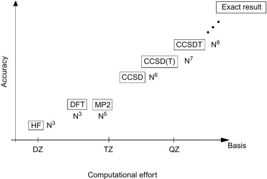

# Método de Hartree-Fock

Usando o @eq-principio-variacional, podemos escolher uma função de onda eletrônica tentativa $\ket{\Psi_e}$ tal que o valor esperado para o Hamiltoniano eletrônico molecular $\hat{H}_e$ possa ser calculado como
$$
E_0 \leq \braket{\Psi_e|\hat{H}_e|\Psi_e} 
$$
onde $E_0$ é a energia do estado fundamental eletrônico e $\hat{H}_e$ é  o Hamiltoniano eletrônico molecular definido, a partir da @eq-problema_eletronico, como 
$$
\hat{H}_e =  \sum_{i=1}^N \hat{h}_i + \frac{1}{2}\sum_{i=1}^N\sum_{j\neq i}^N \frac{1}{|\boldsymbol{r}_i-\boldsymbol{r}_j|}
$$
onde $\hat{h}_i$ é o operador de 1 elétron que inclui a energia cinética do elétron e a interação coulombiana elétron-núcleo, escrito na forma 
$$
    \hat{h}_i=-\frac{1}{2}\nabla_i^2 - \sum_{A=1}^M \frac{Z_A}{|\boldsymbol{r}_i-\boldsymbol{R}_A|}, 
$$
enquanto o termo de interação elétron-elétron é dado por
$$
\frac{1}{2}\sum_{i=1}^N\sum_{j\neq i}^N \frac{1}{|\boldsymbol{r}_i-\boldsymbol{r}_j|}.
$$

O potencial de interação núcleo-núcleo $V_{nn}$ dado por 
$$
V_{nn} = \frac{1}{2}\sum_{A=1}^M\sum_{B \neq A}^M \frac{Z_A Z_B}{|\boldsymbol{R}_A-\boldsymbol{R}_B|}
$$
não é incluído no Hamiltoniano eletrônico, pois ele não depende das coordenadas eletrônicas e portanto, não afeta a função de onda eletrônica. No entanto, o termo $V_{nn}$ deve ser adicionado à energia total da molécula, como veremos mais adiante.

## Determinante de Slater

A função de onda eletrônica de muitos elétrons $\ket{\Psi_e}$ na base de posições e spins deve ser escrita como $\Psi_e(\boldsymbol{x}_1,\boldsymbol{x}_2,\ldots,\boldsymbol{x}_N)$ onde $\boldsymbol{x}_i=(\boldsymbol{r}_i,\sigma_i)$ é uma variável que representa conjuntamente a posição $\boldsymbol{r}_i$ e o spin $\sigma_i$ do elétron $i$. Sabemos que tal função de onda pode ser escrita em termos do produto de funções de onda para 1 elétron, $\psi_j(\boldsymbol{x}_i)$, onde $i$ representa o elétron e $j$ o estado de 1 elétron, e com a condição que $\braket{\psi_i|\psi_j} = \delta_{ij}$. É comum denominarmos o conjunto $\psi_j(\boldsymbol{x}_i)$ como **conjunto de spin-orbitais molecular**.

Para satisfazer o **princípio de exclusão de Pauli** devemos construir uma função de onda que seja totalmente anti-simétrica sobre permutações de 2 elétrons, tal que $\Psi_e(\boldsymbol{x}_1,\boldsymbol{x}_2,\ldots,\boldsymbol{x}_N) = - \Psi_e(\boldsymbol{x}_2,\boldsymbol{x}_1,\ldots,\boldsymbol{x}_N)$. Para resolver esse problema, Slater propôs que a função de onda de $N$ elétrons seja escrita na forma de um determinante de funções de onda de 1 elétrons. O **determinante de Slater** é escrito como 
$$\begin{aligned}
    \Psi_e(\boldsymbol{x}_1,\boldsymbol{x}_2,\ldots,\boldsymbol{x}_N) = \frac{1}{\sqrt{N!}} \begin{vmatrix}
        \psi_1(\boldsymbol{x}_1) & \psi_2(\boldsymbol{x}_1) & \dots & \psi_N(\boldsymbol{x}_1) \\
        \psi_1(\boldsymbol{x}_2) & \psi_2(\boldsymbol{x}_2) & \dots & \psi_N(\boldsymbol{x}_2) \\
        \vdots & \vdots & & \vdots \\
        \psi_1(\boldsymbol{x}_N) & \psi_2(\boldsymbol{x}_N) & \dots & \psi_N(\boldsymbol{x}_N)
    \end{vmatrix}
\end{aligned}$${#eq-determinante_Slater}
onde cada **linha** corresponde a uma coordenada eletrônica $\boldsymbol{x}_i$ e cada **coluna** corresponde a um spin-orbital ocupado $\psi_j$. O termo $\frac{1}{\sqrt{N!}}$ vem da condição de normalização da função de onda $\Psi_e(\boldsymbol{x}_1,\boldsymbol{x}_2,\ldots,\boldsymbol{x}_N)$ dos $N$ elétrons ($N!$ é o número de permutações possíveis de $N$ elétrons). 

## Regras de Slater-Condon

Usando o determinante de Slater, podemos mostrar as chamadas **regras de Slater-Condon** tal que para o operador de 1 elétron temos que 
$$\begin{aligned}
\left\langle \Psi_e \left| \sum_{i=1}^{N} \hat{h}_i \right| \Psi_e \right\rangle &= \sum_{i=1}^{N} \langle \psi_i | \hat{h}_1 | \psi_i \rangle \\
&= \sum_{i=1}^{N}\int \psi_i^*(\boldsymbol{x}_1) \hat{h}_1 \psi_i (\boldsymbol{x}_1)\ \text{d}\boldsymbol{x}_1,
\end{aligned}$$
enquanto que para o operador de interação elétron-elétron, que é um operador de 2 elétrons, temos que 
$$\begin{aligned}
\left\langle \Psi_e \left| \frac{1}{2} \sum_{i=1}^{N} \sum_{j \neq i}^{N} \frac{1}{|\boldsymbol{r}_i - \boldsymbol{r}_j|} \right| \Psi_e \right\rangle =\ & \frac{1}{2} \sum_{i=1}^{N} \sum_{j \neq i}^{N} \left\langle \psi_i \psi_j \left| \frac{1}{|\boldsymbol{r}_1 - \boldsymbol{r}_2|} \right| \psi_i \psi_j \right\rangle \nonumber \\
& - \frac{1}{2} \sum_{i=1}^{N} \sum_{j \neq i}^{N} \left\langle \psi_i \psi_j \left| \frac{1}{|\boldsymbol{r}_1 - \boldsymbol{r}_2|} \right| \psi_j \psi_i \right\rangle
\end{aligned}$${#eq-eletron-eletron-HF}
onde, de forma geral, temos que
$$\begin{aligned}
\left\langle \psi_i \psi_j \left| \frac{1}{|\boldsymbol{r}_1 - \boldsymbol{r}_2|} \right| \psi_k \psi_l \right\rangle = \iint \psi_i^*(\boldsymbol{x}_1) \psi_j^*(\boldsymbol{x}_2) \frac{1}{|\boldsymbol{r}_1 - \boldsymbol{r}_2|} \psi_k(\boldsymbol{x}_1) \psi_l(\boldsymbol{x}_2) \ \text{d}\boldsymbol{x}_1 \text{d}\boldsymbol{x}_2,
\end{aligned}$$
de modo que o primeiro termo da @eq-eletron-eletron-HF é a interação direta de Coulomb e o segundo termo é a interação de troca. Essa interação de troca não possui análogo na física clássica e tem sua origem na antissimetria da função de onda eletrônica exigida para férmions indistinguíveis 

## Equações de Hartree-Fock

Afim de encontrar os melhores spin-orbitais para determinar a energia do estado fundamental do nosso sistema, devemos utilizar o teorema variacional novamente. Como os spin-orbitais devem satisfazer a condição de ortonormalidade

$$
\braket{\psi_i|\psi_j}=\delta_{ij},
$$

podemos construir uma Lagrangeana na forma

$$
\mathcal{L}(\{\psi_i\})
=
\braket{\Psi_e|\hat{H}_e|\Psi_e}
-
\sum_{i=1}^N
\sum_{j=1}^N
\epsilon_{ij}
\left(
\braket{\psi_i|\psi_j}
-
\delta_{ij}
\right),
$$

onde o primeiro termo é o valor esperado do Hamiltoniano eletrônico molecular sem a interação núcleo-núcleo, enquanto os termos $\epsilon_{ij}$ são multiplicadores de Lagrange introduzidos para garantir a ortonormalidade dos spin-orbitais.

Efetuando a derivada variacional em relação a $\bra{\psi_k}$,

$$
\frac{\delta\mathcal{L}(\{\psi_i\})}
{\delta\bra{\psi_k}}
=
0,
$$

obtemos

$$
\hat{F}\ket{\psi_k}
=
\sum_{j=1}^N
\epsilon_{kj}
\ket{\psi_j},
$$

onde o operador de Fock é definido como

$$
\hat{F}
=
\hat{h}
+
\sum_{i=1}^N
\left(
\hat{J}_i-\hat{K}_i
\right).
$$

onde $\hat{J}_i$ e $\hat{K}_i$ são, respectivamente, os operadores de Coulomb e de troca associados ao spin-orbital ocupado $\psi_i$.

O operador de Coulomb $\hat{J}_i$ atua sobre um spin-orbital $\psi_k(\boldsymbol{x})$ na forma

$$
\boxed{
\hat{J}_i\psi_k(\boldsymbol{x})
=
\left[
\int
\frac{
|\psi_i(\boldsymbol{x}')|^2
}{
|\boldsymbol{r}-\boldsymbol{r}'|
}
\text{d}\boldsymbol{x}'
\right]
\psi_k(\boldsymbol{x})
}
$$

onde $\boldsymbol{x}=(\boldsymbol{r},\sigma)$ e $\boldsymbol{x}'=(\boldsymbol{r}',\sigma')$ representam as coordenadas espacial e de spin dos elétrons.

O termo entre colchetes pode ser interpretado como o potencial coulombiano médio produzido pela distribuição eletrônica associada ao spin-orbital $\psi_i$. Portanto, $\hat{J}_i$ é um operador local, pois sua atuação sobre $\psi_k(\boldsymbol{x})$ resulta na multiplicação desse spin-orbital por uma função da posição.

Já o operador de troca $\hat{K}_i$ é definido por

$$
\boxed{
\hat{K}_i\psi_k(\boldsymbol{x})
=
\left[
\int
\frac{
\psi_i^*(\boldsymbol{x}')
\psi_k(\boldsymbol{x}')
}{
|\boldsymbol{r}-\boldsymbol{r}'|
}
\text{d}\boldsymbol{x}'
\right]
\psi_i(\boldsymbol{x})
}
$$

e surge diretamente da antissimetria da função de onda eletrônica representada pelo determinante de Slater.

Ao contrário do operador de Coulomb, o operador de troca é não local, pois sua atuação sobre $\psi_k$ depende dos valores desse spin-orbital em todas as posições $\boldsymbol{r}'$.

Dessa forma, a ação completa do operador de Fock sobre um spin-orbital pode ser escrita como

$$
\boxed{
\hat{F}\psi_k(\boldsymbol{x})
=
\hat{h}\psi_k(\boldsymbol{x})
+
\sum_{i=1}^N
\left[
\hat{J}_i\psi_k(\boldsymbol{x})
-
\hat{K}_i\psi_k(\boldsymbol{x})
\right]
}
$$

::: {.callout-important}
## Operador de troca

É importante notar que o termo de troca somente contribui entre elétrons de mesmo spin. Isso ocorre porque os spin-orbitais podem ser escritos como

$$
\psi_i(\boldsymbol{x})
=
\varphi_i(\boldsymbol{r})
\chi_i(\sigma),
$$

de modo que o termo de troca contém o produto

$$
\chi_i^*(\sigma')
\chi_k(\sigma').
$$

Para spin-orbitais com spins diferentes, as funções de spin são ortogonais e

$$
\int
\chi_i^*(\sigma')
\chi_k(\sigma')
\text{d}\sigma'
=
0.
$$

Assim, o operador de troca atua apenas entre elétrons de mesmo spin.

:::

::: {.callout-note}
## Cancelamento de autointeração

Um resultado importante ocorre quando $i=k$. Nesse caso,

$$
\hat{J}_i\psi_i
=
\hat{K}_i\psi_i,
$$

de modo que

$$
\left(
\hat{J}_i-\hat{K}_i
\right)\psi_i
=
0.
$$

Portanto, no método de Hartree-Fock, a contribuição de Coulomb correspondente à interação de um elétron consigo mesmo é exatamente cancelada pela contribuição de troca. Esse cancelamento elimina a autointeração eletrônica presente no termo de Hartree.

:::

Nesse estágio, as equações de Hartree-Fock ainda não possuem a forma de um problema de autovalores simples, pois os multiplicadores de Lagrange $\epsilon_{ij}$ formam uma matriz.

Como o operador de Fock é hermitiano, a matriz dos multiplicadores de Lagrange também pode ser escolhida hermitiana,

$$
\epsilon_{ij}
=
\epsilon_{ji}^*.
$$

Dessa forma, existe uma transformação unitária dos spin-orbitais capaz de diagonalizar a matriz $\boldsymbol{\epsilon}$. Definindo novos spin-orbitais por

$$
\ket{\psi_i'}
=
\sum_j
U_{ji}
\ket{\psi_j},
$$

onde $U$ é uma matriz unitária tal que

$$
U^\dagger
\boldsymbol{\epsilon}
U
=
\operatorname{diag}
(\epsilon_1,\epsilon_2,\ldots,\epsilon_N),
$$

obtemos a forma canônica das equações de Hartree-Fock,

$$
\boxed{
\hat{F}\ket{\psi_k'}
=
\epsilon_k
\ket{\psi_k'}
}
$$ {#eq-HF}

Os spin-orbitais $\ket{\psi_k'}$ obtidos dessa forma são denominados **spin-orbitais canônicos de Hartree-Fock**, enquanto $\epsilon_k$ são suas respectivas energias orbitais.

Embora as equações de Hartree-Fock apareçam agora na forma de um problema de autovalores, devemos notar que o operador de Fock depende dos próprios spin-orbitais ocupados usados para construí-lo. Dessa forma, as equações devem ser resolvidas de maneira auto-consistente.

Quando os orbitais moleculares são expandidos em um conjunto finito de funções de base, como funções gaussianas,

$$
\varphi_i(\boldsymbol{r})
=
\sum_\mu
c_{\mu i}
\phi_\mu(\boldsymbol{r}),
$$

as equações integro-diferenciais de Hartree-Fock podem ser transformadas em um problema matricial conhecido como **equações de Roothaan-Hall**,

$$
\boxed{
\mathbf{F}\mathbf{C}
=
\mathbf{S}\mathbf{C}\boldsymbol{\epsilon}
}
$$

onde $\mathbf{F}$ é a matriz de Fock, $\mathbf{C}$ contém os coeficientes $c_{\mu i}$ da expansão dos orbitais moleculares, $\mathbf{S}$ é a matriz de sobreposição entre as funções de base e $\boldsymbol{\epsilon}$ é a matriz diagonal das energias orbitais. A presença da matriz $\mathbf{S}$ ocorre porque, em geral, as funções gaussianas utilizadas como base não são ortogonais entre si. Assim, o problema de Hartree-Fock passa a ser resolvido como um problema de autovalores generalizado. Os detalhes sobre a construção, propriedades e escolha dessas funções de base serão discutidos no @sec-bases.

## Método auto-consistente

No procedimento auto-consistente (SCF, do inglês **S**elf **C**onsistent **F**ield) é necessário decidir a forma dos orbitais e inseri-los.

Para uma molécula de camada fechada, utiliza-se normalmente o método **RHF** (*Restricted Hartree-Fock*). Nesse caso, dois elétrons de spins opostos ocupam o mesmo orbital espacial $\varphi_i(\boldsymbol{r})$, de modo que os spin-orbitais são escritos como

$$
\psi_{i\alpha}(\boldsymbol{x})
=
\varphi_i(\boldsymbol{r})
\chi_\alpha(\sigma) = \varphi_i(\boldsymbol{r}_1)\ket{\uparrow} 
$$

e

$$
\psi_{i\beta}(\boldsymbol{x})
=
\varphi_i(\boldsymbol{r})
\chi_\beta(\sigma) = \varphi_i(\boldsymbol{r}_1)\ket{\downarrow}
$$

Assim, cada orbital espacial ocupado contém dois elétrons com spins opostos.

{#fig-Be width=50%}

Por exemplo, no caso do átomo de Be (berílio com $Z=4$, representado na @fig-Be), a função de onda no RHF é escrita da seguinte forma
$$\begin{aligned}
    \Psi_\text{RHF}^{(\text{Be})}(\boldsymbol{x}_1,\boldsymbol{x}_2,\boldsymbol{x}_3,\boldsymbol{x}_4) = \frac{1}{\sqrt{4!}} \begin{vmatrix}
        \varphi_{1s}(\boldsymbol{r}_1)\ket{\uparrow} & \varphi_{1s}(\boldsymbol{r}_1)\ket{\downarrow} & \varphi_{2s}(\boldsymbol{r}_1)\ket{\uparrow} & \varphi_{2s}(\boldsymbol{r}_1)\ket{\downarrow} \\
         \varphi_{1s}(\boldsymbol{r}_2)\ket{\uparrow} & \varphi_{1s}(\boldsymbol{r}_2)\ket{\downarrow}  & \varphi_{2s}(\boldsymbol{r}_2)\ket{\uparrow} & \varphi_{2s}(\boldsymbol{r}_2)\ket{\downarrow}  \\
         \varphi_{1s}(\boldsymbol{r}_3)\ket{\uparrow} & \varphi_{1s}(\boldsymbol{r}_3)\ket{\downarrow}  & \varphi_{2s}(\boldsymbol{r}_3)\ket{\uparrow} & \varphi_{2s}(\boldsymbol{r}_3)\ket{\downarrow}  \\
         \varphi_{1s}(\boldsymbol{r}_4)\ket{\uparrow} & \varphi_{1s}(\boldsymbol{r}_4)\ket{\downarrow}  & \varphi_{2s}(\boldsymbol{r}_4)\ket{\uparrow} & \varphi_{2s}(\boldsymbol{r}_4)\ket{\downarrow} 
    \end{vmatrix},
\end{aligned}$$
com uma redução dimensional do problema pela metade. Note que embora tenhamos 4 elétrons, temos apenas dois orbitais moleculares a serem otimizados, o 1s e o 2s.

No caso de sistemas de camada aberta, uma possibilidade é utilizar o método **ROHF** (*Restricted Open-Shell Hartree-Fock*). Nesse método, os elétrons emparelhados continuam compartilhando os mesmos orbitais espaciais, enquanto os elétrons desemparelhados ocupam orbitais adicionais.

Uma vantagem importante do ROHF é que a função de onda pode ser construída como autofunção dos operadores $\hat{S}^2$ e $\hat{S}_z$, de modo que o estado possui um valor bem definido de spin total. 

{#fig-Li width=50%}

Tomando o átomo de Li (lítio com $Z=3$, conforme @fig-Li) como exemplo podemos escrever 
$$\begin{aligned}
    \Psi_\text{ROHF}^{(\text{Li})}(\boldsymbol{x}_1,\boldsymbol{x}_2,\boldsymbol{x}_3) = \frac{1}{\sqrt{3!}} \begin{vmatrix}
        \varphi_{1s}(\boldsymbol{r}_1)\ket{\uparrow} & \varphi_{1s}(\boldsymbol{r}_1)\ket{\downarrow} & \varphi_{2s}(\boldsymbol{r}_1)\ket{\uparrow} \\
         \varphi_{1s}(\boldsymbol{r}_2)\ket{\uparrow} & \varphi_{1s}(\boldsymbol{r}_2)\ket{\downarrow}  & \varphi_{2s}(\boldsymbol{r}_2)\ket{\uparrow}  \\
         \varphi_{1s}(\boldsymbol{r}_3)\ket{\uparrow} & \varphi_{1s}(\boldsymbol{r}_3)\ket{\downarrow}  & \varphi_{2s}(\boldsymbol{r}_3)\ket{\uparrow}
    \end{vmatrix},
\end{aligned}$$

Uma alternativa é o método **UHF** (*Unrestricted Hartree-Fock*), no qual os elétrons com spins $\ket{\uparrow}$ e $\ket{\downarrow}$ podem ocupar orbitais espaciais diferentes.

No caso do átomo de Li, usado no exemplo anterior, a função de onda no UHF é definida como
$$\begin{aligned}
    \Psi_\text{UHF}^{(\text{Li})}(\boldsymbol{x}_1,\boldsymbol{x}_2,\boldsymbol{x}_3) = \frac{1}{\sqrt{3!}} \begin{vmatrix}
        \varphi_{a}(\boldsymbol{r}_1)\ket{\uparrow} & \varphi_{b}(\boldsymbol{r}_1)\ket{\downarrow} & \varphi_{c}(\boldsymbol{r}_1)\ket{\uparrow} \\
         \varphi_{a}(\boldsymbol{r}_2)\ket{\uparrow} & \varphi_{b}(\boldsymbol{r}_2)\ket{\downarrow}  & \varphi_{c}(\boldsymbol{r}_2)\ket{\uparrow}  \\
         \varphi_{a}(\boldsymbol{r}_3)\ket{\uparrow} & \varphi_{b}(\boldsymbol{r}_3)\ket{\downarrow}  & \varphi_{c}(\boldsymbol{r}_3)\ket{\uparrow}
    \end{vmatrix},
\end{aligned}$$
onde cada orbital molecular $\varphi_{i}(\boldsymbol{r})$ pode ter uma energia distinta. A figura @fig-RHF representa graficamente os três métodos descritos acima.

{#fig-RHF width=80%}

Essa maior liberdade variacional permite que os orbitais $\varphi_{i}(\boldsymbol{r})$ se ajustem independentemente, o que geralmente leva a uma energia Hartree-Fock menor ou igual à obtida com uma função de onda restrita.

No entanto, essa maior flexibilidade possui uma consequência importante. A função de onda UHF é, em geral, autofunção de $\hat{S}_z$, mas não necessariamente de $\hat{S}^2$. Assim, o determinante UHF pode conter contribuições de estados com diferentes valores de spin total.

Esse fenômeno é denominado **contaminação de spin**.

A contaminação de spin pode ser avaliada através do valor esperado

$$
\langle \hat{S}^2 \rangle.
$$

Para um estado de spin puro com número quântico de spin $S$, devemos ter

$$
\boxed{
\langle \hat{S}^2 \rangle
=
S(S+1)
}
$$

em unidades de $\hbar^2$.

Por exemplo, para um estado dubleto,

$$
S=\frac{1}{2},
$$

e portanto

$$
\langle \hat{S}^2 \rangle
=
\frac{3}{4}.
$$

Se um cálculo UHF para um sistema que deveria estar em um estado dubleto fornecer um valor significativamente maior que $0.75$, isso indica a presença de contribuições de estados de spin mais alto na função de onda.

Assim, enquanto o ROHF preserva um estado de spin bem definido, o UHF oferece maior flexibilidade variacional ao custo da possível ocorrência de contaminação de spin.

Assim, no UHF, os orbitais moleculares $\psi_{i}$ são mais flexíveis do que no RHF e no ROHF, produzindo assim resultados mais flexíveis e frequentemente com energia variacional mais baixa. No entanto, como todos os  $\psi_{i}$ são definidos de forma diferente, a quantidade de cálculo é o maior em comparação ao RHF e ao ROHF.

::: {.callout-important}
## Algoritmo SCF

O procedimento auto-consistente é descrito como: 

1. Decida a geometria do sistema que deseja resolver: $\{R_A\}, \{Z_A\}, N$ e defina o tipo de conjunto de base;

2. Defina o conjunto de base $\phi_\mu$ (confome @eq-conjunto_de_base) a ser utilizado;

3. Calcule as integrais $S_{\mu\nu}, h_{\mu\nu}, J_{\mu\nu}$ e $K_{\mu\nu}$ usando o cojunto de base $\phi_\mu$;

4. Inicialize o método com um chute inicial para a matriz densidade $P_{\mu\nu}^{(0)}$;

5. Construa a matriz de Fock $F_{\mu\nu}^{(n)}$ a partir da matriz densidade $P_{\mu\nu}^{(n)}$;

6. Resolva as equações de Roothaan-Hall

$$
\mathbf{F}^{(n)}\mathbf{C}^{(n+1)}
=
\mathbf{S}\mathbf{C}^{(n+1)}
\boldsymbol{\epsilon}^{(n+1)}
$$

para obter novos coeficientes dos orbitais moleculares $c_{\mu i}^{(n+1)}$;

7. Construa uma nova matriz densidade $P_{\mu\nu}^{(n+1)}$ a partir dos orbitais ocupados. Para o caso RHF,

$$
P_{\mu\nu}^{(n+1)}
=
2\sum_{i=1}^{N/2}
c_{\mu i}^{(n+1)}
c_{\nu i}^{(n+1)*}.
$$

8. Calcule a nova energia eletrônica $E^{(n+1)}$ e verifique a convergência. Por exemplo, podemos utilizar simultaneamente os critérios

$$
\left|
E^{(n+1)}-E^{(n)}
\right|
<
\varepsilon_E
$$

e

$$
\left\|
\mathbf{P}^{(n+1)}
-
\mathbf{P}^{(n)}
\right\|
<
\varepsilon_P,
$$

onde $\varepsilon_E$ e $\varepsilon_P$ são tolerâncias previamente definidas. Se ambos os critérios forem satisfeitos, o procedimento auto-consistente é considerado convergido. Caso contrário, utilize a nova matriz densidade para construir uma nova matriz de Fock e retorne ao passo 5.

9. Após a convergência, obtenha os orbitais moleculares a partir dos coeficientes $c_{\mu i}$ e suas respectivas energias orbitais a partir de $\epsilon_i$.

Isso pode ser representado graficamente por um fluxograma como na @fig-SCF-HF.

{#fig-SCF-HF width=80%}

Na prática, procedimentos de mistura da matriz densidade e métodos de aceleração de convergência, como DIIS, são frequentemente utilizados para tornar o processo SCF mais estável e eficiente.

:::

## Energia Total

A energia eletrônica da molécula $E_0$ não é igual a soma dos autovalores das equações de HF, $E_0 \neq \sum_{i=1}^N \epsilon_i$. De fato, podemos notar que 
$$
E_0 = \sum_{i=1}^N \braket{\psi_i|\hat{h}+ \tfrac{1}{2}\sum_{j=1}^N(\hat{J}_j-\hat{K}_j)|\psi_i} 
$$
enquanto que os autovalores de HF são obtidos da @eq-HF como sendo
$$\epsilon_i = \braket{\psi_i|\hat{h}+\sum_{j=1}^N(\hat{J}_j-\hat{K}_j)|\psi_i}$$
de tal modo que podemos escrever 
$$
E_0 = \sum_{i=1}^N \epsilon_i - \frac{1}{2} \sum_{i=1}^N \braket{\psi_i |\sum_{j=1}^N(\hat{J}_j-\hat{K}_j)|\psi_i}
$$

A energia total da molécula deve levar em conta a repulsão eletrostática entre os núcleos tal que 
\begin{align}
    E_\text{tot} = E_0 + V_{nn}
\end{align}
com 
\begin{align}
    V_{nn} = \frac{1}{2}\sum_{A=1}^M\sum_{B \neq A}^M \frac{Z_A Z_B}{|\boldsymbol{R}_A-\boldsymbol{R}_B|}.
\end{align}

## Densidade Eletrônica

Vamos definir o operador de densidade de 1 corpo como sendo dado por 
$$
\hat{\rho}(\boldsymbol{r}) = \sum_{i=1}^N \delta(\boldsymbol{r}-\boldsymbol{r}_i)
$${#eq-operador_densidade}
de modo que o valor esperado desse operador seja calculado como 
$$\begin{aligned}
    \rho(\boldsymbol{r}) &= \braket{\Psi| \hat{\rho}(\boldsymbol{r}) |\Psi} \nonumber \\
    &=\int \Psi^*(\boldsymbol{x}^N)\left[\sum_{i=1}^N \delta(\boldsymbol{r}-\boldsymbol{r}_i) \right]\Psi(\boldsymbol{x}^N)\ \text{d}\boldsymbol{x}^N
\end{aligned}$$
que pode ser resolvida usando as regras de Slater-Condon. De fato, chegamos a seguinte relação 
$$\begin{aligned}
    \rho(\boldsymbol{r}) &= N \sum_{s=-1/2}^{1/2}\int |\Psi(\boldsymbol{r},s,\boldsymbol{x}^{N-1})|^2\ \text{d}\boldsymbol{x}^{N-1} \nonumber \\
    &= N \sum_{s=-1/2}^{1/2}\int |\Psi(\boldsymbol{r},s,\boldsymbol{x}_2,\boldsymbol{x}_3,\ldots,\boldsymbol{x}_N)|^2\ \text{d}\boldsymbol{x}_2\ \text{d}\boldsymbol{x}_3 \ldots\text{d}\boldsymbol{x}_N,
\end{aligned}$$
onde podemos notar que essa distribuição é de fato uma densidade eletrônica pois sua integral nos dá o número total de elétrons, 
$$
N = \int \rho(\boldsymbol{r})\ \text{d}\boldsymbol{r} 
$$. 

No caso UHF, onde cada orbital molecular é escrito separadamente, podemos encontrar que 
$$
\rho(\boldsymbol{r}) =\sum_{i=1}^N|\varphi_i(\boldsymbol{r})|^2
$$
e já no caso RHF, temos uma degenerescência dupla de spin para cada orbital molecular, de modo que 
$$
    \rho(\boldsymbol{r}) = 2 \sum_{i=1}^{N/2} |\varphi_i(\boldsymbol{r})|^2,
$$
de modo que há apenas $N/2$ orbitais moleculares como solução das equações de HF. 

## Correlação Eletrônica

O método de Hartree-Fock aproxima a função de onda eletrônica por um único determinante de Slater,

$$
\Psi_\text{HF}
=
\frac{1}{\sqrt{N!}}
\det
\left[
\psi_i(\boldsymbol{x}_j)
\right],
$$

onde cada spin-orbital é escrito como

$$
\psi_i(\boldsymbol{x})
=
\varphi_i(\boldsymbol{r})
\chi_i(\sigma).
$$

Essa aproximação descreve exatamente, dentro de um único determinante, os efeitos associados à antissimetria da função de onda e, consequentemente, a interação de troca entre elétrons de mesmo spin. No entanto, ela não descreve completamente o movimento correlacionado dos elétrons causado pela interação coulombiana entre eles.

Fisicamente, a presença de um elétron em uma determinada região do espaço modifica a probabilidade de encontrar outros elétrons em sua vizinhança. Os elétrons tendem a ajustar seus movimentos instantaneamente de forma a reduzir a repulsão coulombiana. Esse efeito é denominado **correlação eletrônica** e não pode, em geral, ser representado completamente por um único determinante de Slater.

A energia de correlação pode ser definida como a diferença entre a energia eletrônica exata não relativística, dentro da aproximação de Born-Oppenheimer, e a energia obtida no limite de Hartree-Fock,

$$
\boxed{
E_\text{corr}
=
E_\text{exata}
-
E_\text{HF}
}
$$

onde $E_\text{HF}$ corresponde à energia obtida no limite de um conjunto de base completo. Como o método de Hartree-Fock é variacional,

$$
E_\text{HF}
\geq
E_\text{exata},
$$

de modo que

$$
E_\text{corr}
\leq 0.
$$

É importante distinguir **troca** de **correlação eletrônica**. A troca é consequência direta da antissimetria da função de onda de férmions e já está incluída no método de Hartree-Fock através do operador de troca $\hat{K}$. A correlação eletrônica, por outro lado, está associada aos efeitos da interação entre os elétrons que não podem ser descritos por um único determinante.

Uma forma intuitiva de entender essa limitação é considerar dois elétrons de spins opostos. Como o termo de troca atua apenas entre elétrons de mesmo spin, dois elétrons de spins opostos não apresentam interação de troca entre si no método de Hartree-Fock. Ainda assim, devido à repulsão coulombiana, seus movimentos reais são correlacionados: quando um elétron se encontra em determinada região do espaço, o outro tende a evitar essa região. Esse movimento correlacionado não é descrito adequadamente pela aproximação de campo médio de Hartree-Fock.

### Correlação dinâmica e estática

É comum separar qualitativamente a correlação eletrônica em duas contribuições: **correlação dinâmica** e **correlação estática**, também denominada correlação não dinâmica.

A correlação dinâmica está associada ao movimento correlacionado dos elétrons em pequenas escalas de distância devido à repulsão coulombiana instantânea. Mesmo quando um único determinante fornece uma boa descrição qualitativa do estado eletrônico, pequenas correções na distribuição relativa dos elétrons são necessárias para reduzir a energia do sistema.

A correlação estática torna-se importante quando mais de uma configuração eletrônica possui energia semelhante. Nesse caso, um único determinante de Slater deixa de fornecer uma descrição adequada da função de onda. Um exemplo típico ocorre durante a dissociação de uma ligação química, quando diferentes configurações eletrônicas podem se tornar quase degeneradas.

Assim, podemos representar qualitativamente

$$
E_\text{corr}
\approx
E_\text{corr}^\text{din}
+
E_\text{corr}^\text{est},
$$

embora essa separação não seja, em geral, rigorosamente única.

### Métodos pós-Hartree-Fock

Para recuperar a correlação eletrônica que não está presente na aproximação de Hartree-Fock, foram desenvolvidos diversos métodos denominados **pós-Hartree-Fock**. Em geral, esses métodos utilizam os orbitais obtidos em um cálculo Hartree-Fock como ponto de partida e introduzem configurações eletrônicas adicionais ou correções perturbativas.

Entre os métodos mais comuns estão:

- teoria de perturbação de Møller-Plesset, como MP2;
- interação de configurações (*Configuration Interaction*, CI);
- métodos *Coupled Cluster*, como CCSD e CCSD(T);
- métodos multiconfiguracionais, como CASSCF, utilizados principalmente quando a correlação estática é importante.

Esses métodos diferem na forma como a correlação eletrônica é incorporada e no custo computacional associado. Em geral, uma descrição mais completa da correlação eletrônica exige um custo computacional significativamente maior que o método de Hartree-Fock. A @fig-correlation ilustra qualitativamente a relação entre o custo computacional e a precisão dos métodos pós-Hartree-Fock.

{#fig-correlation width=80%}

A teoria do funcional da densidade oferece uma estratégia diferente. Em vez de construir explicitamente uma função de onda de muitos determinantes, a DFT busca incorporar os efeitos de troca e correlação através de um funcional da densidade eletrônica, denominado funcional de troca-correlação $E_\text{XC}[\rho]$.