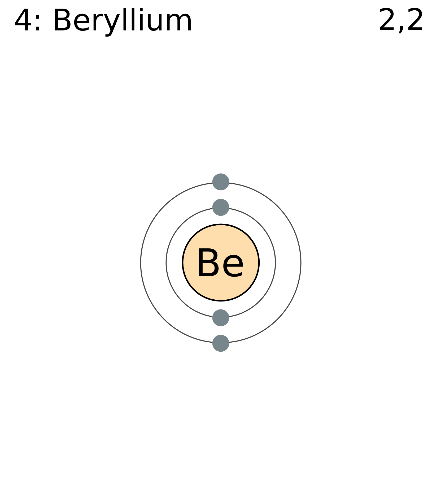
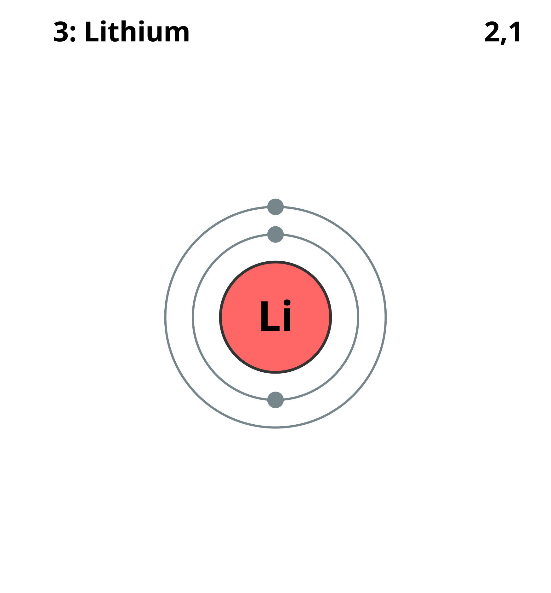
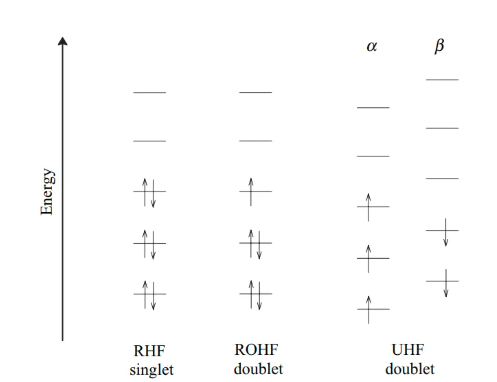
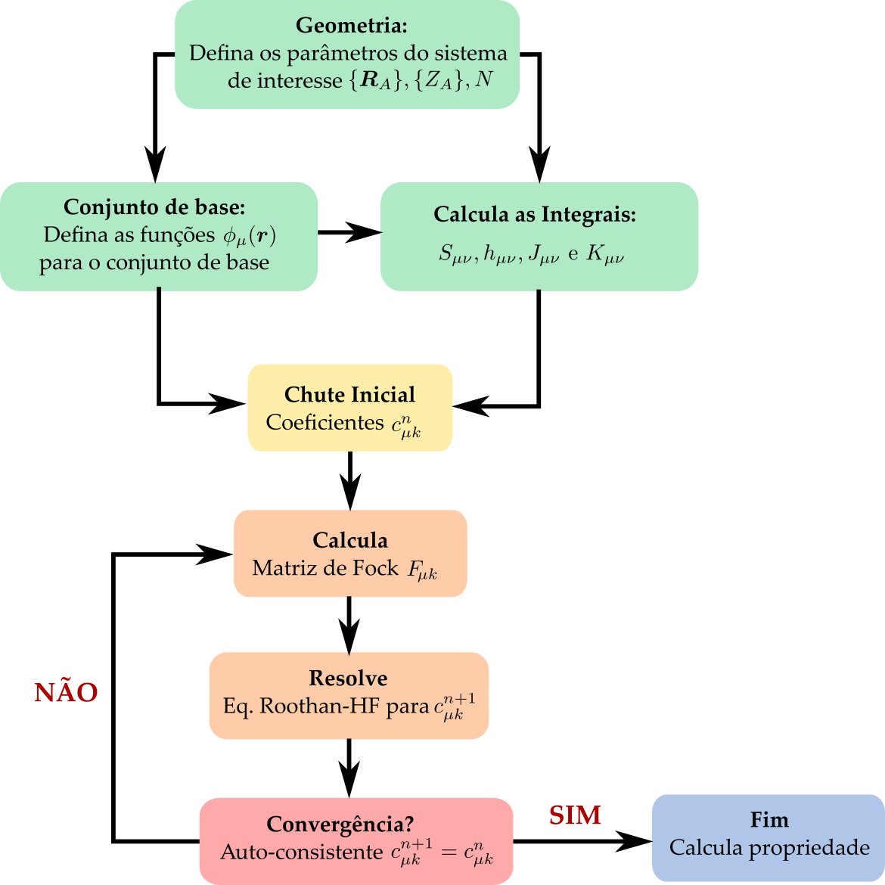

# Método de Hartree-Fock

Usando o @eq-principio-variacional, podemos escolher uma função de onda eletrônica tentativa $\ket{\Psi_e}$ tal que o valor esperado para o Hamiltoniano eletrônico molecular $\hat{H}_e$ possa ser calculado como
$$
E_0 \leq \braket{\Psi_e|\hat{H}_e|\Psi_e} 
$$
onde $E_0$ é a energia do estado fundamental eletrônico e $\hat{H}_e$ é  o Hamiltoniano eletrônico molecular definido, a partir da @eq-problema_eletronico, como 
$$
\hat{H}_e =  \sum_{i=1}^N \hat{h}_i + \frac{1}{2}\sum_{i=1}^N\sum_{j\neq i}^N \frac{1}{|\boldsymbol{r}_i-\boldsymbol{r}_j|}
$$
onde $\hat{h}_i$ é o operador de 1 elétron que inclui a energia cinética do elétron e a interação coulombiana elétron-núcleo, escrito na forma 
$$
    \hat{h}_i=-\frac{1}{2}\nabla_i^2 - \sum_{A=1}^M \frac{Z_A}{|\boldsymbol{r}_i-\boldsymbol{R}_A|}, 
$$
enquanto o termo de interação elétron-elétron é dado por
$$
\frac{1}{2}\sum_{i=1}^N\sum_{j\neq i}^N \frac{1}{|\boldsymbol{r}_i-\boldsymbol{r}_j|}.
$$

O potencial de interação núcleo-núcleo $V_{nn}$ dado por 
$$
V_{nn} = \frac{1}{2}\sum_{A=1}^M\sum_{B \neq A}^M \frac{Z_A Z_B}{|\boldsymbol{R}_A-\boldsymbol{R}_B|}
$$
não é incluído no Hamiltoniano eletrônico, pois ele não depende das coordenadas eletrônicas e portanto, não afeta a função de onda eletrônica. No entanto, o termo $V_{nn}$ deve ser adicionado à energia total da molécula, como veremos mais adiante.

## Determinante de Slater

A função de onda eletrônica de muitos elétrons $\ket{\Psi_e}$ na base de posições e spins deve ser escrita como $\Psi_e(\boldsymbol{x}_1,\boldsymbol{x}_2,\ldots,\boldsymbol{x}_N)$ onde $\boldsymbol{x}_i=\boldsymbol{r}_i,\sigma_i$ é uma variável que representa a posição $\boldsymbol{r}_i$ e o spin $\sigma_i$ do elétron $i$. Sabemos que tal função de onda pode ser escrita em termos do produto de funções de onda para 1 elétron, $\psi_j(\boldsymbol{x}_i)$, onde $i$ representa o elétron e $j$ o estado de 1 elétron, e com a condição que $\braket{\psi_i|\psi_j} = \delta_{ij}$. É comum denominarmos o conjunto $\psi_j(\boldsymbol{x}_i)$ como **conjunto de spin-orbitais molecular**.

Para satisfazer o **princípio de exclusão de Pauli** devemos construir uma função de onda que seja totalmente anti-simétrica sobre permutações de 2 elétrons, tal que $\Psi_e(\boldsymbol{x}_1,\boldsymbol{x}_2,\ldots,\boldsymbol{x}_N) = - \Psi_e(\boldsymbol{x}_2,\boldsymbol{x}_1,\ldots,\boldsymbol{x}_N)$. Para resolver esse problema, Slater propôs que a função de onda de $N$ elétrons seja escrita na forma de um determinante de funções de onda de 1 elétrons. O **determinante de Slater** é escrito como 
$$\begin{aligned}
    \Psi_e(\boldsymbol{x}_1,\boldsymbol{x}_2,\ldots,\boldsymbol{x}_N) = \frac{1}{\sqrt{N!}} \begin{vmatrix}
        \psi_1(\boldsymbol{x}_1) & \psi_2(\boldsymbol{x}_1) & \dots & \psi_N(\boldsymbol{x}_1) \\
        \psi_1(\boldsymbol{x}_2) & \psi_2(\boldsymbol{x}_2) & \dots & \psi_N(\boldsymbol{x}_2) \\
        \vdots & \vdots & & \vdots \\
        \psi_1(\boldsymbol{x}_N) & \psi_2(\boldsymbol{x}_N) & \dots & \psi_N(\boldsymbol{x}_N)
    \end{vmatrix}
\end{aligned}$${#eq-determinante_Slater}
onde a 1ª linha representa os $N$ estados possíveis para o elétron $i=1$, a 2ª linha representa os $N$ estados possíveis para o elétron $i=2$, e assim por diante. O termo $\frac{1}{\sqrt{N!}}$ vem da condição de normalização da função de onda $\Psi_e(\boldsymbol{x}_1,\boldsymbol{x}_2,\ldots,\boldsymbol{x}_N)$ dos $N$ elétrons ($N!$ é o número de permutações possíveis de $N$ elétrons). 

## Regras de Slater-Condon

Usando o determinante de Slater, podemos mostrar as chamadas **regras de Slater-Condon** tal que para o operador de 1 elétron temos que 
$$\begin{aligned}
\left\langle \Psi_e \left| \sum_{i=1}^{N} \hat{h}_i \right| \Psi_e \right\rangle &= \sum_{i=1}^{N} \langle \psi_i | \hat{h}_1 | \psi_i \rangle \\
&= \sum_{i=1}^{N}\int \psi_i^*(\boldsymbol{x}_1) \hat{h}_1 \psi_i (\boldsymbol{x}_1)\ \text{d}\boldsymbol{x}_1,
\end{aligned}$$
enquanto que para o operador de interação elétron-elétron, que é um operador de 2 elétrons, temos que 
$$\begin{aligned}
\left\langle \Psi_e \left| \frac{1}{2} \sum_{i=1}^{N} \sum_{j \neq i}^{N} \frac{1}{|\boldsymbol{r}_i - \boldsymbol{r}_j|} \right| \Psi_e \right\rangle =\ & \frac{1}{2} \sum_{i=1}^{N} \sum_{j \neq i}^{N} \left\langle \psi_i \psi_j \left| \frac{1}{|\boldsymbol{r}_1 - \boldsymbol{r}_2|} \right| \psi_i \psi_j \right\rangle \nonumber \\
& - \frac{1}{2} \sum_{i=1}^{N} \sum_{j \neq i}^{N} \left\langle \psi_i \psi_j \left| \frac{1}{|\boldsymbol{r}_1 - \boldsymbol{r}_2|} \right| \psi_j \psi_i \right\rangle
\end{aligned}$${#eq-eletron-eletron-HF}
onde 
$$\begin{aligned}
\left\langle \psi_i \psi_j \left| \frac{1}{|\boldsymbol{r}_1 - \boldsymbol{r}_2|} \right| \psi_k \psi_l \right\rangle = \iint \psi_i^*(\boldsymbol{x}_1) \psi_j^*(\boldsymbol{x}_2) \frac{1}{|\boldsymbol{r}_1 - \boldsymbol{r}_2|} \psi_k(\boldsymbol{x}_1) \psi_l(\boldsymbol{x}_2) \ \text{d}\boldsymbol{x}_1 \text{d}\boldsymbol{x}_2,
\end{aligned}$$
de modo que o primeiro termo da @eq-eletron-eletron-HF é a interação direta de Coulomb e o segundo termo é a interação de troca. Essa interação de troca não possui análogo na física clássica e tem sua origem na indistinguibilidade dos elétrons. 

## Equações de Hartree-Fock

Afim de encontrar os melhores spin-orbitais para determinar a energia do estado fundamental do nosso sistema, devemos utilizar o teorema variacional novamente. Podemos construir uma Lagrangeana na seguinte forma 
$$\begin{aligned}
    \mathcal{L}(\{\psi_i\}) = \braket{\Psi_e|\hat{H}_e|\Psi_e} - \sum_{ij} \epsilon_{ij} (\braket{\psi_i|\psi_j}-\delta_{ij})
\end{aligned}$$
onde o primeiro termo é o valor esperado do Hamiltoniano eletrônico molecular sem a interação núcleo-núcleo e o segundo termo aparece como um multiplicador de Lagrange $\epsilon_{ij}$ afim de satisfazer a condição de orto-normalização dos spin-orbitais. Efetuando a derivada variacional do tipo
$$
\frac{\delta \mathcal{L}(\{\psi_i\})}{\delta \bra{\psi_k}} = 0
$$
chegamos a 
$$\begin{aligned}
    \hat{F} \ket{\psi_k} = \left[\hat{h} + \hat{J} - \hat{K} \right] \ket{\psi_k} = \epsilon_k \ket{\psi_k},
\end{aligned}$${#eq-HF}
que são as **equações de Hartree-Fock** para os $N$ spin-orbitais. O operador $\hat{F}$ é denominado operador de Fock, e pode ser escrito em termo de $\hat{h}$ e de dois novos operadores $\hat{J}$ e $\hat{K}$. O operador de Coulomb $\hat{J}$ é definido como sendo
$$\begin{aligned}
\hat{J} = \sum_{i=1}^N \left \langle \psi_i(\boldsymbol{x}') \left|\frac{1}{|\boldsymbol{r} - \boldsymbol{r}'|}\right|\psi_i(\boldsymbol{x}') \right \rangle = \sum_{i=1}^N \int \frac{|\psi_i(\boldsymbol{x}')|^2}{|\boldsymbol{r} - \boldsymbol{r}'|} \ \text{d}\boldsymbol{x}',
\end{aligned}$$
enquanto o operador de troca $\hat{K}$ é escrito como
$$\begin{aligned}
\hat{K}\ket{\psi_k}= \sum_{i=1}^N \left \langle \psi_i(\boldsymbol{x}') \left|\frac{1}{|\boldsymbol{r} - \boldsymbol{r}'|}\right|\psi_k(\boldsymbol{x}') \right \rangle \ket{\psi_i} = \sum_{i=1}^N \left[ \int  \frac{\psi_i^*(\boldsymbol{x}') \psi_k(\boldsymbol{x}')}{|\boldsymbol{r} - \boldsymbol{r}'|}\ \text{d}\boldsymbol{x}'\right] \psi_i(\boldsymbol{x}).
\end{aligned}$$

As soluções $\ket{\psi_k}$ e $\epsilon_k$ são os spin-orbitais moleculares e as energias orbitais, respectivamente. Embora as equações de Hartree-Fock apareçam na forma de um problema de autovalor, devemos notar que o operador de Fock depende das próprias soluções $\ket{\psi_k}$. Assim, tal problema deve ser resolvido por outras técnicas. 

## Método auto-consistente

No procedimento auto-consistente (SCF, do inglês **S**elf **C**onsistent **F**ield) é necessário decidir a forma dos orbitais e inseri-los.

Para uma molécula de camada fechada, mantém-se o mesmo orbital molecular $\psi_i$ para os dois elétrons emparelhados, e isso é chamado de **RHF** (Hartree-Fock Restrito). 

{#fig-Be width=50%}

Por exemplo, no caso do átomo de Be (berílio com $Z=4$, conforme @fig-Be), a função de onda no RHF é escrita da seguinte forma
$$\begin{aligned}
    \Psi_\text{RHF}^{(\text{Be})}(\boldsymbol{x}_1,\boldsymbol{x}_2,\boldsymbol{x}_3,\boldsymbol{x}_4) = \frac{1}{\sqrt{4!}} \begin{vmatrix}
        \psi_{1s}(\boldsymbol{r}_1)\ket{\uparrow} & \psi_{1s}(\boldsymbol{r}_1)\ket{\downarrow} & \psi_{2s}(\boldsymbol{r}_1)\ket{\uparrow} & \psi_{2s}(\boldsymbol{r}_1)\ket{\downarrow} \\
         \psi_{1s}(\boldsymbol{r}_2)\ket{\uparrow} & \psi_{1s}(\boldsymbol{r}_2)\ket{\downarrow}  & \psi_{2s}(\boldsymbol{r}_2)\ket{\uparrow} & \psi_{2s}(\boldsymbol{r}_2)\ket{\downarrow}  \\
         \psi_{1s}(\boldsymbol{r}_3)\ket{\uparrow} & \psi_{1s}(\boldsymbol{r}_3)\ket{\downarrow}  & \psi_{2s}(\boldsymbol{r}_3)\ket{\uparrow} & \psi_{2s}(\boldsymbol{r}_3)\ket{\downarrow}  \\
         \psi_{1s}(\boldsymbol{r}_4)\ket{\uparrow} & \psi_{1s}(\boldsymbol{r}_4)\ket{\downarrow}  & \psi_{2s}(\boldsymbol{r}_4)\ket{\uparrow} & \psi_{2s}(\boldsymbol{r}_4)\ket{\downarrow} 
    \end{vmatrix},
\end{aligned}$$
com uma redução dimensional do problema pela metade. Note que embora tenhamos 4 elétrons, temos apenas dois orbitais moleculares a serem otimizados, o 1s e o 2s.

No caso de moléculas de camada aberta, o método acima não pode ser usado, sendo necessário outro método. No caso do **ROHF** (Hartree-Fock Restrito de Camada Aberta), utiliza-se o mesmo método do RHF para elétrons emparelhados, atribuindo um orbital molecular $\psi_i$ fixo, enquanto o elétron desemparelhado recebe uma função de onda diferente. 

{#fig-Li width=50%}

Tomando o átomo de Li (lítio com $Z=3$, conforme @fig-Li) como exemplo podemos escrever 
$$\begin{aligned}
    \Psi_\text{ROHF}^{(\text{Li})}(\boldsymbol{x}_1,\boldsymbol{x}_2,\boldsymbol{x}_3) = \frac{1}{\sqrt{3!}} \begin{vmatrix}
        \psi_{1s}(\boldsymbol{r}_1)\ket{\uparrow} & \psi_{1s}(\boldsymbol{r}_1)\ket{\downarrow} & \psi_{2s}(\boldsymbol{r}_1)\ket{\uparrow} \\
         \psi_{1s}(\boldsymbol{r}_2)\ket{\uparrow} & \psi_{1s}(\boldsymbol{r}_2)\ket{\downarrow}  & \psi_{2s}(\boldsymbol{r}_2)\ket{\uparrow}  \\
         \psi_{1s}(\boldsymbol{r}_3)\ket{\uparrow} & \psi_{1s}(\boldsymbol{r}_3)\ket{\downarrow}  & \psi_{2s}(\boldsymbol{r}_3)\ket{\uparrow}  
    \end{vmatrix},
\end{aligned}$$
No entanto, há um problema com esse método. No caso de $\psi_{1s}(\boldsymbol{r}_1)\ket{\uparrow}$ e $\psi_{2s}(\boldsymbol{r}_1)\ket{\uparrow}$, os spins são paralelos, havendo interação por meio do potencial de troca. Isso não ocorre para $\psi_{1s}(\boldsymbol{r}_1)\ket{\downarrow}$. Em outras palavras, as energias de $\psi_{1s}(\boldsymbol{r}_1)\ket{\uparrow}$ e $\psi_{1s}(\boldsymbol{r}_1)\ket{\downarrow}$ tendem a ser diferentes, mas, no caso do ROHF, essas energias são forçadas a serem iguais, gerando erros. Tal fenômeno se chama **contaminação de spin**.

Para resolver esse problema, no \textbf{UHF} (Hartree-Fock Não Restrito de Camada Aberta), todos os orbitais podem ter formas diferentes. No caso do átomo de Li, usado no exemplo anterior, a função de onda no UHF é definida como
$$\begin{aligned}
    \Psi_\text{UHF}^{(\text{Li})}(\boldsymbol{x}_1,\boldsymbol{x}_2,\boldsymbol{x}_3) = \frac{1}{\sqrt{3!}} \begin{vmatrix}
        \psi_{a}(\boldsymbol{r}_1)\ket{\uparrow} & \psi_{b}(\boldsymbol{r}_1)\ket{\downarrow} & \psi_{c}(\boldsymbol{r}_1)\ket{\uparrow} \\
         \psi_{a}(\boldsymbol{r}_2)\ket{\uparrow} & \psi_{b}(\boldsymbol{r}_2)\ket{\downarrow}  & \psi_{c}(\boldsymbol{r}_2)\ket{\uparrow}  \\
         \psi_{a}(\boldsymbol{r}_3)\ket{\uparrow} & \psi_{b}(\boldsymbol{r}_3)\ket{\downarrow}  & \psi_{c}(\boldsymbol{r}_3)\ket{\uparrow}  
    \end{vmatrix},
\end{aligned}$$
onde cada orbital molecular $\psi_{i}$ pode ter uma energia distinta. A figura @fig-RHF representa graficamente os três métodos descritos acima.

{#fig-RHF width=80%}

Assim, no UHF, os orbitais moleculares $\psi_{i}$ são mais flexíveis do que no RHF e no ROHF, produzindo assim resultados mais precisos do que ambos os métodos. No entanto, como todos os  $\psi_{i}$ são definidos de forma diferente, a quantidade de cálculo é o dobro em comparação ao RHF e ao ROHF.

O procedimento auto-consistente é descrito como: 

1. Decida a geometria do sistema que deseja resolver: $\{R_A\}, \{Z_A\}, N$ e defina o tipo de conjunto de base;

2. Defina o conjunto de base $\phi_\mu$ (confome @eq-conjunto_de_base) a ser utilizado;

3. Calcule as integrais $S_{\mu\nu}, h_{\mu\nu}, J_{\mu\nu}$ e $K_{\mu\nu}$ usando o cojunto de base $\phi_\mu$;

4. Inicialize o método com um chute inicial para os coeficientes $c_{\mu k}^n$;

5. Calcule a matriz de Fock $F_{\mu\nu}$;

6. Resolve a Eq de Roothan-HF para novos coeficientes  $c_{\mu k}^{n+1}$;

7. Verifique a convergência $c_{\mu k}^{n+1}=c_{\mu k}^{n}$. Se for verdadeiro, pare o cálculo e siga para o item 8. Caso contrário volte ao item 4. 

8. Por fim, obtenha a forma dos orbitais moleculares (MO) a partir de $ c_{\mu k}$ e as energias dos MOs a partir de $\epsilon_k$.

Isso pode ser representado graficamente por um fluxograma como na @fig-SCF-HF.

{#fig-SCF-HF width=80%}

## Energia Total

A energia eletrônica da molécula $E_0$ não é igual a soma dos autovalores das equações de HF, $E_0 \neq \sum_{i=1}^N \epsilon_i$. De fato, podemos notar que 
$$
E_0 = \sum_{i=1}^N \braket{\psi_i|\hat{h}+ \tfrac{1}{2}(\hat{J}-\hat{K})|\psi_i} 
$$
enquanto que os autovalores de HF são obtidos da @eq-HF como sendo
$$\epsilon_i = \braket{\psi_i|\hat{h}+\hat{J}-\hat{K}|\psi_i}$$
de tal modo que podemos escrever 
$$
E_0 = \sum_{i=1}^N \epsilon_i - \frac{1}{2} \sum_{i=1}^N \braket{\psi_i |\hat{J}-\hat{K}|\psi_i}
$$

A energia total da molécula deve levar em conta a repulsão eletrostática entre os núcleos tal que 
\begin{align}
    E_\text{tot} = E_0 + V_{nn}
\end{align}
com 
\begin{align}
    V_{nn} = \frac{1}{2}\sum_{A=1}^M\sum_{B \neq A}^M \frac{Z_A Z_B}{|\boldsymbol{R}_A-\boldsymbol{R}_B|}.
\end{align}

## Densidade Eletrônica

Vamos definir o operador de densidade de 1 corpo como sendo dado por 
$$
\hat{\rho}(\boldsymbol{r}) = \sum_{i=1}^N \delta(\boldsymbol{r}-\boldsymbol{r}_i)
$${#eq-operador_densidade}
de modo que o valor esperado desse operador seja calculado como 
$$\begin{aligned}
    \rho(\boldsymbol{r}) &= \braket{\Psi| \hat{\rho}(\boldsymbol{r}) |\Psi} \nonumber \\
    &=\int \Psi^*(\boldsymbol{x}^N)\left[\sum_{i=1}^N \delta(\boldsymbol{r}-\boldsymbol{r}_i) \right]\Psi(\boldsymbol{x}^N)\ \text{d}\boldsymbol{x}^N
\end{aligned}$$
que pode ser resolvida usando as regras de Slater-Condon. De fato, chegamos a seguinte relação 
$$\begin{aligned}
    \rho(\boldsymbol{r}) &= N \sum_{s=-1/2}^{1/2}\int |\Psi(\boldsymbol{r},s,\boldsymbol{x}^{N-1})|^2\ \text{d}\boldsymbol{x}^{N-1} \nonumber \\
    &= N \sum_{s=-1/2}^{1/2}\int |\Psi(\boldsymbol{r},s,\boldsymbol{x}_2,\boldsymbol{x}_3,\ldots,\boldsymbol{x}_N)|^2\ \text{d}\boldsymbol{x}_2\ \text{d}\boldsymbol{x}_3 \ldots\text{d}\boldsymbol{x}_N,
\end{aligned}$$
onde podemos notar que essa distribuição é de fato uma densidade eletrônica pois sua integral nos dá o número total de elétrons, 
$$
N = \int \rho(\boldsymbol{r})\ \text{d}\boldsymbol{r} 
$$. 

No caso UHF, onde cada orbital molecular é escrito separadamente, podemos encontrar que 
$$
\rho(\boldsymbol{r}) =\sum_{i=1}^N|\psi_i(\boldsymbol{r})|^2
$$
e já no caso RHF, temos uma degenerescência dupla de spin para cada orbital molecular, de modo que 
$$
    \rho(\boldsymbol{r}) = 2 \sum_{i=1}^{N/2} |\psi_i(\boldsymbol{r})|^2,
$$
de modo que há apenas $N/2$ orbitais moleculares como solução das equações de HF. Usando o conjunto de base, dado pela @eq-conjunto_de_base, podemos escrever a densidade eletrônica como sendo
\begin{align}
    \rho(\boldsymbol{r}) = \sum_{\mu \nu} P_{\mu\nu} \phi_\nu(\boldsymbol{r})\phi_\mu^*(\boldsymbol{r})
\end{align}
onde definimos a matriz densidade como 
$$
P_{\mu\nu} = 2\sum_{i=1}^{N/2} c_{\mu i} c_{\nu i}^*,
$$
de tal forma que dado um conjunto de base $\{\phi_\mu(\boldsymbol{r})\}$, a matriz densidade $P_{\mu\nu}$ especifica completamente a densidade eletrônica $\rho(\boldsymbol{r})$.