# Sólidos

## Rede cristalina

Uma **rede cristalina** é um conjunto infinito e periódico de pontos no espaço gerado por combinações lineares inteiras de um conjunto de vetores primitivos. Em três dimensões, qualquer ponto da rede pode ser escrito como

$$
\boxed{
\boldsymbol{R}_n
=
n_1\boldsymbol{a}_1
+
n_2\boldsymbol{a}_2
+
n_3\boldsymbol{a}_3
}
$$ {#eq-rede-cristalina}

onde

$$
n_1,n_2,n_3\in\mathbb{Z},
$$

e $\boldsymbol{a}_1$, $\boldsymbol{a}_2$ e $\boldsymbol{a}_3$ são os **vetores primitivos da rede**.

A rede apresenta invariância por translação, no sentido de que, se $\boldsymbol{R}_n$ é um ponto da rede, então

$$
\boldsymbol{R}_n+\boldsymbol{R}_m
$$

também pertence à rede para qualquer vetor $\boldsymbol{R}_m$ da própria rede.

A escolha dos vetores primitivos não é única.^[Diferentes conjuntos de vetores primitivos podem gerar exatamente o mesmo conjunto de pontos da rede.]

### Vetores primitivos

Os vetores

$$
\boldsymbol{a}_1,
\qquad
\boldsymbol{a}_2,
\qquad
\boldsymbol{a}_3
$$

são denominados **vetores primitivos da rede** quando qualquer vetor da rede pode ser escrito como uma combinação linear inteira desses vetores,

$$
\boldsymbol{R}
=
n_1\boldsymbol{a}_1
+
n_2\boldsymbol{a}_2
+
n_3\boldsymbol{a}_3.
$$

Em duas dimensões, a construção é análoga,

$$
\boldsymbol{R}_n^\text{2D}
=
n_1\boldsymbol{a}_1
+
n_2\boldsymbol{a}_2,
$$

com

$$
n_1,n_2\in\mathbb{Z}.
$$

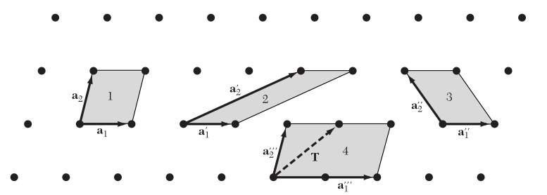{#fig-rede2d width=80%}

A @fig-rede2d mostra que diferentes escolhas de vetores primitivos podem gerar a mesma rede.

Em três dimensões,

$$
\boldsymbol{R}_n^\text{3D}
=
n_1\boldsymbol{a}_1
+
n_2\boldsymbol{a}_2
+
n_3\boldsymbol{a}_3.
$$

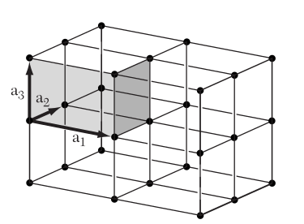{#fig-rede3d width=50%}

### Volume da célula primitiva

Os vetores primitivos definem um paralelepípedo que constitui uma célula primitiva da rede. O volume dessa célula é dado pelo produto misto

$$
\boxed{
\Omega
=
\left|
\boldsymbol{a}_1
\cdot
\left(
\boldsymbol{a}_2
\times
\boldsymbol{a}_3
\right)
\right|
}
$$ {#eq-volume-celula-primitiva}

onde $\Omega$ representa o volume da célula primitiva.

Em duas dimensões, a área da célula primitiva é dada por

$$
A
=
\left|
\boldsymbol{a}_1
\times
\boldsymbol{a}_2
\right|.
$$

Diferentes escolhas equivalentes de vetores primitivos podem gerar células com formas distintas, mas com o mesmo volume.

## Estrutura cristalina: rede + base

Uma **estrutura cristalina** é obtida associando a cada ponto de uma rede de Bravais um conjunto de um ou mais átomos, denominado **base** ou **motivo** cristalino. Dessa forma, podemos representar uma estrutura cristalina simbolicamente como

$$
\boxed{
\text{estrutura cristalina}
=
\text{rede de Bravais}
+
\text{base}
}
$$

A rede de Bravais descreve apenas a periodicidade translacional do cristal, enquanto a base especifica quais átomos estão associados a cada ponto da rede e quais são suas posições relativas dentro da célula.

### Base cristalina

Considere uma rede de Bravais definida pelos vetores

$$
\boldsymbol{R}_n
=
n_1\boldsymbol{a}_1
+
n_2\boldsymbol{a}_2
+
n_3\boldsymbol{a}_3.
$$

A cada ponto $\boldsymbol{R}_n$ da rede associamos uma base contendo $N_b$ átomos. A posição do átomo $\alpha$ dentro da base pode ser representada por um vetor

$$
\boldsymbol{\tau}_\alpha,
$$

com

$$
\alpha=1,2,\ldots,N_b.
$$

Assim, a posição de qualquer átomo da estrutura cristalina pode ser escrita como

$$
\boxed{
\boldsymbol{r}_{n\alpha}
=
\boldsymbol{R}_n
+
\boldsymbol{\tau}_\alpha
}
$$ {#eq-posicao-estrutura-cristalina}

onde $\boldsymbol{R}_n$ identifica a célula da rede e $\boldsymbol{\tau}_\alpha$ identifica a posição do átomo $\alpha$ dentro dessa célula.

Os vetores $\boldsymbol{\tau}_\alpha$ podem ser escritos em termos dos vetores primitivos como

$$
\boldsymbol{\tau}_\alpha
=
u_\alpha\boldsymbol{a}_1
+
v_\alpha\boldsymbol{a}_2
+
w_\alpha\boldsymbol{a}_3,
$$

onde $u_\alpha$, $v_\alpha$ e $w_\alpha$ são denominadas **coordenadas fracionárias** do átomo dentro da célula.

Por exemplo, uma base contendo dois átomos pode ser representada por

$$
\boldsymbol{\tau}_1=(0,0,0)
$$

e

$$
\boldsymbol{\tau}_2
=
\frac{1}{4}\boldsymbol{a}_1
+
\frac{1}{4}\boldsymbol{a}_2
+
\frac{1}{4}\boldsymbol{a}_3.
$$

Nesse caso, cada ponto da rede de Bravais gera dois átomos na estrutura cristalina.

## Células unitárias

Uma **célula unitária** é uma região do espaço que, quando repetida pelas translações da rede, preenche todo o espaço sem deixar lacunas ou produzir sobreposições. A escolha da célula unitária não é única, e diferentes células podem representar exatamente a mesma rede cristalina.

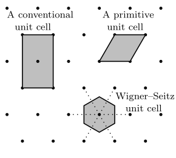{#fig-rede2d-unitcell width=60%}

A @fig-rede2d-unitcell ilustra que uma mesma rede pode ser descrita por diferentes células unitárias, com formas distintas.

### Célula primitiva

Uma **célula primitiva** é uma célula unitária que contém exatamente um ponto da rede de Bravais. Ela representa a menor região do espaço capaz de reproduzir toda a rede por translação.

Em três dimensões, uma célula primitiva pode ser construída a partir dos vetores primitivos

$$
\boldsymbol{a}_1,
\qquad
\boldsymbol{a}_2,
\qquad
\boldsymbol{a}_3,
$$

e seu volume é dado por

$$
\Omega
=
\left|
\boldsymbol{a}_1
\cdot
\left(
\boldsymbol{a}_2
\times
\boldsymbol{a}_3
\right)
\right|.
$$

É importante notar que uma célula primitiva contém **um ponto da rede**, mas não necessariamente apenas um átomo. O número de átomos presentes na célula depende da base associada à rede cristalina.

### Célula convencional

Uma **célula convencional** é uma célula unitária escolhida para representar de maneira mais evidente a simetria da rede cristalina. Em geral, ela possui um volume maior que a célula primitiva e pode conter mais de um ponto da rede.

A célula convencional é particularmente útil para visualizar e classificar redes cristalinas, pois seus vetores geralmente são escolhidos de modo a refletir diretamente elementos de simetria como comprimentos iguais, ângulos retos ou eixos de rotação.

Por exemplo, as redes cúbica de corpo centrado (BCC) e cúbica de face centrada (FCC) são normalmente representadas por células convencionais cúbicas. Essas células contêm, respectivamente, dois e quatro pontos da rede, embora ambas possuam células primitivas de menor volume.

Assim, enquanto a célula primitiva é definida pela condição de conter exatamente um ponto da rede, a célula convencional é escolhida principalmente por razões de simetria e conveniência geométrica.

### Célula de Wigner--Seitz

A **célula de Wigner--Seitz** é uma célula primitiva construída de forma que todos os pontos no seu interior estejam mais próximos de um determinado ponto da rede do que de qualquer outro ponto da rede.

Sua construção pode ser feita escolhendo um ponto da rede e seguindo os passos:

1. ligar o ponto escolhido aos pontos vizinhos da rede;
2. traçar os planos perpendiculares a esses segmentos passando por seus pontos médios;
3. selecionar a região fechada que contém o ponto inicial.

A região obtida é a célula de Wigner--Seitz.

Por construção, a célula de Wigner--Seitz contém exatamente um ponto da rede e possui o mesmo volume de qualquer outra célula primitiva da mesma rede.

Uma característica importante dessa célula é que sua forma reflete diretamente a simetria local da rede. Por esse motivo, a construção de Wigner--Seitz será particularmente útil posteriormente na definição da primeira zona de Brillouin, que corresponde à célula de Wigner--Seitz da rede recíproca.

## Redes de Bravais

Uma **rede de Bravais** é um conjunto infinito de pontos equivalentes gerados por translações inteiras dos vetores primitivos da rede,

$$
\boldsymbol{R}_n
=
n_1\boldsymbol{a}_1
+
n_2\boldsymbol{a}_2
+
n_3\boldsymbol{a}_3,
$$

com

$$
n_1,n_2,n_3\in\mathbb{Z}.
$$

Em três dimensões existem apenas **14 redes de Bravais distintas**, que podem ser agrupadas em **7 sistemas cristalinos** de acordo com as relações entre os comprimentos dos vetores da célula convencional,

$$
a,\qquad b,\qquad c,
$$

e os ângulos entre eles,

$$
\alpha,\qquad \beta,\qquad \gamma.
$$

Os sete sistemas cristalinos são triclínico, monoclínico, ortorrômbico, tetragonal, trigonal ou romboédrico, hexagonal e cúbico.

| Sistema cristalino | Relações entre os parâmetros da célula | Redes de Bravais |
|---|---|---|
| Triclínico | $a\neq b\neq c$; $\alpha\neq\beta\neq\gamma\neq90^\circ$ | P |
| Monoclínico | $a\neq b\neq c$; $\alpha=\gamma=90^\circ$, $\beta\neq90^\circ$ | P, C |
| Ortorrômbico | $a\neq b\neq c$; $\alpha=\beta=\gamma=90^\circ$ | P, C, I, F |
| Tetragonal | $a=b\neq c$; $\alpha=\beta=\gamma=90^\circ$ | P, I |
| Trigonal | $a=b=c$; $\alpha=\beta=\gamma\neq90^\circ$ | R |
| Hexagonal | $a=b\neq c$; $\alpha=\beta=90^\circ$, $\gamma=120^\circ$ | P |
| Cúbico | $a=b=c$; $\alpha=\beta=\gamma=90^\circ$ | P, I, F |

Na tabela, as letras indicam o tipo de centragem da célula convencional:

- **P**: primitiva;
- **I**: corpo centrado;
- **F**: faces centradas;
- **C**: base centrada;
- **R**: romboédrica.

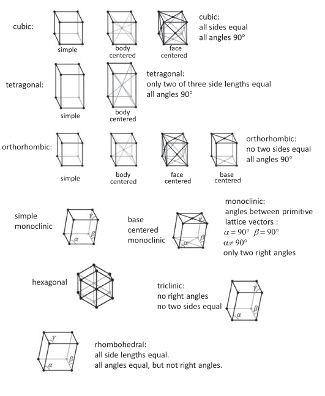{#fig-redes3d width=80%}

### Rede cúbica simples (SC)

Na rede **cúbica simples** (*simple cubic*, SC), os pontos da rede estão localizados apenas nos vértices da célula cúbica convencional.

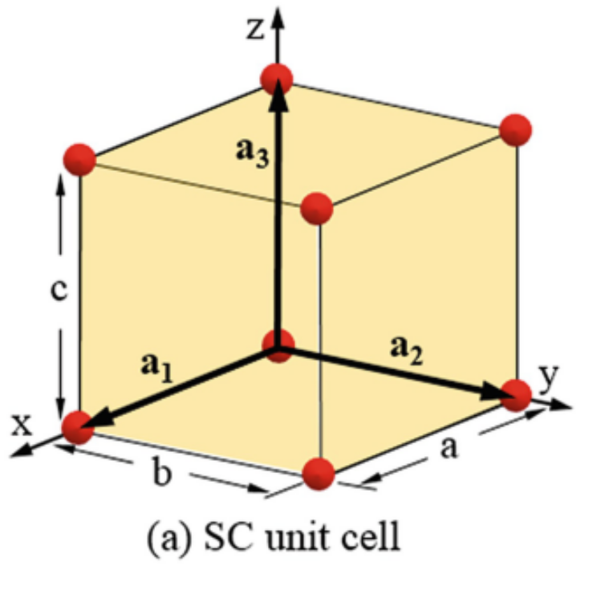{#fig-sc width=50%}

Uma escolha natural de vetores primitivos é

$$
\boldsymbol{a}_1
=
a\hat{\boldsymbol{x}},
\qquad
\boldsymbol{a}_2
=
a\hat{\boldsymbol{y}},
\qquad
\boldsymbol{a}_3
=
a\hat{\boldsymbol{z}},
$$

onde $a$ é o parâmetro de rede.

O volume da célula primitiva é

$$
\Omega_\text{SC}
=
a^3.
$$

Cada vértice da célula cúbica é compartilhado por oito células vizinhas. Como existem oito vértices, o número efetivo de pontos da rede por célula convencional é

$$
8\times\frac{1}{8}
=
1.
$$

Portanto, para a rede cúbica simples, a célula convencional também é uma célula primitiva.

Cada ponto da rede possui seis primeiros vizinhos, localizados nas direções

$$
\pm\hat{\boldsymbol{x}},
\qquad
\pm\hat{\boldsymbol{y}},
\qquad
\pm\hat{\boldsymbol{z}},
$$

de modo que o número de coordenação da rede SC é

$$
z_\text{SC}=6.
$$

### Rede cúbica de corpo centrado (BCC)

Na rede **cúbica de corpo centrado** (*body-centered cubic*, BCC), além dos pontos localizados nos oito vértices da célula convencional, existe um ponto adicional no centro do cubo.

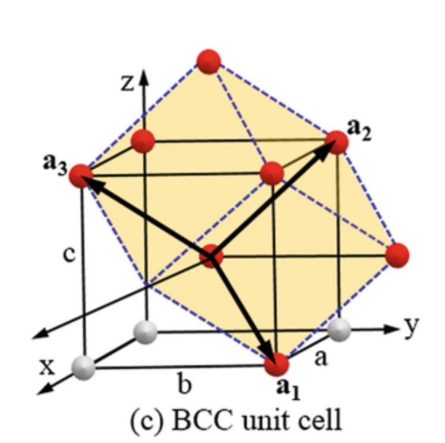{#fig-bcc width=50%}

A célula convencional contém

$$
8\times\frac{1}{8}+1=2
$$

pontos da rede.

Portanto, a célula cúbica convencional não é primitiva.

Uma possível escolha de vetores primitivos é

$$
\boldsymbol{a}_1
=
\frac{a}{2}
\left(
-\hat{\boldsymbol{x}}
+
\hat{\boldsymbol{y}}
+
\hat{\boldsymbol{z}}
\right),
$$

$$
\boldsymbol{a}_2
=
\frac{a}{2}
\left(
\hat{\boldsymbol{x}}
-
\hat{\boldsymbol{y}}
+
\hat{\boldsymbol{z}}
\right),
$$

$$
\boldsymbol{a}_3
=
\frac{a}{2}
\left(
\hat{\boldsymbol{x}}
+
\hat{\boldsymbol{y}}
-
\hat{\boldsymbol{z}}
\right).
$$

O volume da célula primitiva é

$$
\boxed{
\Omega_\text{BCC}
=
\frac{a^3}{2}
}
$$

e corresponde à metade do volume da célula convencional.

Cada ponto da rede BCC possui oito primeiros vizinhos, de modo que

$$
z_\text{BCC}=8.
$$

A distância entre primeiros vizinhos é

$$
d_\text{nn}
=
\frac{\sqrt{3}}{2}a.
$$

### Rede cúbica de face centrada (FCC)

Na rede **cúbica de face centrada** (*face-centered cubic*, FCC), existem pontos da rede nos oito vértices e no centro de cada uma das seis faces da célula cúbica convencional.

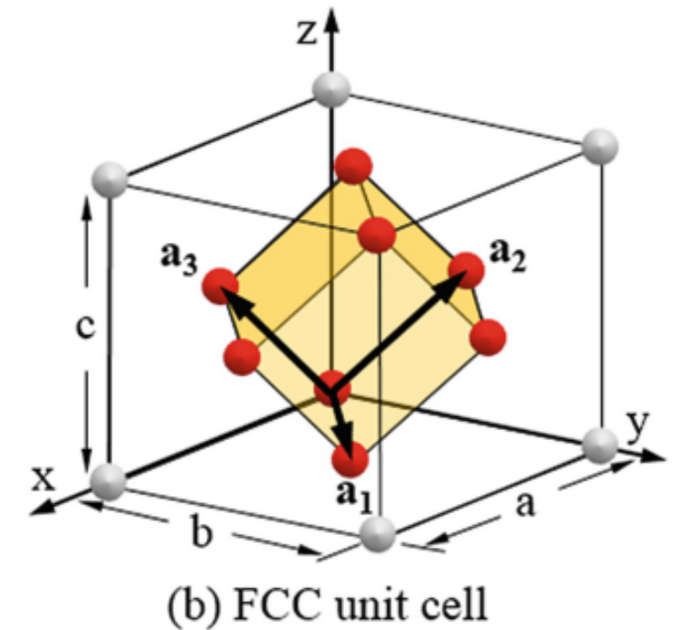{#fig-fcc width=50%}

O número efetivo de pontos da rede por célula convencional é

$$
8\times\frac{1}{8}
+
6\times\frac{1}{2}
=
4.
$$

Assim, a célula convencional FCC contém quatro pontos da rede.

Uma escolha comum de vetores primitivos é

$$
\boldsymbol{a}_1
=
\frac{a}{2}
\left(
\hat{\boldsymbol{y}}
+
\hat{\boldsymbol{z}}
\right),
$$

$$
\boldsymbol{a}_2
=
\frac{a}{2}
\left(
\hat{\boldsymbol{x}}
+
\hat{\boldsymbol{z}}
\right),
$$

$$
\boldsymbol{a}_3
=
\frac{a}{2}
\left(
\hat{\boldsymbol{x}}
+
\hat{\boldsymbol{y}}
\right).
$$

O volume da célula primitiva é

$$
\boxed{
\Omega_\text{FCC}
=
\frac{a^3}{4}
}
$$

e corresponde a um quarto do volume da célula convencional.

Cada ponto da rede possui doze primeiros vizinhos,

$$
z_\text{FCC}=12,
$$

e a distância entre primeiros vizinhos é

$$
d_\text{nn}
=
\frac{a}{\sqrt{2}}.
$$

A rede FCC apresenta uma alta eficiência de empacotamento e aparece como rede de Bravais de diversas estruturas cristalinas importantes, incluindo estruturas metálicas e a estrutura do diamante.

### Rede hexagonal

A rede de Bravais **hexagonal** pode ser descrita por dois vetores primitivos de mesmo comprimento no plano basal, formando um ângulo de $120^\circ$, e um terceiro vetor perpendicular a esse plano.

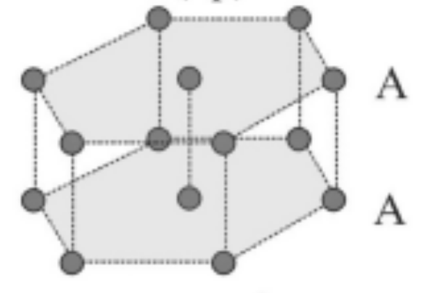{#fig-hex width=40%}

Uma escolha comum é

$$
\boldsymbol{a}_1
=
a\hat{\boldsymbol{x}},
$$

$$
\boldsymbol{a}_2
=
a
\left(
-\frac{1}{2}\hat{\boldsymbol{x}}
+
\frac{\sqrt{3}}{2}\hat{\boldsymbol{y}}
\right),
$$

e

$$
\boldsymbol{a}_3
=
c\hat{\boldsymbol{z}}.
$$

Assim,

$$
|\boldsymbol{a}_1|
=
|\boldsymbol{a}_2|
=
a,
\qquad
|\boldsymbol{a}_3|
=
c,
$$

com

$$
\boldsymbol{a}_1\cdot\boldsymbol{a}_2
=
a^2\cos120^\circ.
$$

O volume da célula primitiva hexagonal é

$$
\boxed{
\Omega_\text{hex}
=
\frac{\sqrt{3}}{2}a^2c
}
$$

É importante distinguir a **rede de Bravais hexagonal** da estrutura **hexagonal compacta (HCP)**. A rede hexagonal é uma das 14 redes de Bravais, enquanto a estrutura HCP resulta da associação dessa rede a uma base contendo mais de um átomo. 

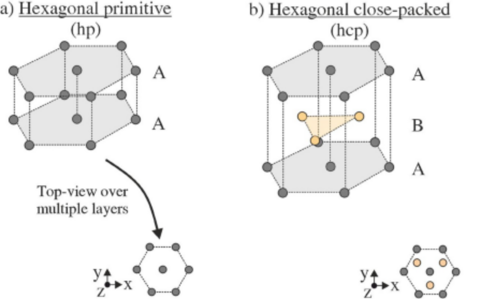{#fig-hex_hcp width=80%}

::: {.callout-important}

## Rede de Bravais e estrutura cristalina

É importante distinguir os conceitos de rede de Bravais e estrutura cristalina. Uma **rede de Bravais** é um conjunto geométrico de pontos equivalentes relacionados por translações da rede. Todos os pontos da rede possuem exatamente a mesma vizinhança e são geometricamente equivalentes.

Já uma **estrutura cristalina** contém, além da periodicidade da rede, informações sobre a identidade química e a posição dos átomos que compõem a base. Assim, estruturas cristalinas diferentes podem possuir a mesma rede de Bravais, mas bases distintas.

Por exemplo, a estrutura do diamante pode ser descrita por uma rede de Bravais cúbica de face centrada (FCC) associada a uma base contendo dois átomos. Da mesma forma, a estrutura do NaCl também pode ser descrita a partir de uma rede FCC, porém com uma base diferente contendo espécies químicas distintas.

Portanto, estruturas como **diamante**, **NaCl** e **HCP** não devem ser confundidas com redes de Bravais. As redes de Bravais descrevem a simetria translacional, enquanto essas estruturas resultam da combinação de uma rede com uma determinada base atômica.

:::

## Estruturas cristalinas importantes

Diversas estruturas cristalinas de interesse em física, química e ciência dos materiais podem ser descritas a partir de uma rede de Bravais associada a uma base contendo um ou mais átomos. A posição de qualquer átomo pode ser escrita como

$$
\boldsymbol{r}_{n\alpha}
=
\boldsymbol{R}_n
+
\boldsymbol{\tau}_\alpha,
$$

onde $\boldsymbol{R}_n$ identifica um ponto da rede de Bravais e $\boldsymbol{\tau}_\alpha$ representa a posição do átomo $\alpha$ dentro da base.

A seguir serão discutidas três estruturas cristalinas importantes: HCP, diamante e NaCl.

### Estrutura hexagonal compacta (HCP)

A estrutura **hexagonal compacta** (*hexagonal close-packed*, HCP) não constitui uma rede de Bravais. Ela pode ser descrita por uma rede de Bravais hexagonal associada a uma base contendo dois átomos.

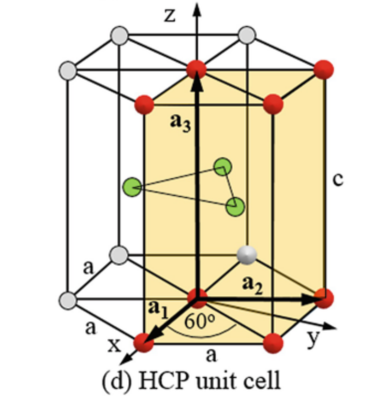{#fig-hcp width=50%}

Utilizando os vetores primitivos da rede hexagonal

$$
\boldsymbol{a}_1
=
a\hat{\boldsymbol{x}},
$$

$$
\boldsymbol{a}_2
=
a
\left(
-\frac{1}{2}\hat{\boldsymbol{x}}
+
\frac{\sqrt{3}}{2}\hat{\boldsymbol{y}}
\right),
$$

e

$$
\boldsymbol{a}_3
=
c\hat{\boldsymbol{z}},
$$

uma possível escolha para a base é

$$
\boldsymbol{\tau}_1
=
\boldsymbol{0}
$$

e

$$
\boldsymbol{\tau}_2
=
\frac{2}{3}\boldsymbol{a}_1
+
\frac{1}{3}\boldsymbol{a}_2
+
\frac{1}{2}\boldsymbol{a}_3.
$$

Em coordenadas fracionárias, podemos escrever

$$
\boldsymbol{\tau}_1=(0,0,0)
$$

e

$$
\boldsymbol{\tau}_2=
\left(
\frac{2}{3},
\frac{1}{3},
\frac{1}{2}
\right).
$$

Assim, cada célula primitiva da estrutura HCP contém dois átomos.

A estrutura HCP pode ser interpretada como um empilhamento de planos hexagonais compactos na sequência

$$
\text{ABABAB}\ldots
$$

O número de coordenação é

$$
z_\text{HCP}=12,
$$

isto é, cada átomo possui doze primeiros vizinhos.

Para um empacotamento ideal de esferas rígidas, a razão entre os parâmetros de rede é

$$
\boxed{
\frac{c}{a}
=
\sqrt{\frac{8}{3}}
\approx
1.633
}
$$

Embora HCP e FCC possuam o mesmo número de coordenação e a mesma eficiência máxima de empacotamento, elas diferem na sequência de empilhamento. Enquanto HCP apresenta

$$
\text{ABAB}\ldots,
$$

a estrutura FCC apresenta

$$
\text{ABCABC}\ldots.
$$

### Estrutura do diamante

A estrutura do **diamante** pode ser descrita por uma rede de Bravais cúbica de face centrada (FCC) associada a uma base contendo dois átomos idênticos.

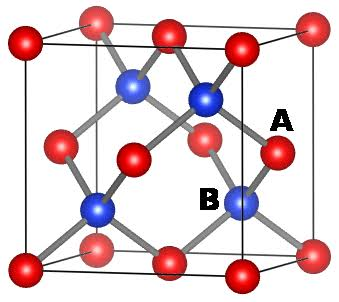{#fig-diamond width=60%}

Uma possível escolha para a base é

$$
\boldsymbol{\tau}_1
=
(0,0,0)
$$

e

$$
\boldsymbol{\tau}_2
=
\left(
\frac{1}{4},
\frac{1}{4},
\frac{1}{4}
\right)a,
$$

onde as coordenadas são dadas em relação aos eixos da célula cúbica convencional de parâmetro de rede $a$.

Assim, a estrutura pode ser interpretada como duas sub-redes FCC interpenetrantes, deslocadas uma em relação à outra pelo vetor

$$
\boxed{
\boldsymbol{\tau}
=
\frac{a}{4}
\left(
\hat{\boldsymbol{x}}
+
\hat{\boldsymbol{y}}
+
\hat{\boldsymbol{z}}
\right)
}
$$

A célula convencional FCC contém quatro pontos da rede. Como existem dois átomos na base, a célula convencional da estrutura do diamante contém

$$
4\times2=8
$$

átomos.

Cada átomo possui quatro primeiros vizinhos dispostos segundo uma geometria tetraédrica, de modo que

$$
z_\text{diamante}=4.
$$

A distância entre primeiros vizinhos é

$$
\boxed{
d_\text{nn}
=
\frac{\sqrt{3}}{4}a
}
$$

A estrutura do diamante é encontrada em materiais importantes como carbono na fase diamante, silício e germânio.

### Estrutura do NaCl

A estrutura cristalina do **NaCl**, também denominada estrutura *rock salt*, pode ser descrita a partir de uma rede de Bravais FCC associada a uma base contendo dois átomos de espécies diferentes.

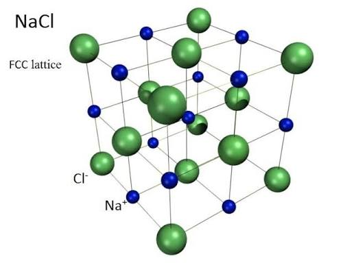{#fig-nacl width=80%}

Uma possível escolha para a base é

$$
\boldsymbol{\tau}_\text{Cl}
=
(0,0,0)
$$

e

$$
\boldsymbol{\tau}_\text{Na}
=
\left(
\frac{1}{2},
0,
0
\right)a.
$$

Outras escolhas equivalentes para a origem e para a base são possíveis.

A estrutura também pode ser interpretada como duas sub-redes FCC interpenetrantes, uma formada por íons Na$^+$ e outra por íons Cl$^-$, deslocadas uma em relação à outra.

A célula convencional contém quatro pontos da rede FCC. Como a base contém dois átomos, a célula convencional da estrutura NaCl contém

$$
4\text{ Na}
+
4\text{ Cl},
$$

totalizando oito átomos.

Cada íon Na$^+$ possui seis íons Cl$^-$ como primeiros vizinhos, e cada íon Cl$^-$ possui seis íons Na$^+$ como primeiros vizinhos. Portanto,

$$
z_\text{NaCl}=6.
$$

A geometria local é octaédrica.

A distância entre primeiros vizinhos é

$$
\boxed{
d_\text{nn}
=
\frac{a}{2}
}
$$

A estrutura do NaCl mostra claramente que a rede de Bravais descreve apenas a periodicidade translacional, enquanto a base determina a identidade química dos átomos e sua disposição relativa dentro da célula.

## Direções e planos cristalinos

A geometria de uma rede cristalina pode ser descrita não apenas pelos vetores primitivos e pelas posições dos pontos da rede, mas também por direções e famílias de planos. Essas construções são particularmente importantes para descrever propriedades anisotrópicas dos cristais, superfícies, crescimento cristalino e fenômenos de difração.

### Direções cristalográficas

Uma **direção cristalográfica** é definida por um vetor que conecta dois pontos da rede. Em uma célula convencional, uma direção pode ser escrita como

$$
\boldsymbol{d}
=
u\boldsymbol{a}_1
+
v\boldsymbol{a}_2
+
w\boldsymbol{a}_3,
$$

onde $u$, $v$ e $w$ são números proporcionais às componentes do vetor ao longo dos eixos cristalográficos.

Os índices de uma direção são obtidos reduzindo essas componentes aos menores números inteiros proporcionais e são representados pela notação

$$
\boxed{
[uvw]
}
$$

Por exemplo, uma direção paralela ao eixo $x$ em uma célula cúbica é representada por

$$
[100],
$$

enquanto a diagonal de uma face é representada por

$$
[110],
$$

e a diagonal do corpo por

$$
[111].
$$

Índices negativos são representados por uma barra sobre o número. Por exemplo,

$$
[\bar{1}10]
$$

representa uma direção com componente negativa ao longo do primeiro eixo cristalográfico.

Uma família de direções equivalentes por operações de simetria é representada utilizando sinais de menor e maior,

$$
\boxed{
\langle uvw\rangle
}
$$

Por exemplo, em uma rede cúbica, a família

$$
\langle 100\rangle
$$

inclui as direções

$$
[100],\quad
[010],\quad
[001],
$$

e suas direções opostas.

### Planos cristalinos

Um **plano cristalino** é um plano que contém pontos da rede e cuja orientação pode ser especificada em relação aos eixos cristalográficos.

Uma família de planos paralelos pode ser caracterizada pelas distâncias em que um desses planos intercepta os eixos definidos pelos vetores da célula.

Considere um plano que intercepta os eixos cristalográficos nas posições

$$
\frac{a}{h},
\qquad
\frac{b}{k},
\qquad
\frac{c}{l},
$$

onde $a$, $b$ e $c$ são os parâmetros da célula. Os números inteiros $h$, $k$ e $l$ definem os **índices de Miller** do plano.

### Índices de Miller

Os índices de Miller são representados pela notação

$$
\boxed{
(hkl)
}
$$

e podem ser obtidos através do seguinte procedimento:

1. determine os pontos onde o plano intercepta os três eixos cristalográficos;
2. escreva esses interceptos em unidades dos parâmetros de rede $a$, $b$ e $c$;
3. tome os inversos desses valores;
4. multiplique por um fator comum de modo a obter os menores números inteiros possíveis.

Por exemplo, considere um plano que intercepta os eixos nas posições

$$
a,\qquad
b,\qquad
\infty.
$$

Em unidades dos parâmetros de rede, os interceptos são

$$
1,\qquad
1,\qquad
\infty.
$$

Tomando os inversos,

$$
1,\qquad
1,\qquad
0,
$$

obtemos o plano

$$
\boxed{
(110)
}
$$

O índice zero indica que o plano é paralelo ao eixo correspondente.

Da mesma forma, um plano com interceptos

$$
a,\qquad
\infty,\qquad
\infty
$$

possui índices

$$
(100).
$$

Índices negativos são indicados por uma barra. Assim,

$$
(\bar{1}10)
$$

representa um plano que possui intercepto negativo ao longo do primeiro eixo cristalográfico.

Uma família de planos equivalentes por simetria é indicada por chaves,

$$
\boxed{
\{hkl\}
}
$$

Por exemplo, em um cristal cúbico,

$$
\{100\}
$$

representa os planos equivalentes às faces do cubo.

Outros planos podem ser visualizados na @fig-planos.

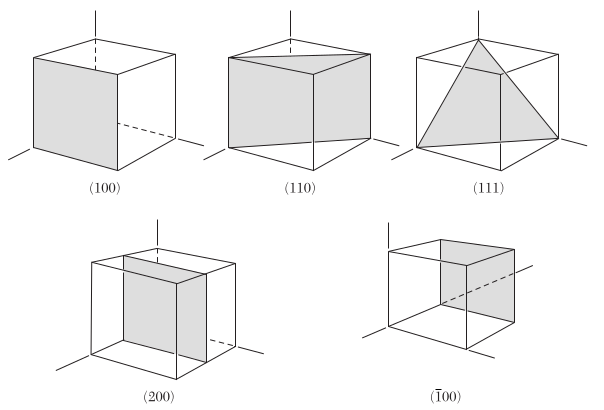{#fig-planos width=80%}

### Notação para direções e planos

É importante distinguir as diferentes notações utilizadas em cristalografia:

| Notação | Significado |
|---|---|
| $[uvw]$ | uma direção cristalográfica |
| $\langle uvw\rangle$ | família de direções equivalentes |
| $(hkl)$ | um plano cristalino |
| $\{hkl\}$ | família de planos equivalentes |

Em sistemas cúbicos, a direção $[hkl]$ é perpendicular ao plano $(hkl)$.
Essa relação simples não é válida, em geral, para células não ortogonais. No próximo capítulo, essa relação será formulada de maneira geral através da rede recíproca.

## Difração de Raios X

A difração de raios X é uma das principais técnicas utilizadas para caracterizar a estrutura de materiais cristalinos. Sua origem está na interferência entre ondas eletromagnéticas espalhadas pelos átomos de um cristal.

Como as distâncias interatômicas típicas em sólidos são da ordem de

$$
d \sim 1~\text{Å},
$$

é necessário utilizar radiação com comprimento de onda da mesma ordem de grandeza para observar efeitos de difração. Os raios X possuem comprimentos de onda adequados para esse propósito.

Quando um feixe de raios X incide sobre um cristal, os átomos espalham a radiação incidente. Devido à periodicidade da estrutura cristalina, as ondas espalhadas podem interferir construtiva ou destrutivamente dependendo da direção de observação.

A ocorrência de interferência construtiva está relacionada às distâncias entre os planos cristalinos e pode ser descrita pela **lei de Bragg**.

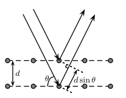{#fig-bragg width=50%}

### Condição de Bragg

Considere duas ondas incidentes sobre dois planos cristalinos paralelos separados por uma distância $d_{hkl}$, como ilustrado na @fig-bragg.

A onda espalhada pelo segundo plano percorre uma distância adicional em relação à onda espalhada pelo primeiro plano. A diferença de caminho óptico é

$$
\Delta L
=
2d_{hkl}\sin\theta,
$$

onde $\theta$ é o ângulo entre o feixe incidente e o plano cristalino.

Para que as duas ondas interfiram construtivamente, essa diferença de caminho deve ser um múltiplo inteiro do comprimento de onda,

$$
\Delta L
=
n\lambda,
$$

com

$$
n=1,2,3,\ldots
$$

Assim, obtemos a **lei de Bragg**,

$$
\boxed{
2d_{hkl}\sin\theta
=
n\lambda
}
$$ {#eq-bragg}

onde

- $d_{hkl}$ é a distância entre planos cristalinos consecutivos da família $(hkl)$;
- $\theta$ é o ângulo de Bragg;
- $\lambda$ é o comprimento de onda da radiação incidente;
- $n$ é a ordem da reflexão.

A condição de Bragg determina os ângulos nos quais ocorre interferência construtiva entre as ondas espalhadas por diferentes planos do cristal.

### Espaçamento interplanar

A distância $d_{hkl}$ depende da geometria da rede cristalina e dos índices de Miller do plano considerado.

Para um sistema cúbico de parâmetro de rede $a$, o espaçamento entre planos da família $(hkl)$ é dado por

$$
\boxed{
d_{hkl}
=
\frac{a}
{\sqrt{h^2+k^2+l^2}}
}
$$ {#eq-dhkl-cubic}

Por exemplo,

$$
d_{100}=a,
$$

$$
d_{110}
=
\frac{a}{\sqrt{2}},
$$

e

$$
d_{111}
=
\frac{a}{\sqrt{3}}.
$$

Substituindo essas distâncias na lei de Bragg, é possível determinar os ângulos de difração associados a diferentes famílias de planos cristalinos.

### Padrão de difração

Experimentalmente, a intensidade da radiação difratada é medida em função do ângulo de espalhamento. Em experimentos convencionais de difração de raios X, é comum representar a intensidade em função de

$$
2\theta,
$$

onde $\theta$ é o ângulo que aparece na lei de Bragg.

Cada pico observado no padrão de difração está associado a uma condição de interferência construtiva e pode ser relacionado a uma família de planos $(hkl)$ do cristal.

Assim, a posição dos picos fornece informações sobre as distâncias interplanares e, consequentemente, sobre os parâmetros da célula cristalina.

A intensidade dos picos, por outro lado, depende da distribuição dos átomos dentro da célula unitária. Portanto, dois cristais que possuem a mesma rede de Bravais podem apresentar padrões de difração diferentes caso suas bases cristalinas sejam distintas.

A análise de um padrão de difração permite, entre outras aplicações,

- identificar fases cristalinas;
- determinar parâmetros de rede;
- determinar simetrias cristalinas;
- identificar famílias de planos cristalinos;
- obter informações sobre a estrutura atômica do material.

Uma descrição mais geral da difração cristalina será obtida posteriormente utilizando a rede recíproca.
