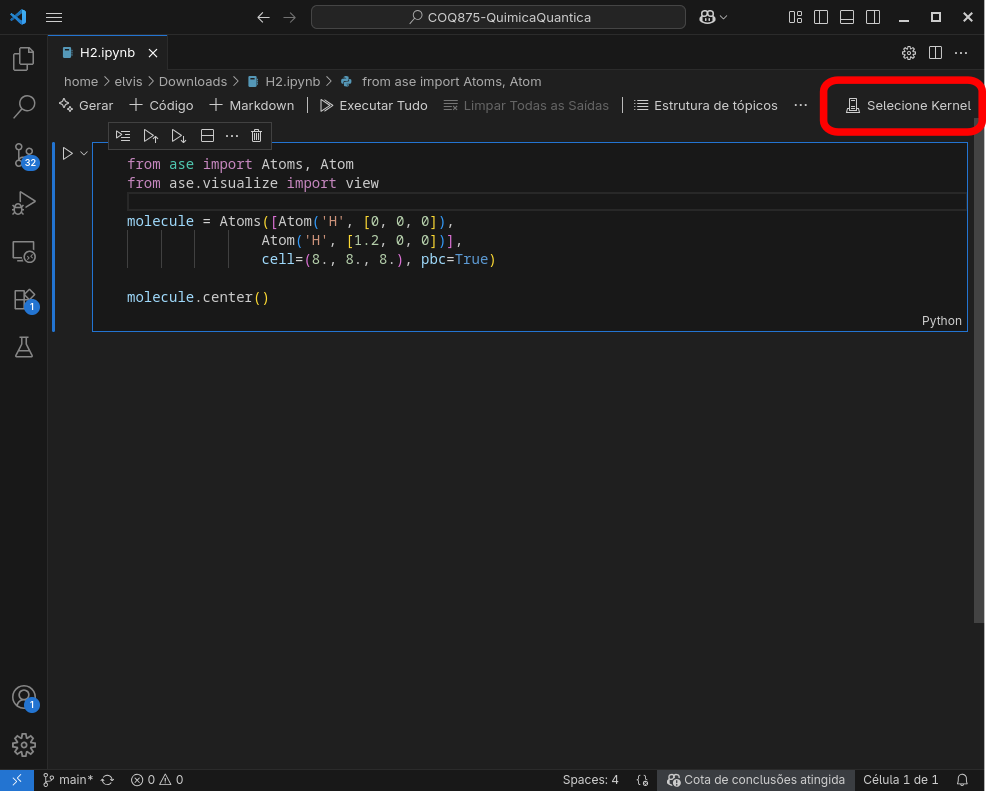
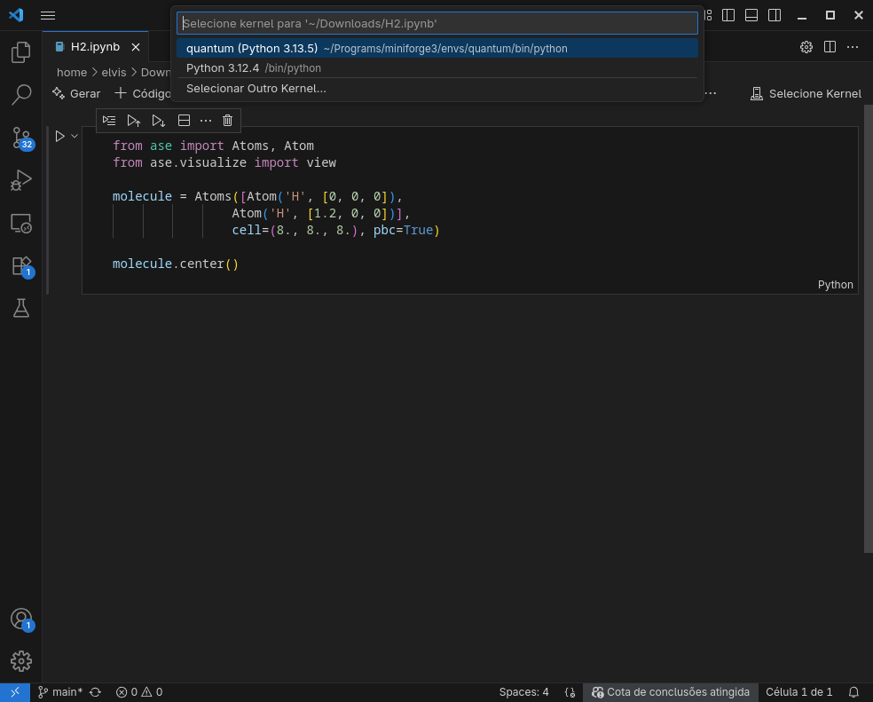
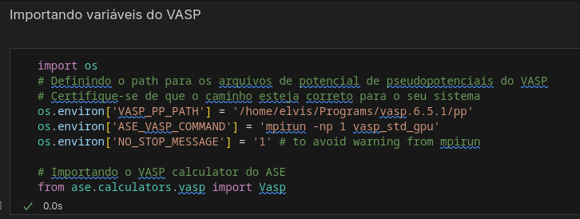

A ideia é usarmos o ambiente [ASE](https://ase-lib.org/) em Python para rodarmos programas usando o VASP. 

- Para isso precisaremos criar um `environment` no conda. Criando ambiente conda
```bash
conda create -n quantum -c conda-forge python
```

- Entre no ambiente `quantum` 
```bash
conda activate quantum
```

- Instale o ASE usando o comando
```bash
pip install --upgrade ase
```

Agora você pode usar o ASE sempre que ativar o ambiente `quantum` do conda. 

## Usando o VScode

- No VScode você pode escolher o Kernel no canto direito


- Escolha o kernel `quantum` que você acabou de criar


- Agora você pode rodar o código usando a biblioteca ASE

## Usando o VASP no ASE

Para usar o VASP no ASE devemos informar o caminho para a pasta de pseudopotenciais e o comando de execução do VASP.

```python
import os

# Definindo o path para os arquivos de potencial de pseudopotenciais do VASP
# Certifique-se de que o caminho esteja correto para o seu sistema
os.environ['VASP_PP_PATH'] = '/home/elvis/Programs/vasp.6.5.1/pp'
os.environ['ASE_VASP_COMMAND'] = 'mpirun -np 1 vasp_std_gpu'
os.environ['NO_STOP_MESSAGE'] = '1' # to avoid warning from mpirun

# Importando o VASP calculator do ASE
from ase.calculators.vasp import Vasp
```

